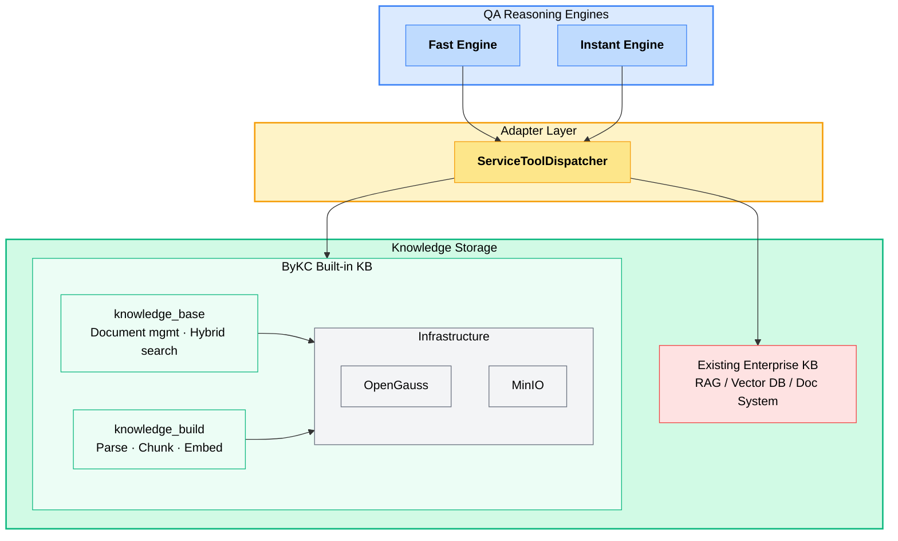

<div align="center">

# ByKC

**Beyond Knowledge Core · Enterprise Knowledge Hub**

From document ingestion to multi-hop reasoning — a knowledge foundation for enterprise AI agents.

[](https://www.python.org/downloads/)
[](https://fastapi.tiangolo.com/)
[](https://github.com/langchain-ai/langgraph)
[](LICENSE)

English | [中文](README_zh.md)

</div>

---

## Project Positioning

ByKC (Beyond Knowledge Core) is an open-source enterprise knowledge reasoning engine — the company's "digital senior expert". It weaves information scattered across messaging apps, email, meetings, and code into a living knowledge network, so newcomers can tap into the experience of senior staff from day one.

Technically, ByKC aims to **improve the accuracy of existing RAG knowledge bases on complex QA scenarios**.

The core flow of traditional RAG is "retrieve top-K chunks → concatenate → generate", which has systemic gaps when facing real business questions:

| Traditional RAG Problem | ByKC Approach |
|---|---|
| **Compound questions fail** — "How do A and B differ?" needs separate retrievals to compare; a single retrieval mixes targets and yields low-relevance hits | **Sub-question decomposition** — Splits a compound question into independent sub-questions, each issuing its own retrieval. Single-target retrievals produce more relevant hits<br/>*Example: "How do product A and B differ in battery life and weight?" → split into 4 sub-retrievals: "A battery life", "A weight", "B battery life", "B weight"* |
| **Multi-hop reasoning breaks** — "What projects does Zhang San's manager own?" has chained dependencies; one retrieval cannot fetch the full answer | **Step-by-step iterative retrieval** — Runs retrieval in iterative rounds along the reasoning chain, rebuilding the next query from the previous round's result, advancing until the full evidence chain is gathered<br/>*Example: "What projects does Zhang San's manager own?" → round 1 retrieves "Who is Zhang San's manager" → gets "Li Si" → round 2 retrieves "Projects owned by Li Si"* |
| **Cross-KB silos** — Information lives in multiple knowledge bases; a single retrieval only hits one source | **KBs unified as agent tools** — Exposes multiple knowledge bases as a standard agent tool set. The agent calls them in parallel and aggregates results uniformly<br/>*Example: "What's the company's remote work policy?" → calls HR-policy, IT-security, and finance-reimbursement KBs in parallel, then aggregates into a complete answer* |

To deliver these capabilities, ByKC adopts a layered architecture — the reasoning engines connect to knowledge storage through an adapter layer. You can use the built-in knowledge base end-to-end, or layer ByKC directly on top of your existing RAG infrastructure:



---

## Core Features

- **Dual-mode QA engines** — Fast Engine handles simple questions; Instant Engine handles multi-hop complex questions. One codebase, switch by scenario.
- **AgentOverride hot-swap** — Each reasoning node (decomposer, retrieval agent, aggregator, generator) supports independent replacement of prompt / middleware / tools, so the same engine adapts to legal, customer service, R&D, and other domains.
- **Knowledge bases as a tool set** — ServiceToolDispatcher automatically converts remote knowledge-base APIs into LangGraph tools (search / listDir / glob / readFile). The QA engine is not bound to any specific storage and works with any compatible service.

---

## Core Design

### Dual Engines: Fast vs Instant

| | **Fast Engine** | **Instant Engine** |
|---|---|---|
| **Scenario** | Factual lookup, definition, single information point | Comparison, multi-condition filtering, cross-document synthesis |
| **Flow** | Linear: rewrite → retrieve → generate | Graph: decompose → parallel agents → aggregate → final answer |
| **Latency** | Low (single-round LLM + single retrieval) | Higher (multi-round tool calls, parallel sub-questions offset some latency) |
| **Example** | "What is the reimbursement process?" | "How do products A and B differ in reliability and performance?" |

### AgentOverride: Per-Node Behavior Configuration

Every agent node in both engines can be configured independently via `AgentOverride` — no engine code changes needed:

```python
from by_qa.qa.common.config import AgentOverride

config = {
    "agents": {
        # Instant engine nodes:
        #   decomposer_agent / single_hop_agent / multi_hop_agent /
        #   multi_hop_summary_agent / aggregator_agent
        "single_hop_agent": AgentOverride(
            prompt="You are a legal document assistant. Always cite the original clause number...",
            middleware=[YourCustomMiddleware()],
            tools=[your_extra_tool],
        ),
        # Fast engine nodes:
        #   rewriter_agent / answer_agent
        "answer_agent": AgentOverride(
            prompt="Answer in three sentences or fewer, friendly tone...",
        ),
    }
}
```

Same engine code: legal scenarios swap in a strict-citation prompt, customer service injects a concise style, R&D adds a code search tool.

### ServiceToolDispatcher: Knowledge Base → Agent Tools

The QA engine never accesses a database directly; it converts remote knowledge-base services into LangGraph tools:

```python
dispatcher = ServiceToolDispatcher(knowledge_bases=[
    KnowledgeBaseConfig(
        kb_code="product_docs",
        service_name="by-qa-manager",
        operations={
            OperationType.KNOWLEDGE_SEARCH: "/api/v1/knowledgeItems/search",
            OperationType.LIST_DIR: "/api/v1/listDir",
            OperationType.GLOB: "/api/v1/glob",
            OperationType.READ_FILE: "/api/v1/readFile",
        }
    )
])
tools = dispatcher.build_tools()
# → [search_knowledge, list_directory, glob_search, read_file]
```

- Works with any service that implements the same protocol — not tied to ByKC's own knowledge_base module
- Agents get full knowledge-exploration powers: search, list directories, glob, read original content
- Parallel retrieval across multiple KBs, results unified by relevance

---

## Quick Start

### Requirements

- Python 3.12+
- [uv](https://github.com/astral-sh/uv) (recommended) or pip
- Docker (required by the knowledge base module)

### Install

```bash
# pip install (recommended)
pip install by-qa[all]

# Or via uv
uv pip install by-qa[all]

# Install on demand
pip install by-qa[knowledge]   # knowledge base only
pip install by-qa[qa]          # QA engines only
```

From source:

```bash
git clone https://github.com/beyonai/ByKC.git && cd ByKC
uv sync --all-extras
```

### Start Middleware

```bash
make kb-stack-up   # Bring up OpenGauss + MinIO + Redis in one shot
```

### Configure

```bash
cp .env.example .env
```

Key variables:

```bash
LLM_BASE_URL=http://your-llm/v1       # OpenAI-compatible endpoint
LLM_API_KEY=your-key
LLM_STANDARD_MODEL=gpt-4o             # Primary reasoning
LLM_LIGHTWEIGHT_MODEL=gpt-4o-mini     # Decomposition / rewrite

EMBEDDING_BASE_URL=http://your-embedding
EMBEDDING_MODEL_NAME=bge-m3
EMBEDDING_DIMENSION=1024
```

### Run

```bash
by-qa
```

Visit `/health` to see loaded modules and `/docs` for the knowledge base API reference.

### End-to-End Walkthrough

After installing by-qa via pip/uv, you can run the full pipeline:

```bash
# Install
pip install by-qa[all]
# Or
uv pip install by-qa[all]

# Configure env vars (LLM, embedding, middleware addresses)
cp .env.example .env && vi .env

# Start the service
by-qa
```

Once the service is up, call the APIs in order to build knowledge and ask questions:

```bash
# 1. Create a knowledge base
curl -X POST http://127.0.0.1:8000/api/v1/knowledgeBases/create \
  -H "Content-Type: application/json" \
  -d '{"knName": "my-docs", "knDescription": "Product docs"}'
# → {"resultObject": {"knCode": "74", ...}}

# 2. Import a file (PDF/Word/PPT/Excel/Markdown/CSV supported)
curl -X POST http://127.0.0.1:8000/api/v1/knowledgeItems/import \
  -F "knCode=74" \
  -F "filePath=/docs/handbook.md" \
  -F "fileContent=@handbook.md"

# 3. Trigger parsing → chunking → embedding (async background)
curl -X POST http://127.0.0.1:8000/api/v1/fileToMarkdownIndex \
  -H "Content-Type: application/json" \
  -d '{"knCode": "74", "filePath": "/docs/handbook.md"}'

# 4. Check build status (status=complete means ready)
curl -X POST http://127.0.0.1:8000/api/v1/fileBuildStatus \
  -H "Content-Type: application/json" \
  -d '{"knCode": "74", "filePath": "/docs/handbook.md"}'

# 5. Verify retrieval
curl -X POST http://127.0.0.1:8000/api/v1/knowledgeItems/search \
  -H "Content-Type: application/json" \
  -d '{"knCodeList": ["74"], "query": "how to use", "topK": 3, "searchMode": "mixedRecall"}'
```

After knowledge is built, use the QA scripts in the repo to ask questions:

```bash
# Instant engine (multi-hop, for complex questions)
python examples/e2e_kb_qa/run_instant_qa.py --query "What's the difference between A and B?"

# Fast engine (linear pipeline, for simple questions)
python examples/e2e_kb_qa/run_instant_qa.py --mode fast --query "What is the reimbursement process?"

# More options
python examples/e2e_kb_qa/run_instant_qa.py --help
```

---

## Usage

### Knowledge Base API

The knowledge base exposes full document management and retrieval via REST. See the [API reference](docs/modules/knowledge/api.md).

### QA Engines (Code-Level Integration)

The QA engines are code-level entry points for upper-layer agent frameworks or business services to integrate:

```python
from by_qa.qa.engines.instant.engine import InstantQAEngine
from by_qa.qa.engines.fast.engine import FastQAEngine
from by_qa.qa.common.models import CoreInput
from by_qa.qa.common.config import AgentOverride

retrieval_config = {
    "knowledge_bases": [{
        "kb_code": "my_kb",
        "kb_name": "Product docs",
        "service_name": "by-qa-manager",
        "base_url": "http://127.0.0.1:8000",
        "operations": {
            "knowledgeSearch": "/api/v1/knowledgeItems/search",
            "listDir": "/api/v1/listDir",
            "readFile": "/api/v1/readFile",
        }
    }]
}

# Simple question → Fast
async with FastQAEngine({"retrieval": retrieval_config}) as engine:
    async for event in engine.stream_search(CoreInput(query="What is the reimbursement process?")):
        if event.type == "token":
            print(event.data["content"], end="")

# Complex question → Instant + customized agent behavior
async with InstantQAEngine({
    "retrieval": retrieval_config,
    "agents": {"single_hop_agent": AgentOverride(prompt="When citing original text, include the page number...")}
}) as engine:
    async for event in engine.stream_search(CoreInput(query="How do the breach clauses in the two contracts differ?")):
        if event.type == "token":
            print(event.data["content"], end="")
```

---

## Evaluation

A standardized evaluation framework is built in. Currently supports the [FRAMES](https://huggingface.co/datasets/google/frames-benchmark) multi-hop QA benchmark:

```bash
uv sync --extra eval --extra qa
uv run python -m eval.cli download frames
uv run python -m eval.cli ingest frames --kb-base-url http://127.0.0.1:8000
uv run python -m eval.cli run frames --mode instant --sample 10
```

Adding a new dataset: implement the `DatasetSpec` protocol under `eval/datasets/<name>/`.

---

## Project Structure

```
src/by_qa/
├── main.py                 # FastAPI entry, dynamic module registration
├── config.py               # Pydantic Settings
├── core/                   # ModelConfigProvider protocol, logging, service discovery
├── knowledge_base/
│   ├── api/                # REST routes
│   ├── services/           # KB management, ingestion, retrieval
│   ├── repositories/       # OpenGauss data access
│   └── infrastructure/     # DB connection pool, MinIO client
├── knowledge_build/
│   └── services/           # Document parsing, semantic chunking, embedding
├── knowledge_common/       # Cross-module shared schemas
└── qa/
    ├── common/
    │   ├── base_engine.py          # BaseQAEngine abstract base class
    │   ├── config.py               # QAEngineConfig / AgentOverride / QARetrievalConfig
    │   ├── models.py               # StreamEvent / CoreInput / CoreOutput
    │   ├── operation_registry.py   # Tool registry
    │   └── middleware/             # ToolCallGuardMiddleware
    ├── agents/                     # Reusable subgraphs
    │   ├── query_decomposer.py
    │   ├── single_hop_react.py
    │   ├── multi_hop_react.py
    │   ├── subanswer_aggregator.py
    │   └── answer_synthesizer.py
    ├── engines/
    │   ├── instant/                # Instant engine
    │   └── fast/                   # Fast engine
    ├── services/                   # LLMService, CheckpointerFactory
    └── tools/                      # ServiceToolDispatcher
```

---

## Roadmap

- [ ] AgentOverride extensions: support MCP Server, external Tools, and Skills as agent capability extensions, for seamless integration with the external tool ecosystem
- [ ] Knowledge base metadata system: custom metadata import with switchable structured / semantic / hybrid retrieval modes
- [ ] Structured anchors: tag unstructured documents with business master data, automatically linking documents to business entities
- [ ] Compounding flywheel: user graph → enterprise graph, turning personal knowledge sediment into reusable organizational assets

---

## License

[MIT License](LICENSE)
