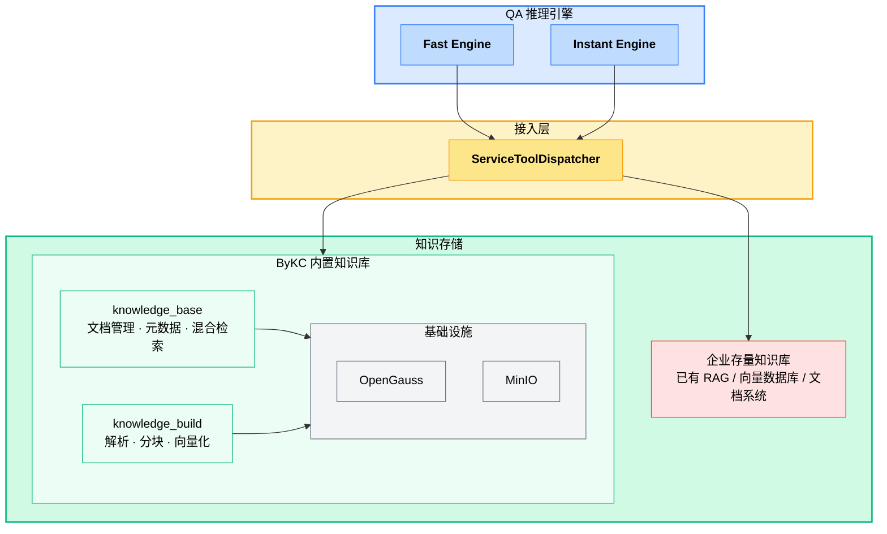

<div align="center">

# ByKC

**Beyond Knowledge Core · 企业知识中枢**

从文档入库到多跳推理，为企业 AI 智能体提供知识基座。

[](https://www.python.org/downloads/)
[](https://fastapi.tiangolo.com/)
[](https://github.com/langchain-ai/langgraph)
[](LICENSE)

[English](README.md) | 中文

</div>

---

## 项目定位

ByKC（Beyond Knowledge Core）是一套开源的企业知识推理引擎——企业的"数字老师傅"。它能够把散在钉钉、邮件、会议、代码等各种知识体系下的信息组成一张活的知识网络，让新人一上手就能调用老员工的经验。

技术层面，ByKC 的目标是**提升存量 RAG 知识库在复杂问答场景下的准确性**。

传统 RAG 的核心流程是”检索 Top-K 片段 → 拼接 → 生成”，面对真实业务问题时存在系统性缺陷：

| 传统 RAG 的问题 | ByKC 的做法 |
|---|---|
| **复合问答失败** — “A和B有何差异？”需要分别检索再对比，单次检索目标混杂导致命中内容相关度低 | **子问题分解检索** — 将复合问题拆分为多个独立子问题，每个子问题单独发起检索，单次检索目标单一，命中内容相关度更高<br/>*例：“A产品和B产品在续航和重量上有何差异？” → 拆为「A产品续航」「A产品重量」「B产品续航」「B产品重量」四个子问题* |
| **多跳推理断链** — “张三领导负责哪些项目？”存在推理链依赖，一次检索拿不到完整答案 | **逐步迭代检索推理** — 沿推理链多轮迭代检索，每一轮基于上一轮结果重构 query，逐步推进直至拿到完整证据链<br/>*例：“张三领导负责哪些项目？” → 第一轮检索“张三的领导是谁” → 得到“李四” → 第二轮检索“李四负责的项目”* |
| **跨库信息孤岛** — 信息分散在多个知识库，单次检索只能命中一个来源 | **知识库统一为 Agent 工具** — 将多个知识库整合为标准 Agent 工具集，Agent 并行调用各工具检索后统一聚合结果<br/>*例：“公司远程办公政策？” → 同时调用 HR制度库、IT安全库、财务报销库 三个工具，聚合后形成完整答案* |

为了实现上述能力，ByKC 采用分层架构——推理引擎通过接入层对接知识存储，既可使用内置的知识库全套能力，也可直接叠加在企业已有的 RAG 基础设施之上：



---

## 技术栈

| 层次 | 技术 |
|------|------|
| **API 框架** | [FastAPI](https://fastapi.tiangolo.com/) 0.115+ · Pydantic v2 |
| **AI 编排** | [LangGraph](https://github.com/langchain-ai/langgraph) 0.2+ · LangChain |
| **LLM 接入 / 向量化** | OpenAI-compatible API（支持任意兼容接口） |
| **数据库** | [OpenGauss](https://opengauss.org/)（PostgreSQL 兼容，内置向量检索） |
| **文档解析** | PyMuPDF（PDF）· python-docx（Word）· python-pptx（PPT）· openpyxl（Excel）|
| **全文检索** | OpenGauss FTS · Jieba 中文分词 |
| **对象存储** | [MinIO](https://min.io/)（S3 兼容） |
| **缓存 / 服务发现** | Redis |
| **运行时** | Python 3.12+ · [uv](https://github.com/astral-sh/uv) |

---

## 核心特性

- **双模式 QA 引擎** — Fast Engine应对简单问题；Instant Engine处理多跳复杂问题。同一套代码，按场景切换。
- **AgentOverride 热插拔** — 每个推理节点（分解器、检索 agent、聚合器、生成器）均可独立替换 prompt / middleware / tools，同一引擎适配法务、客服、研发等不同业务场景。
- **知识库即工具集** — ServiceToolDispatcher 将远程知识库 API 自动转化为 LangGraph 工具（search / listDir / glob / readFile），QA 引擎不绑定特定存储，可对接任何兼容服务。
- **元数据管理与结构化检索** — 支持自定义元数据字段、文件级元数据写入/读取、字段枚举，以及基于 Agent DSL 的结构化过滤；同一知识库可按全文、向量、混合多种模式检索。

---

## 核心设计

### 双引擎：Fast vs Instant

| | **Fast 引擎** | **Instant 引擎** |
|---|---|---|
| **场景** | 事实查询、定义解释、单一信息点 | 对比分析、多条件筛选、跨文档综合 |
| **流程** | 线性：改写 → 检索 → 生成 | 图：分解 → 并行 Agent → 聚合 → 终答 |
| **延迟** | 低（单轮 LLM + 单次检索） | 较高（多轮工具调用，子问题并行抵消部分延迟） |
| **示例** | "报销流程是什么？" | "A产品和B产品在可靠性和性能上有何差异？" |

### AgentOverride：节点级行为配置

两个引擎的每个 Agent 节点均支持通过 `AgentOverride` 独立配置，无需改引擎代码：

```python
from by_qa.qa.common.config import AgentOverride

config = {
    "agents": {
        # Instant 引擎节点：
        #   decomposer_agent / single_hop_agent / multi_hop_agent /
        #   multi_hop_summary_agent / aggregator_agent
        "single_hop_agent": AgentOverride(
            prompt="你是法律文档助手，必须引用原文条款编号...",
            middleware=[YourCustomMiddleware()],
            tools=[your_extra_tool],
        ),
        # Fast 引擎节点：
        #   rewriter_agent / answer_agent
        "answer_agent": AgentOverride(
            prompt="用三句话以内回答，语气亲切...",
        ),
    }
}
```

同一套引擎代码，法务场景替换 prompt 要求严格引用，客服场景注入简洁风格，研发场景追加代码搜索工具。

### ServiceToolDispatcher：知识库 → Agent 工具

QA 引擎不直接访问数据库，而是将远程知识库服务自动转化为 LangGraph 工具：

```python
dispatcher = ServiceToolDispatcher(knowledge_bases=[
    KnowledgeBaseConfig(
        kb_code="product_docs",
        service_name="by-qa-manager",
        operations={
            OperationType.KNOWLEDGE_SEARCH: "/api/v1/knowledgeItems/search",
            OperationType.LIST_DIR: "/api/v1/listDir",
            OperationType.GLOB: "/api/v1/glob",
            OperationType.READ_FILE: "/api/v1/readFile",
        }
    )
])
tools = dispatcher.build_tools()
# → [search_knowledge, list_directory, glob_search, read_file]
```

- 可对接任何实现相同协议的知识库服务，不绑定 ByKC 自身的 knowledge_base 模块
- Agent 拥有完整的知识探索能力：搜索、浏览目录、通配匹配、阅读原文
- 跨多个知识库并行检索，结果按相关性统一排序

---

## 快速开始

### 环境要求

- Python 3.12+
- [uv](https://github.com/astral-sh/uv)（推荐）或 pip
- Docker（知识库模块需要）

### 安装

```bash
# pip 安装（推荐）
pip install by-qa[all]

# 或使用 uv
uv pip install by-qa[all]

# 按需安装
pip install by-qa[knowledge]   # 仅知识库
pip install by-qa[qa]          # 仅问答引擎
```

从源码开发：

```bash
git clone https://github.com/beyonai/ByKC.git && cd ByKC
uv sync --all-extras
```

### 启动中间件

```bash
make kb-stack-up   # 一键拉起 OpenGauss + MinIO + Redis
```

### 配置

```bash
cp .env.example .env
```

关键变量：

```bash
LLM_BASE_URL=http://your-llm/v1       # OpenAI 兼容接口
LLM_API_KEY=your-key
LLM_STANDARD_MODEL=gpt-4o             # 主力推理
LLM_LIGHTWEIGHT_MODEL=gpt-4o-mini     # 分解/改写

EMBEDDING_BASE_URL=http://your-embedding
EMBEDDING_MODEL_NAME=bge-m3
EMBEDDING_DIMENSION=1024
```

### 启动服务

```bash
by-qa
```

访问 `/health` 查看已加载模块，`/docs` 查看知识库 API 文档。

### 端到端体验

通过 pip/uv 安装 by-qa 后，可以快速走通完整链路：

```bash
# 安装
pip install by-qa[all]
# 或
uv pip install by-qa[all]

# 配置环境变量（LLM、Embedding、中间件地址等）
cp .env.example .env && vi .env

# 启动服务
by-qa
```

服务运行后，依次调用 API 完成知识构建和问答：

```bash
# 1. 创建知识库
curl -X POST http://127.0.0.1:8000/api/v1/knowledgeBases/create \
  -H "Content-Type: application/json" \
  -d '{"knName": "my-docs", "knDescription": "产品文档库"}'
# → {"resultObject": {"knCode": "74", ...}}

# 2. 导入文件（支持 PDF/Word/PPT/Excel/Markdown/CSV）
curl -X POST http://127.0.0.1:8000/api/v1/knowledgeItems/import \
  -F "knCode=74" \
  -F "filePath=/docs/handbook.md" \
  -F "fileContent=@handbook.md"

# 3. 触发解析→分块→向量化（后台异步）
curl -X POST http://127.0.0.1:8000/api/v1/fileToMarkdownIndex \
  -H "Content-Type: application/json" \
  -d '{"knCode": "74", "filePath": "/docs/handbook.md"}'

# 4. 查询构建状态（status 变为 complete 即就绪）
curl -X POST http://127.0.0.1:8000/api/v1/fileBuildStatus \
  -H "Content-Type: application/json" \
  -d '{"knCode": "74", "filePath": "/docs/handbook.md"}'

# 5. 检索验证
curl -X POST http://127.0.0.1:8000/api/v1/knowledgeItems/search \
  -H "Content-Type: application/json" \
  -d '{"knCodeList": ["74"], "query": "如何使用", "topK": 3, "searchMode": "mixedRecall"}'
```

如果需要为文件定义业务属性、写入元数据、做纯结构化检索，或在全文/向量/混合检索中叠加 `where` 过滤，请查看独立文档 [元数据与检索扩展接口](docs/modules/knowledge/metadata_api.md)。

知识构建完成后，可使用仓库提供的问答脚本直接提问：

```bash
# Instant 引擎（多跳推理，适合复杂问题）
python examples/e2e_kb_qa/run_instant_qa.py --query "A和B有什么区别？"

# Fast 引擎（线性流水线，适合简单问题）
python examples/e2e_kb_qa/run_instant_qa.py --mode fast --query "报销流程是什么？"

# 更多选项
python examples/e2e_kb_qa/run_instant_qa.py --help
```

---

## 使用方式

### 知识库 API

知识库接口文档分为两部分：

- 基础知识库接口：文档与目录管理、知识构建、原文读取与下载，详见 [知识模块接口说明](docs/modules/knowledge/api.md)
- 元数据与检索扩展接口：元数据字段管理、文件级元数据维护、结构化检索、带 DSL 过滤的检索能力，详见 [元数据与检索扩展接口](docs/modules/knowledge/metadata_api.md)

当前内置能力包括：

- 文档与目录管理：知识库、目录、文件导入、原文读取、原始文件下载
- 知识构建：解析、分块、向量化、构建状态查询
- 元数据管理：元数据字段定义、批量创建、删除、文件级元数据更新/读取、全库字段枚举
- 检索模式：全文检索、向量检索、混合检索
- 结构化过滤：支持自定义字段与系统字段（如 `fileName`、`fileType`、`fileSize`、`mimeType`、`createdAt`、`updatedAt`、`filePath`）的 Agent DSL 过滤
- 文件级召回：`searchFile` 会对多 chunk 命中文件做聚合，适合先筛文件、再读原文

### QA 引擎（代码级集成）

QA 引擎是代码级能力入口，供上层 Agent 框架或业务服务集成：

```python
from by_qa.qa.engines.instant.engine import InstantQAEngine
from by_qa.qa.engines.fast.engine import FastQAEngine
from by_qa.qa.common.models import CoreInput
from by_qa.qa.common.config import AgentOverride

retrieval_config = {
    "knowledge_bases": [{
        "kb_code": "my_kb",
        "kb_name": "产品文档",
        "service_name": "by-qa-manager",
        "base_url": "http://127.0.0.1:8000",
        "operations": {
            "knowledgeSearch": "/api/v1/knowledgeItems/search",
            "listDir": "/api/v1/listDir",
            "readFile": "/api/v1/readFile",
        }
    }]
}

# 简单问题 → Fast
async with FastQAEngine({"retrieval": retrieval_config}) as engine:
    async for event in engine.stream_search(CoreInput(query="报销流程是什么？")):
        if event.type == "token":
            print(event.data["content"], end="")

# 复杂问题 → Instant + 自定义 agent 行为
async with InstantQAEngine({
    "retrieval": retrieval_config,
    "agents": {"single_hop_agent": AgentOverride(prompt="引用原文时标注页码...")}
}) as engine:
    async for event in engine.stream_search(CoreInput(query="两份合同的违约条款有何不同？")):
        if event.type == "token":
            print(event.data["content"], end="")
```

---

## 评估

内置标准化评估框架，当前支持 [FRAMES](https://huggingface.co/datasets/google/frames-benchmark) 多跳问答基准：

```bash
uv sync --extra eval --extra qa
uv run python -m eval.cli download frames
uv run python -m eval.cli ingest frames --kb-base-url http://127.0.0.1:8000
uv run python -m eval.cli run frames --mode instant --sample 10
```

添加新数据集：在 `eval/datasets/<name>/` 下实现 `DatasetSpec` 协议即可。

---

## 项目结构

```
src/by_qa/
├── main.py                 # FastAPI 入口，动态模块注册
├── config.py               # Pydantic Settings
├── core/                   # ModelConfigProvider 协议、日志、服务发现
├── knowledge_base/
│   ├── api/                # REST 路由
│   ├── services/           # 知识库管理、导入、元数据、检索
│   ├── repositories/       # OpenGauss 数据访问
│   └── infrastructure/     # 数据库连接池、MinIO 客户端
├── knowledge_build/
│   └── services/           # 文档解析、语义分块、Embedding
├── knowledge_common/       # 跨模块共享 schema
└── qa/
    ├── common/
    │   ├── base_engine.py          # BaseQAEngine 抽象基类
    │   ├── config.py               # QAEngineConfig / AgentOverride / QARetrievalConfig
    │   ├── models.py               # StreamEvent / CoreInput / CoreOutput
    │   ├── operation_registry.py   # 工具注册表
    │   └── middleware/             # ToolCallGuardMiddleware
    ├── agents/                     # 可复用子图
    │   ├── query_decomposer.py
    │   ├── single_hop_react.py
    │   ├── multi_hop_react.py
    │   ├── subanswer_aggregator.py
    │   └── answer_synthesizer.py
    ├── engines/
    │   ├── instant/                # Instant 引擎
    │   └── fast/                   # Fast 引擎
    ├── services/                   # LLMService、CheckpointerFactory
    └── tools/                      # ServiceToolDispatcher
```

---

## 路线图

- [ ] AgentOverride 增强：支持 MCP Server、外部 Tools、Skill 作为 agent 能力扩展，实现引擎与外部工具生态的无缝对接
- [x] 知识库元数据基础能力：支持自定义元数据字段、文件级元数据维护、结构化检索，以及全文/向量/混合多模式检索
- [ ] 结构化锚点：以业务主数据标注非结构化文档，建立文档与业务实体的自动关联
- [ ] 复利飞轮：用户图谱 → 企业图谱，个人知识沉淀为可复用的组织资产

---

## 许可证

[MIT License](LICENSE)
