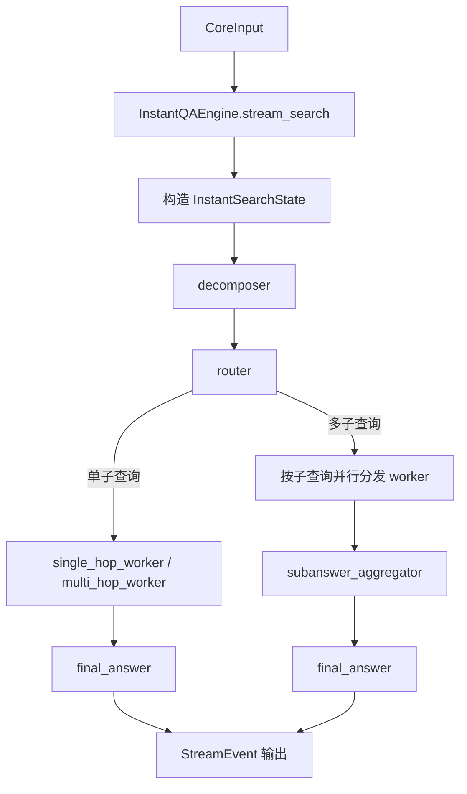
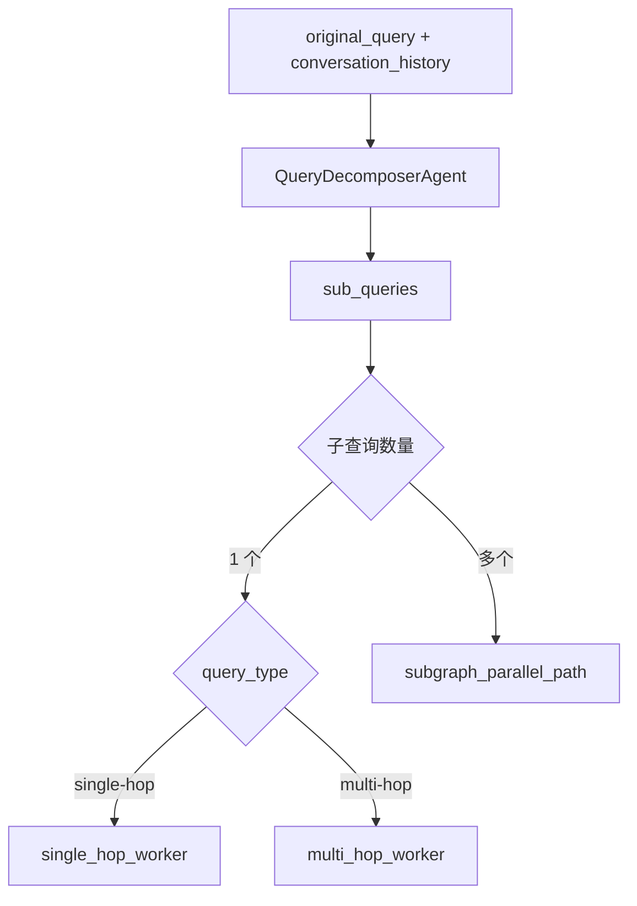
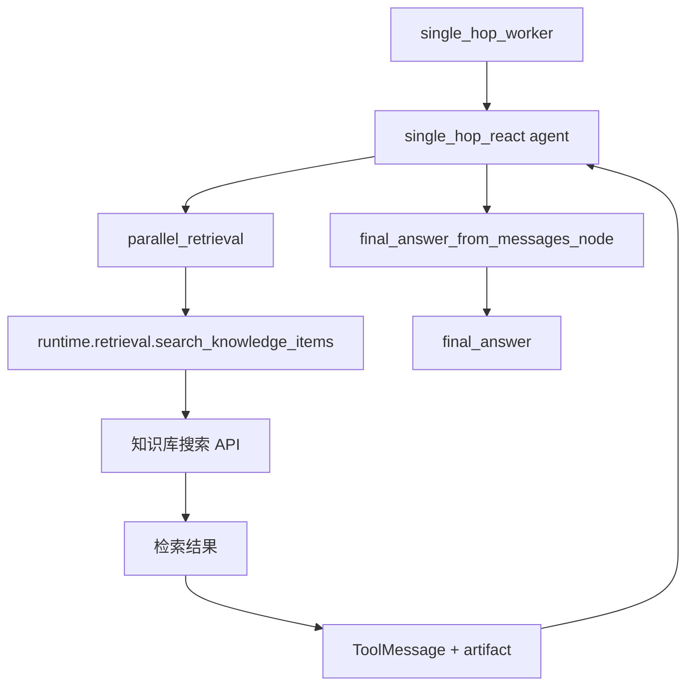
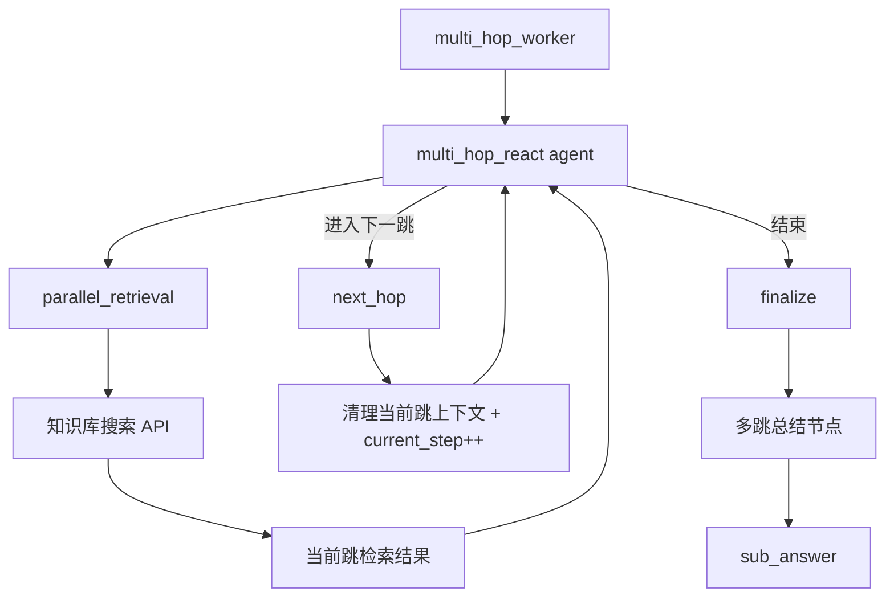
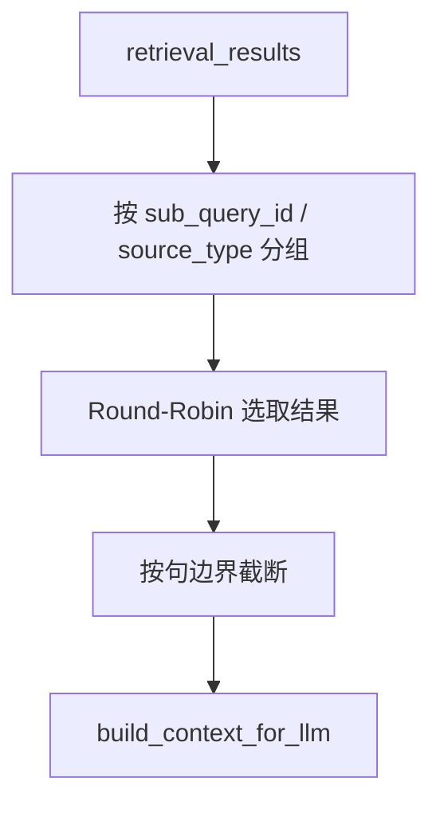
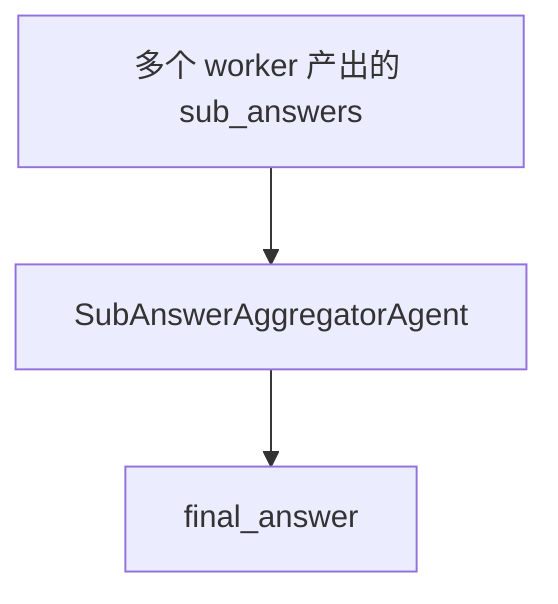
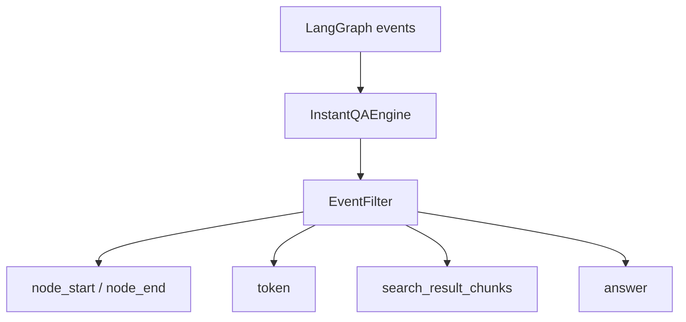

# 即时问答处理流程

## 总流程

说明：

- 入口是 `InstantQAEngine.stream_search()`
- 先分解问题，再决定走单 worker 还是并行 worker
- 单子查询直接出最终答案，多子查询先聚合再出最终答案
- LangGraph 内部事件最终会被转换成统一的 `StreamEvent`

## 分解与路由

说明：

- `decomposer` 会输出 `sub_queries`、`hop_count`、`query_type`
- `router` 先按“子查询数量”分流
- 单个子查询时，再由 worker 内部处理 single-hop 或 multi-hop

## 单跳流程

说明：

- 单跳问题通过 ReAct agent 驱动检索
- `parallel_retrieval` 负责调用知识库搜索接口
- 证据足够后，agent 直接生成答案

## 多跳流程

说明：

- 多跳问题会在同一子图里多次检索
- `next_hop` 用来推进步骤，不直接结束问题
- `finalize` 结束多跳推理，并产出该子查询的 `sub_answer`

## 上下文裁剪

说明：

- 使用 `CONTEXT_MAX_TOKENS`
- 使用 `INSTANT_SEARCH_MAX_CONTEXT_RATIO`
- 使用 `INSTANT_SEARCH_RESERVED_TOKENS`
- 使用 `INSTANT_SEARCH_MIN_SENTENCE_TOKENS`

## 多子查询聚合

说明：

- 多子查询场景不会直接结束
- 会先聚合 `sub_answers`
- 聚合后再写入 `final_answer`

## 流式输出

说明：

- 对外暴露的是统一的 `StreamEvent`
- 检索结果优先从 `ToolMessage.artifact` 提取
- 不直接暴露 LangGraph 原始事件结构
