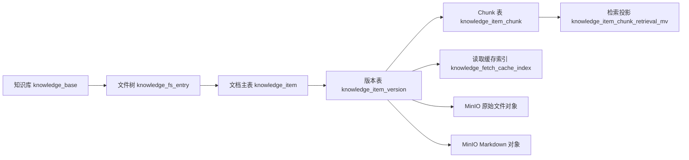
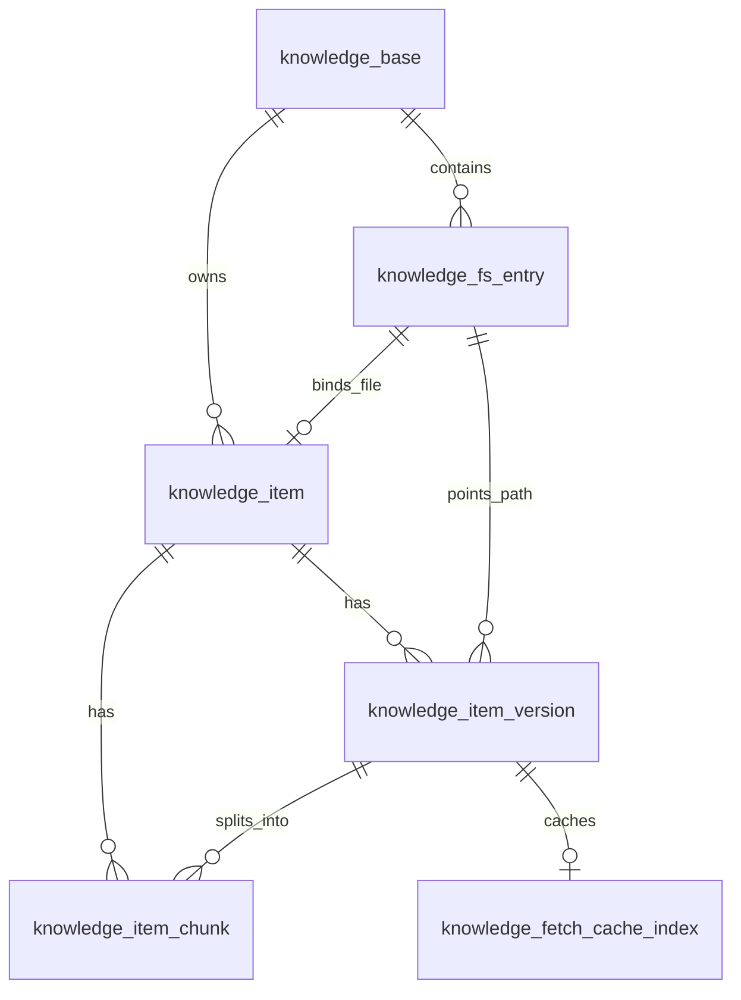

# 知识库模块存储设计文档

## 文档目标

本文档描述知识库模块的整体存储结构，回答三个核心问题：

- openGauss 中有哪些核心表，各自负责什么
- 这些表之间如何关联，主数据如何从知识库一路落到 chunk
- MinIO 中对象如何存、如何命名、如何参与导入和读取

相关文档：

- [framework.md](./framework.md)
- [design.md](./design.md)
- [api.md](./api.md)
- [minio.md](./minio.md)

## 整体存储结构

知识库模块采用“双存储层”设计：

- openGauss：保存结构化元数据、版本关系、chunk、检索投影和缓存索引
- MinIO：保存原始文件对象和 Markdown sidecar 对象

职责边界如下：

- 数据库是业务状态的权威来源
- MinIO 是文件内容的权威来源
- 本地缓存目录 `agent_data/kb_cache` 是读取优化层，不是业务主存储

整体数据流如下：



## 存储分层设计

### 1. 知识库层

负责描述一个知识库实例本身，包括编码、名称、状态和根目录入口。

对应表：

- `knowledge_base`

### 2. 文件树层

负责表达虚拟目录树，把知识库中的目录和文件路径统一建模。

对应表：

- `knowledge_fs_entry`

### 3. 文档主实体层

负责表达“这个文件对应的业务文档是谁”，把文件树节点和业务文档身份绑定起来。

对应表：

- `knowledge_item`

### 4. 文档版本层

负责表达同一个文档在不同版本下的文件内容、对象存储位置和摘要信息。

对应表：

- `knowledge_item_version`

### 5. 内容切片层

负责表达某个版本切分后的 chunk 内容，供全文检索、向量检索和上下文抽取使用。

对应表：

- `knowledge_item_chunk`
- 动态 embedding 表

### 6. 检索投影层

负责把“当前可检索版本”的知识库、文件、文档、版本和 chunk 字段拍平，服务检索链路。

对应表：

- `knowledge_item_chunk_retrieval_mv`

### 7. 读取缓存层

负责记录 Markdown sidecar 拉取到本地缓存后的索引信息，服务按行读取和重复读取优化。

对应表：

- `knowledge_fetch_cache_index`

## 数据库表设计

### `knowledge_base`

知识库主表，表示一个知识库租户。

核心字段：

- `kid`：主键
- `kb_code`：知识库编码，唯一
- `kb_name`：知识库名称
- `kb_description`：知识库描述
- `status`：`ACTIVE` 或 `INACTIVE`
- `is_deleted`：逻辑删除标记
- `metadata`：扩展元数据
- `root_entry_id`：根目录节点 ID

设计要点：

- 一个知识库只有一个根目录节点
- 软删除和状态控制并存，便于做业务可见性治理
- `root_entry_id` 将知识库和文件树根节点直接绑定

### `knowledge_fs_entry`

文件树节点表，统一建模目录和文件。

核心字段：

- `kid`：主键
- `knowledge_base_id`：所属知识库
- `parent_entry_id`：父目录节点
- `entry_type`：`DIRECTORY` 或 `FILE`
- `is_root`：是否根节点
- `name`：当前层级名称
- `full_path`：从知识库根开始的完整路径
- `path_ltree`：用于层级查询的 `ltree`
- `depth`：目录深度
- `status`、`is_deleted`：状态与软删除

关键约束：

- 根节点必须 `parent_entry_id IS NULL` 且 `depth = 0`
- 非根节点必须 `depth >= 1`
- 根节点 `full_path = ''`
- 同一知识库内活动路径唯一：`(knowledge_base_id, full_path)`
- 同一父目录下活动名称唯一：`(knowledge_base_id, parent_entry_id, name)`

设计要点：

- 文件树层只表达路径和层级，不表达业务文档版本
- 文件和目录共用一张表，便于统一做目录遍历和路径匹配
- `ltree` 主要服务目录查询、子树查询和路径匹配

### `knowledge_item`

文档主表，表示一个业务文档实体。

核心字段：

- `kid`：主键
- `knowledge_base_id`：所属知识库
- `fs_entry_id`：绑定的文件节点，唯一
- `item_code`：文档编码，在知识库内唯一
- `current_version_id`：当前版本
- `source_code`：来源系统
- `type_code`：文档类型
- `title`：标题
- `status`、`is_deleted`：状态与软删除
- `metadata`：扩展属性

关键约束：

- 一个文件节点最多绑定一个文档：`fs_entry_id UNIQUE`
- 一个知识库内 `item_code` 唯一

设计要点：

- `knowledge_fs_entry` 解决“文件在哪里”
- `knowledge_item` 解决“这是谁的业务文档”
- `current_version_id` 让检索和读取默认指向当前生效版本

### `knowledge_item_version`

版本表，记录文档每个版本对应的对象存储位置和摘要信息。

核心字段：

- `kid`：主键
- `knowledge_item_id`：所属文档
- `fs_entry_id`：所属文件节点
- `version`：版本号
- `bucket_name`、`object_key`：原始文件对象位置
- `markdown_bucket_name`、`markdown_object_key`：Markdown sidecar 对象位置
- `file_size`、`checksum`：原始文件大小与校验和
- `markdown_file_size`、`markdown_checksum`：Markdown 大小与校验和
- `mime_type`：文件类型
- `line_count`：Markdown 或文本行数

关键约束：

- 同一文档下 `version` 唯一：`(knowledge_item_id, version)`

设计要点：

- 版本表不直接保存大文本，只保存对象位置和摘要
- 原始文件与 Markdown sidecar 都挂在版本级，而不是文档级
- 当前实现支持“一个业务文档多个历史版本，一个当前版本”

### `knowledge_item_chunk`

chunk 表，记录某个版本切分后的文本块。

核心字段：

- `kid`：主键
- `knowledge_item_id`：所属文档
- `knowledge_item_version_id`：所属版本
- `chunk_no`：chunk 序号
- `start_line`、`end_line`：行区间
- `char_start`、`char_end`：字符区间
- `chunk_text`：chunk 原文
- `search_text`：全文检索向量

关键约束：

- 同一版本内 `chunk_no` 唯一
- `start_line >= 1`
- `end_line >= start_line`

设计要点：

- chunk 以版本为边界，避免不同版本内容互相污染
- `search_text` 为数据库全文检索预处理结果
- embedding 不直接存这张表，而是存动态 embedding 表

### 动态 embedding 表

该表由模板 `014_embedding_table.sql.tpl` 动态生成，按 embedding 模型注册结果落地。

逻辑结构：

- `kid`：主键
- `chunk_id`：对应 `knowledge_item_chunk.kid`
- `embedding`：向量字段

设计要点：

- 一个 chunk 对应一个 embedding 向量
- embedding 表按模型隔离，避免不同维度和距离度量相互污染
- 检索链路会把向量召回结果再和文本召回在服务层融合

### `knowledge_item_chunk_retrieval_mv`

当前版本检索投影表，用于把检索需要的字段拍平成一张宽表。

核心字段：

- `chunk_id`
- `knowledge_base_id`、`kb_code`、`knowledge_base_status`
- `fs_entry_id`、`parent_entry_id`、`full_path`
- `knowledge_item_id`、`item_code`、`knowledge_item_status`
- `current_version_id`、`knowledge_item_version_id`、`version`
- `source_code`、`type_code`
- `metadata`
- `chunk_no`、`start_line`、`end_line`
- `chunk_text`、`search_text`

设计要点：

- 只保留“当前版本”的检索视图，减少历史版本噪声
- 查询时不必多表 join，提升检索链路稳定性
- 命名虽然带 `mv`，当前实现是物化投影表，不是数据库原生 materialized view

### `knowledge_fetch_cache_index`

Markdown 读取缓存索引表，记录远端对象到本地缓存文件的映射。

核心字段：

- `knowledge_base_id`、`fs_entry_id`、`knowledge_item_id`、`knowledge_item_version_id`
- `kb_code`、`full_path`、`virtual_path`
- `bucket_name`、`object_key`、`checksum`
- `cache_file_path`
- `file_size`
- `cache_ttl_seconds`
- `first_cached_at`、`last_cached_at`、`last_accessed_at`、`expires_at`
- `cache_status`
- `evict_retry_count`
- `last_error`

关键约束：

- 一个版本最多一条缓存索引：`knowledge_item_version_id UNIQUE`
- 一个本地缓存路径只能被一个版本占用：`cache_file_path UNIQUE`
- `cache_status` 限定为 `READY`、`EVICTING`、`ERROR`

设计要点：

- 这张表不管理远端对象，只管理本地缓存文件状态
- 它服务 `read-file` 等读取接口的缓存命中与清理
- 是存储优化层，不是主业务表

## 表关系设计

### 主关系链

主关系链如下：



关系说明：

- 一个 `knowledge_base` 下有多个 `knowledge_fs_entry`
- 一个 `knowledge_base` 下有多个 `knowledge_item`
- 一个文件节点 `knowledge_fs_entry` 最多绑定一个 `knowledge_item`
- 一个 `knowledge_item` 下有多个 `knowledge_item_version`
- 一个 `knowledge_item_version` 下有多个 `knowledge_item_chunk`
- 一个 `knowledge_item_version` 最多对应一个 `knowledge_fetch_cache_index`

### 当前版本关系

`knowledge_item.current_version_id -> knowledge_item_version.kid`

这条关系负责：

- 指定当前对外生效的文档版本
- 驱动检索投影刷新
- 驱动默认读取行为

### 根目录关系

`knowledge_base.root_entry_id -> knowledge_fs_entry.kid`

这条关系负责：

- 标识知识库树的起点
- 保证目录遍历和文件创建有统一根节点

## MinIO 存储方法

### 存储对象类型

MinIO 中保存两类正式对象：

- 原始文件对象
- Markdown sidecar 对象

以及一类中间态对象：

- 临时对象 `tmp/`

### Bucket 设计

当前实现使用两个业务 bucket：

- 原始文件 bucket：`knowledge-base`
- Markdown bucket：`knowledge-base-markdown`

分桶原因：

- 原始文件和 Markdown sidecar 的读取模式不同
- Markdown 会被频繁读取和缓存
- 分桶后更利于做权限、配额和生命周期管理

### Object Key 设计

#### 临时对象 key

```text
tmp/{import_request_id}/content.md
```

用途：

- 导入事务开始时先写入临时区
- 避免事务失败时留下业务可见的正式对象

#### 原始文件 key

```text
{knowledge_base_id}/{full_path}/{version}/{file_name}
```

示例：

```text
12/hr/policy/leave.docx/v1/leave.docx
```

#### Markdown 对象 key

```text
{knowledge_base_id}/{full_path}/{version}/{stem}.md
```

示例：

```text
12/hr/policy/leave.docx/v1/leave.md
```

设计意图：

- 用 `knowledge_base_id` 做租户边界
- 用 `full_path` 保留业务语义
- 用 `version` 显式隔离不同版本
- 用文件名保留排障可读性

### 导入存储方法

导入时采用“临时上传 + 数据库提交 + 正式晋升”的方法。

步骤如下：

1. 原始文件上传到原始 bucket 的 `tmp/` 路径
2. Markdown sidecar 上传到 Markdown bucket 的 `tmp/` 路径
3. 数据库中写入 `knowledge_item`、`knowledge_item_version`、`knowledge_item_chunk`
4. 刷新 `knowledge_item.current_version_id`
5. 刷新 `knowledge_item_chunk_retrieval_mv`
6. 数据库事务提交成功后，将临时对象 copy 到正式 object key
7. 删除临时对象

这种方法的意义：

- 事务失败时，正式对象不会提前暴露
- 版本表中保存的对象位置是稳定引用
- 原始文件与 Markdown sidecar 的正式路径完全可追溯

### 读取存储方法

#### 原始文件读取

原始文件读取通过版本表中的：

- `bucket_name`
- `object_key`

定位对象，然后生成 MinIO 预签名 URL 返回。

适用场景：

- 文件下载
- 回放原始内容
- 不需要服务端做按行切片的读取

#### Markdown 读取

Markdown 读取通过版本表中的：

- `markdown_bucket_name`
- `markdown_object_key`

定位对象，但不会直接返回 URL，而是：

1. 先检查 `knowledge_fetch_cache_index`
2. 若缓存有效，则直接读取本地缓存文件
3. 若缓存无效，则从 MinIO 下载 Markdown 对象
4. 将内容写入 `agent_data/kb_cache`
5. upsert `knowledge_fetch_cache_index`
6. 按全文或按行区间返回内容

这样设计的原因：

- Markdown 常被按行读取
- 直接返回远端 URL 不方便服务端做 line window 裁切
- 同一版本 Markdown 可能被频繁复用，适合本地缓存

## 存储关系总结

可以把整个存储结构理解为三层：

1. 数据库主链：`knowledge_base -> knowledge_fs_entry -> knowledge_item -> knowledge_item_version -> knowledge_item_chunk`
2. 检索侧投影：`knowledge_item_chunk_retrieval_mv` 和动态 embedding 表
3. 文件内容侧：`knowledge_item_version -> MinIO 对象 -> knowledge_fetch_cache_index -> 本地缓存文件`

其中：

- 业务状态以数据库为准
- 文件内容以 MinIO 为准
- 检索性能依赖投影表和 embedding 表
- 读取性能依赖本地缓存索引表
