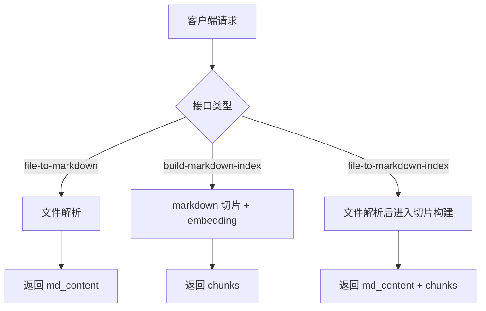
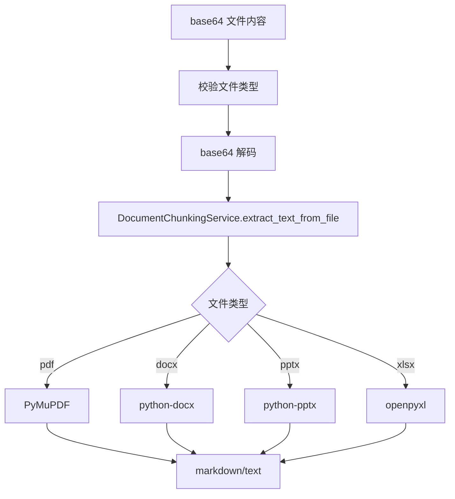
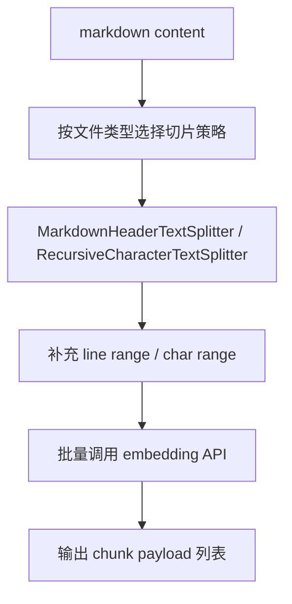
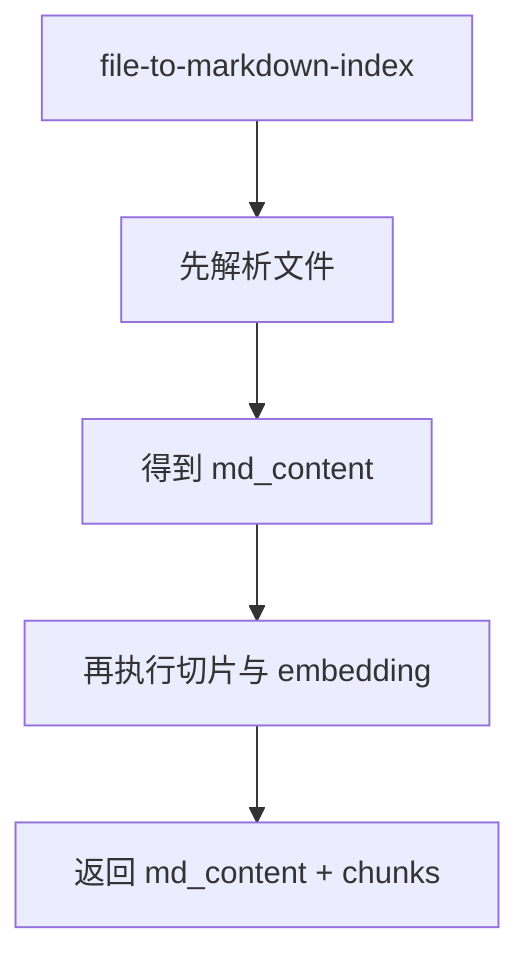
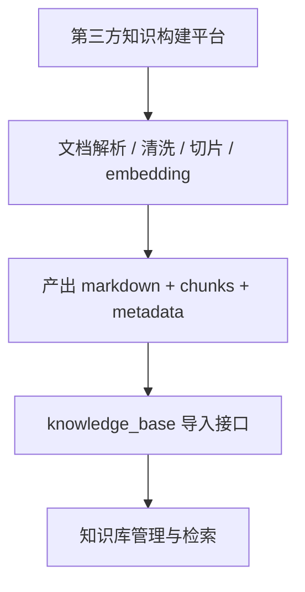

# 知识构建处理流程

## 总流程

说明：

- 当前模块提供 3 个示例接口
- 处理目标是输出构建中间产物
- 不直接负责知识库落库

## 文件解析流程

说明：

- 文件解析是示例级实现
- 目标是尽快拿到可构建文本
- 复杂版式和高保真解析不在当前范围内

## 构建流程

说明：

- markdown 优先按标题切片
- 纯文本走通用字符切片
- 最终输出统一的 chunk payload

## 组合流程

说明：

- 这个接口适合快速联调
- 更像示例入口，不一定适合生产长链路调用

## 推荐生产链路

说明：

- 生产检索效果通常更多取决于构建质量
- 当前 `knowledge_build` 主要用于示例和参考
- 若追求更稳定的检索效果，建议优先接入第三方知识构建能力
