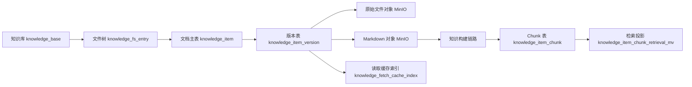
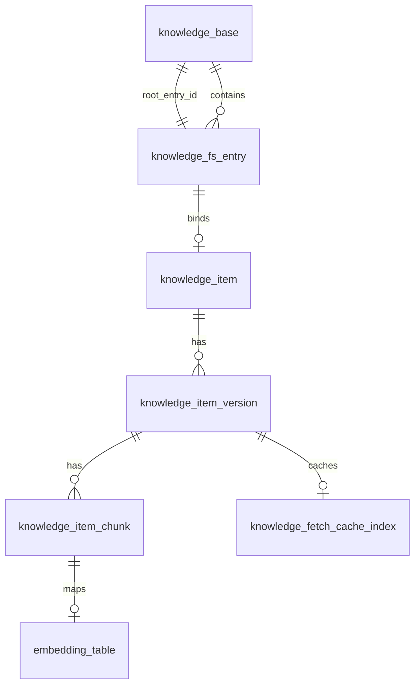
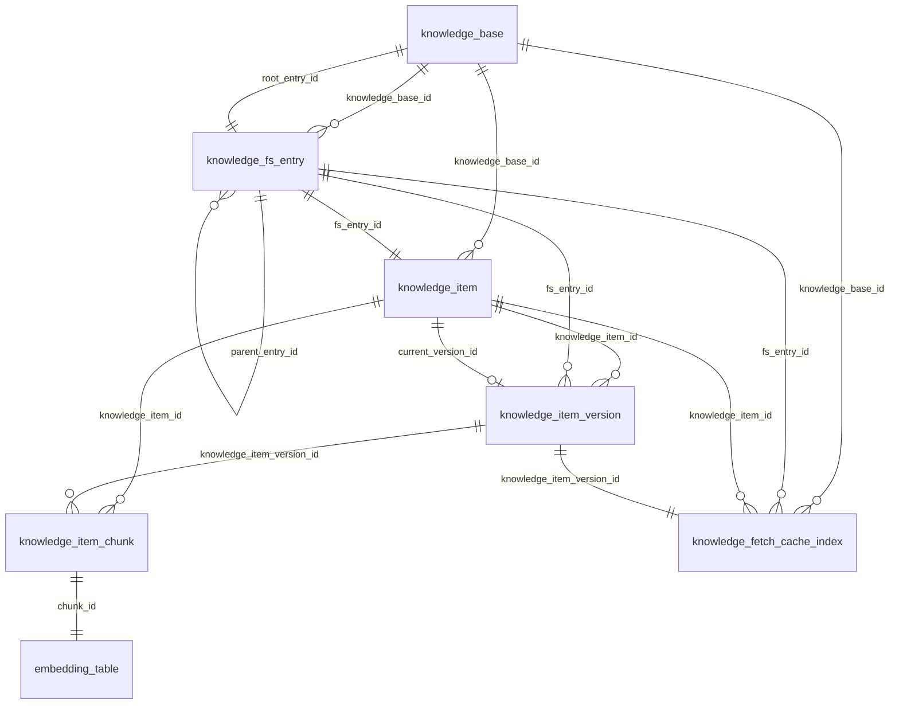

# 知识模块设计文档

## 文档目标

本文档描述知识模块的整体结构，回答 4 个核心问题：

- openGauss 中有哪些核心表，各自负责什么
- 这些表之间如何关联，主数据如何从知识库一路落到 chunk
- MinIO 中对象如何存、如何命名、如何参与导入和读取
- 文件解析、切片和 embedding 构建如何接入整条知识链路

相关文档：

- [framework.md](./framework.md)
- [design.md](./design.md)
- [api.md](./api.md)
- [process.md](./process.md)
- [minio.md](./minio.md)

## 整体结构

知识模块采用“双存储层 + 一条构建链路”设计：

- openGauss：保存结构化元数据、版本关系、chunk、检索投影和缓存索引
- MinIO：保存原始文件对象和 Markdown sidecar 对象
- 构建链路：负责原始文件转 Markdown、切片和向量化

职责边界如下：

- 数据库是业务状态的权威来源
- MinIO 是文件内容的权威来源
- 本地缓存目录 `agent_data/kb_cache` 是读取优化层，不是业务主存储
- 构建链路服务于导入后的读取和检索能力

整体数据流如下：

## 存储分层设计

### 1. 知识库层

负责描述一个知识库实例本身，包括编码、名称、状态和根目录入口。

对应表：

- `knowledge_base`

### 2. 文件树层

负责表达虚拟目录树，把知识库中的目录和文件路径统一建模。

对应表：

- `knowledge_fs_entry`

### 3. 文档主实体层

负责表达“这个文件对应的业务文档是谁”，把文件树节点和业务文档身份绑定起来。

对应表：

- `knowledge_item`

### 4. 文档版本层

负责表达同一个文档在不同版本下的文件内容、对象存储位置和摘要信息。

对应表：

- `knowledge_item_version`

### 5. 内容切片层

负责表达某个版本切分后的 chunk 内容，供全文检索、向量检索和上下文抽取使用。

对应表：

- `knowledge_item_chunk`
- 动态 embedding 表

### 6. 检索投影层

负责把“当前可检索版本”的知识库、文件、文档、版本和 chunk 字段拍平，服务检索链路。

对应表：

- `knowledge_item_chunk_retrieval_mv`

### 7. 读取缓存层

负责记录 Markdown sidecar 拉取到本地缓存后的索引信息，服务按行读取和重复读取优化。

对应表：

- `knowledge_fetch_cache_index`

## 数据库表设计

### `knowledge_base`

知识库主表，表示一个知识库租户。

核心字段：

- `kid`：主键
- `kb_code`：知识库编码，唯一
- `kb_name`：知识库名称
- `kb_description`：知识库描述
- `status`：`ACTIVE` 或 `INACTIVE`
- `is_deleted`：逻辑删除标记
- `metadata`：扩展元数据
- `root_entry_id`：根目录节点 ID

设计要点：

- 一个知识库只有一个根目录节点
- 软删除和状态控制并存，便于做业务可见性治理
- `root_entry_id` 将知识库和文件树根节点直接绑定

### `knowledge_fs_entry`

文件树节点表，统一建模目录和文件。

核心字段：

- `kid`：主键
- `knowledge_base_id`：所属知识库
- `parent_entry_id`：父目录节点
- `entry_type`：`DIRECTORY` 或 `FILE`
- `is_root`：是否根节点
- `name`：当前层级名称
- `path_ltree`：用于层级查询的 `ltree`
- `depth`：目录深度
- `status`、`is_deleted`：状态与软删除

关键约束：

- 根节点必须 `parent_entry_id IS NULL` 且 `depth = 0`
- 非根节点必须 `depth >= 1`
- 同一父目录下活动名称唯一：`(knowledge_base_id, parent_entry_id, name)`

设计要点：

- 文件树层只表达路径和层级，不表达业务文档版本
- 文件和目录共用一张表，便于统一做目录遍历和路径匹配
- 完整路径不再作为主数据持久化，读取侧按树结构推导
- `ltree` 主要服务目录查询、子树查询和路径匹配

### `knowledge_item`

业务实体主表，当前统一用于承载文件与目录的业务元数据。

核心字段：

- `kid`：主键
- `knowledge_base_id`：所属知识库
- `fs_entry_id`：绑定的文件节点，唯一
- `item_code`：文档编码，在知识库内唯一
- `item_kind`：`FILE` 或 `DIRECTORY`
- `description`：描述信息
- `current_version_id`：当前版本
- `source_code`：来源系统
- `type_code`：文档类型
- `status`、`is_deleted`：状态与软删除
- `metadata`：扩展属性

关键约束：

- 一个文件节点最多绑定一个文档：`fs_entry_id UNIQUE`
- 一个知识库内 `item_code` 唯一

设计要点：

- `knowledge_fs_entry` 解决“文件在哪里”
- `knowledge_item` 解决“这是谁的业务实体以及它有哪些业务属性”
- `current_version_id` 让检索和读取默认指向当前生效版本
- 当前名称真相位于 `knowledge_fs_entry.name`，`knowledge_item` 不再保存独立标题字段

### `knowledge_item_version`

版本表，记录文档每个版本对应的对象存储位置和摘要信息。

核心字段：

- `kid`：主键
- `knowledge_item_id`：所属文档
- `fs_entry_id`：所属文件节点
- `version`：版本号
- `bucket_name`、`object_key`：原始文件对象位置
- `markdown_bucket_name`、`markdown_object_key`：Markdown sidecar 对象位置
- `file_size`、`checksum`：原始文件大小与校验和
- `markdown_file_size`、`markdown_checksum`：Markdown 大小与校验和
- `mime_type`：文件类型
- `line_count`：Markdown 或文本行数

关键约束：

- 同一文档下 `version` 唯一：`(knowledge_item_id, version)`

设计要点：

- 版本表不直接保存大文本，只保存对象位置和摘要
- 原始文件与 Markdown sidecar 都挂在版本级，而不是文档级
- 支持“一个业务文档多个历史版本，一个当前版本”
- 对象键不再依赖逻辑路径，而是依赖稳定的知识库 ID、文档 ID 与版本号

### `knowledge_item_chunk`

chunk 表，记录某个版本切分后的文本块。

核心字段：

- `kid`：主键
- `knowledge_item_id`：所属文档
- `knowledge_item_version_id`：所属版本
- `chunk_no`：chunk 序号
- `start_line`、`end_line`：行区间
- `char_start`、`char_end`：字符区间
- `chunk_text`：chunk 原文
- `search_text`：全文检索向量

关键约束：

- 同一版本内 `chunk_no` 唯一
- `start_line >= 1`
- `end_line >= start_line`

设计要点：

- chunk 以版本为边界，避免不同版本内容互相污染
- `search_text` 为数据库全文检索预处理结果
- embedding 不直接存这张表，而是存动态 embedding 表

### 动态 embedding 表

该表由模板 `014_embedding_table.sql.tpl` 动态生成，按 embedding 模型注册结果落地。

逻辑结构：

- `kid`：主键
- `chunk_id`：对应 `knowledge_item_chunk.kid`
- `embedding`：向量字段

设计要点：

- 一个 chunk 对应一个 embedding 向量
- embedding 表按模型隔离，避免不同维度和距离度量相互污染
- 检索链路会把向量召回结果再和文本召回在服务层融合

### `knowledge_item_chunk_retrieval_mv`

当前版本检索投影表，用于把检索需要的字段拍平成一张宽表。

设计要点：

- 只暴露当前生效版本的 chunk
- 同时携带知识库、文件、版本与 chunk 信息
- 尽量避免检索时做多表复杂 join

### `knowledge_fetch_cache_index`

本地读取缓存索引表，用于管理 Markdown sidecar 的本地缓存。

核心字段：

- `knowledge_item_version_id`
- `bucket_name`、`object_key`
- `cache_file_path`
- `checksum`
- `expires_at`
- `cache_status`

设计要点：

- 服务 `readFile` 的按行读取能力
- 减少相同版本 Markdown 的重复下载
- 与后台缓存清理任务协同

## 表关系

核心主从关系如下：

也可以按业务链路理解为：

1. 一个 `knowledge_base` 对应一棵文件树
2. 文件树中的文件节点绑定一个 `knowledge_item`
3. 一个 `knowledge_item` 可以有多个 `knowledge_item_version`
4. 一个版本可以切分出多个 `knowledge_item_chunk`
5. 一个 chunk 对应一个 embedding 记录

### 基于 SQL 的关系说明

结合 `sql/knowledge_base/` 下的建表语句，核心关系可以表示为：

说明：

- 主链路是 `knowledge_base -> knowledge_fs_entry -> knowledge_item -> knowledge_item_version -> knowledge_item_chunk`。
- `knowledge_fs_entry` 既承担知识库根节点绑定，也承担目录树父子关系。
- `knowledge_item.current_version_id` 指向当前生效版本。
- `embedding_table` 是按模板动态生成的向量表，通过 `chunk_id` 与 `knowledge_item_chunk` 一对一关联。
- `knowledge_fetch_cache_index` 是版本级 Markdown 本地缓存索引表。
- `knowledge_item_chunk_retrieval_mv` 是检索宽表，保存拍平后的检索字段，不通过外键维护关系。

## 构建设计

知识构建链路包含 3 个阶段：

1. 原始文件解析为 Markdown
2. Markdown 切片
3. 切片向量化

支持的输入文件类型包括：

- `txt`
- `md`
- `csv`
- `pdf`
- `docx`
- `pptx`
- `xlsx`

设计说明：

- Markdown 文本优先按标题切片
- 纯文本走通用字符切片
- 最终输出统一的 chunk payload，落到版本与 chunk 体系中

## 读取设计

知识模块同时提供两类读取能力：

- `readFile`：返回 Markdown 文本内容，可按行范围读取
- `downloadFile`：直接返回原始文件流

设计说明：

- `readFile` 依赖 Markdown 对象与本地缓存索引
- `downloadFile` 直接面向原始对象，不需要服务端做文本切片

## 检索设计

知识检索以 chunk 为最小召回单元，返回：

- 所属知识库
- 文档路径
- chunk 编号
- chunk 文本
- 行号范围
- 融合得分

检索链路通常包括：

1. 文本召回
2. 向量召回
3. 服务层融合排序
4. 返回最终 chunk 命中列表
