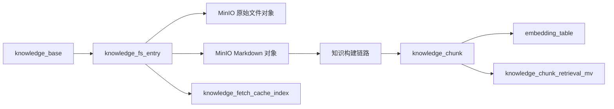
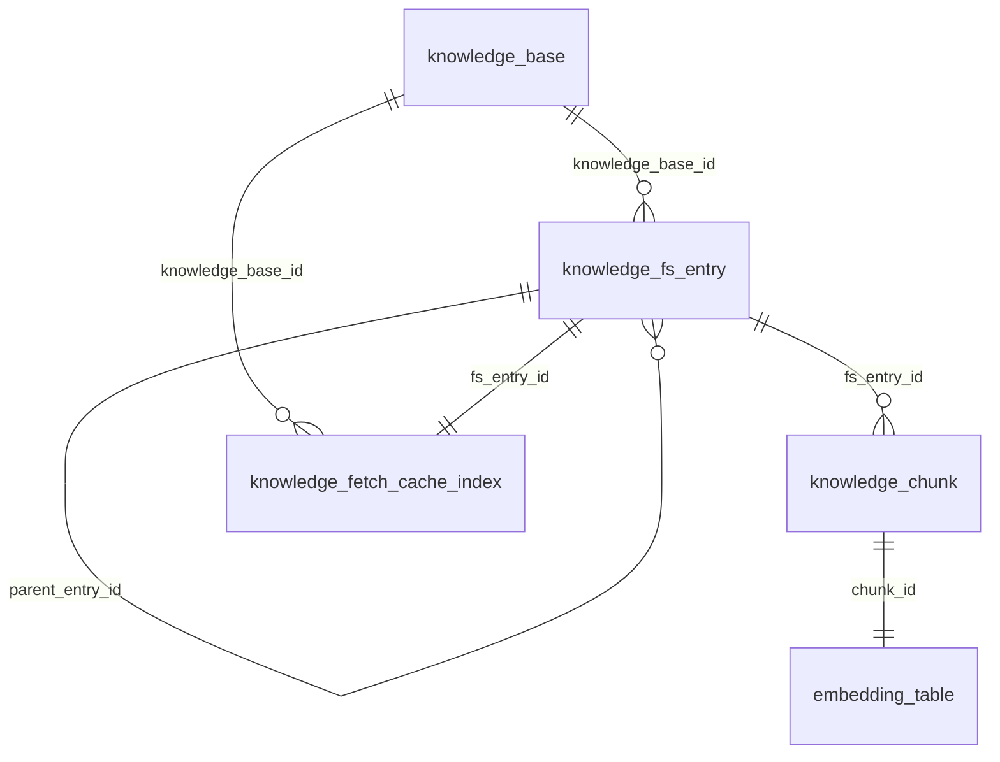

# 知识模块设计文档

## 文档目标

本文档描述知识模块的目标数据模型与存储结构，回答 4 个核心问题：

- openGauss 中有哪些核心表，各自负责什么
- 这些表之间如何关联，主数据如何从知识库一路落到 chunk
- MinIO 中对象如何存、如何命名、如何参与导入和读取
- 文件解析、切片和 embedding 构建如何接入整条知识链路

相关文档：

- [framework.md](./framework.md)
- [api.md](./api.md)
- [process.md](./process.md)
- [minio.md](./minio.md)

## 设计原则

本轮重构采用以下原则：

- 对外接口继续使用 `knCode`
- 数据库内部不再保存 `kb_code`，统一使用 `knowledge_base.kid`
- `knCode` 在接口层等价于 `knowledge_base.kid` 的字符串形式
- 路径树是唯一主模型
- 删除 `knowledge_item`、`knowledge_item_version`
- 保留 `knowledge_fetch_cache_index`，因为本地文件缓存仍然需要
- chunk 直接从属于文件节点，不再从属于旧的 item/version 体系

## 整体结构

知识模块采用“双存储层 + 一条构建链路”设计：

- openGauss：保存知识库、路径树、chunk、检索投影和缓存索引
- MinIO：保存原始文件对象和 Markdown sidecar 对象
- 构建链路：负责原始文件转 Markdown、切片和向量化

职责边界如下：

- 数据库是业务状态的权威来源
- MinIO 是文件内容的权威来源
- 本地缓存目录 `agent_data/kb_cache` 是读取优化层，不是业务主存储
- 构建链路服务于导入后的读取和检索能力

整体数据流如下：

## 存储分层设计

### 1. 知识库层

负责描述一个知识库实例本身。

对应表：

- `knowledge_base`

说明：

- 内部主键是 `kid`
- 对外 `knCode` 等价于 `kid` 的字符串形式
- 知识库名称与描述仍保留

### 2. 文件树层

负责表达虚拟目录树，把知识库中的目录和文件路径统一建模。

对应表：

- `knowledge_fs_entry`

说明：

- 目录和文件共用一张表
- 路径树是唯一主模型
- 文件节点本身直接携带对象存储位置和基础摘要信息

### 3. 内容切片层

负责表达某个文件切分后的 chunk 内容，供全文检索、向量检索和上下文抽取使用。

对应表：

- `knowledge_chunk`
- 动态 embedding 表

说明：

- chunk 直接从属于文件节点
- 不再依赖版本体系

### 4. 检索投影层

负责把检索需要的字段拍平，服务检索链路。

对应表：

- `knowledge_chunk_retrieval_mv`

说明：

- 这是面向检索的薄表
- 只保留检索真正需要的字段

### 5. 读取缓存层

负责记录 Markdown sidecar 拉取到本地缓存后的索引信息，服务按行读取和重复读取优化。

对应表：

- `knowledge_fetch_cache_index`

## 数据库表设计

### `knowledge_base`

知识库主表。

核心字段：

- `kid`：主键，同时作为对外 `knCode` 的内部来源
- `kb_name`：知识库名称
- `kb_description`：知识库描述
- `is_deleted`：逻辑删除标记

设计要点：

- 不再保存 `kb_code`
- 不再保存 `status`
- 不再保存 `metadata`
- 不再保存 `root_entry_id`
- 根目录通过 `knowledge_fs_entry.is_root = true` 推导

### `knowledge_fs_entry`

文件树节点表，统一建模目录和文件。

核心字段：

- `kid`：主键
- `knowledge_base_id`：所属知识库
- `parent_entry_id`：父目录节点
- `entry_type`：`DIRECTORY` 或 `FILE`
- `is_root`：是否根节点
- `name`：当前层级名称
- `path_ltree`：用于层级查询的 `ltree`
- `depth`：目录深度
- `description`：目录或文件描述
- `file_bucket_name`、`file_object_key`：原始文件对象位置
- `markdown_bucket_name`、`markdown_object_key`：Markdown 对象位置
- `file_size`、`mime_type`、`checksum`、`line_count`：文件摘要信息
- `is_deleted`：逻辑删除标记

关键约束：

- 根节点必须 `parent_entry_id IS NULL` 且 `depth = 0`
- 非根节点必须 `depth >= 1`
- 同一父目录下活动名称唯一
- 一个知识库只有一个根节点

设计要点：

- 文件树层既表达路径，也承载文件对象位置
- 不再引入额外的文档主实体表
- 完整路径不单独持久化为业务主字段，而通过树结构推导

### `knowledge_chunk`

chunk 表，记录某个文件切分后的文本块。

核心字段：

- `kid`：主键
- `fs_entry_id`：所属文件节点
- `chunk_no`：chunk 序号
- `start_line`、`end_line`：行区间
- `chunk_text`：chunk 原文
- `search_text`：全文检索向量

关键约束：

- 同一文件内 `chunk_no` 唯一
- `start_line >= 1`
- `end_line >= start_line`

设计要点：

- chunk 直接依附文件节点
- 不再保留 `knowledge_item_id`
- 不再保留 `knowledge_item_version_id`
- 不再保留字符偏移字段

### 动态 embedding 表

该表由模板 `014_embedding_table.sql.tpl` 动态生成，按 embedding 模型注册结果落地。

逻辑结构：

- `kid`：主键
- `chunk_id`：对应 `knowledge_chunk.kid`
- `embedding`：向量字段

设计要点：

- 一个 chunk 对应一个 embedding 向量
- embedding 表按模型隔离，避免不同维度和距离度量相互污染

### `knowledge_chunk_retrieval_mv`

检索投影表，用于把检索需要的字段拍平成一张宽度受控的表。

核心字段：

- `chunk_id`
- `knowledge_base_id`
- `fs_entry_id`
- `full_path`
- `chunk_no`
- `start_line`
- `end_line`
- `chunk_text`
- `search_text`

设计要点：

- 只保留检索真正需要的字段
- 删除旧版 `kb_code`、`item_code`、`version`、`source_code`、`type_code`、各类状态字段

### `knowledge_fetch_cache_index`

本地读取缓存索引表，用于管理 Markdown sidecar 的本地缓存。

核心字段：

- `knowledge_base_id`
- `fs_entry_id`
- `full_path`
- `bucket_name`、`object_key`
- `checksum`
- `cache_file_path`
- `file_size`
- `cache_ttl_seconds`
- `first_cached_at`、`last_cached_at`、`last_accessed_at`
- `expires_at`
- `cache_status`
- `evict_retry_count`
- `last_error`

设计要点：

- 一个文件节点对应一条缓存索引
- 缓存是版本外的当前态能力，因此不再依赖旧版本表
- 服务 `readFile` 的按行读取和重复读取优化

## 表关系

核心关系如下：

说明：

- 主链路是 `knowledge_base -> knowledge_fs_entry -> knowledge_chunk`。
- `knowledge_fs_entry` 同时承担根目录与目录树父子关系。
- `embedding_table` 是按模板动态生成的向量表，通过 `chunk_id` 与 `knowledge_chunk` 一对一关联。
- `knowledge_fetch_cache_index` 是文件节点级 Markdown 本地缓存索引表。
- `knowledge_chunk_retrieval_mv` 是检索薄表，保存拍平后的检索字段，不通过外键维护关系。

## MinIO 设计要点

- 原始文件对象位置直接挂在 `knowledge_fs_entry.file_bucket_name/file_object_key`
- Markdown 对象位置直接挂在 `knowledge_fs_entry.markdown_bucket_name/markdown_object_key`
- `downloadFile` 直接读取原始文件对象
- `readFile` 优先使用 `knowledge_fetch_cache_index` 指向的本地缓存，未命中时再从 Markdown 对象下载

## 接口映射

- 创建知识库：落 `knowledge_base`
- 创建/修改/删除目录：落 `knowledge_fs_entry`
- 上传文档：写 MinIO，并更新文件节点对象信息
- `readFile`：依赖 `knowledge_fetch_cache_index`
- `downloadFile`：按文件节点的原始对象位置直接返回文件流
- `fileToMarkdownIndex`：重建 `knowledge_chunk + embedding_table + knowledge_chunk_retrieval_mv`
- 检索：查 `knowledge_chunk_retrieval_mv`

## 本轮删除项

本轮设计明确删除以下旧模型：

- `knowledge_item`
- `knowledge_item_version`
- 旧版 `knowledge_item_chunk`
- 旧版 `knowledge_item_chunk_retrieval_mv`
- `knowledge_base.kb_code`
