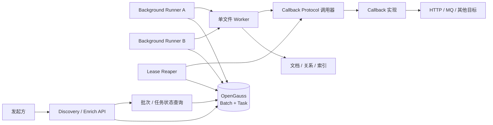
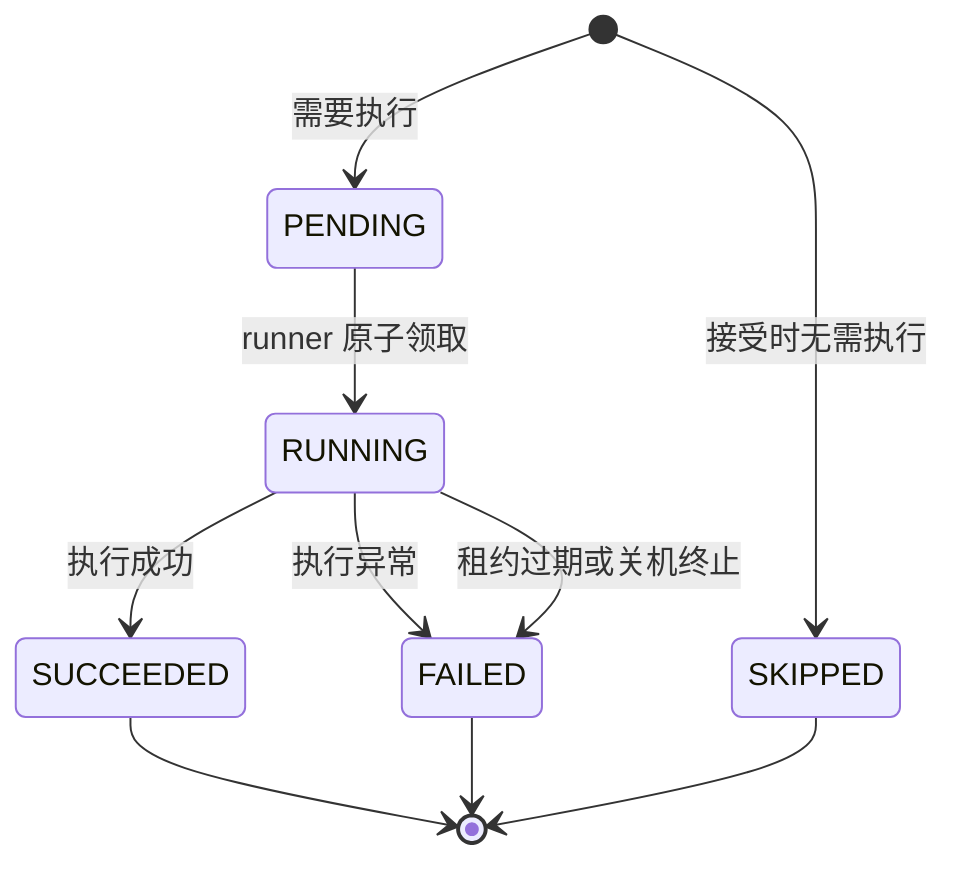
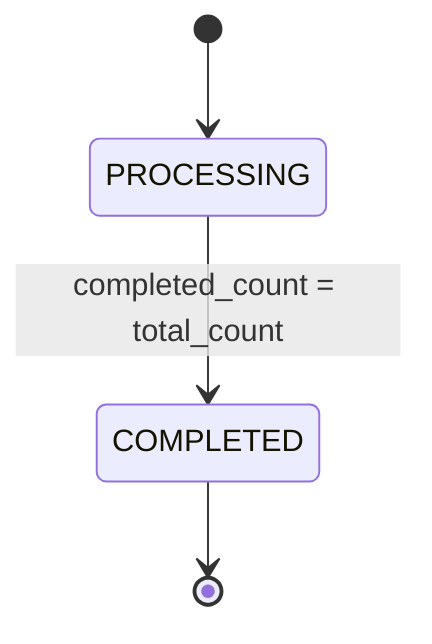

# KnowledgeEntity 后台处理与 Callback 简化设计

## 1. 文档目标

本文档定义 KnowledgeEntity Discovery 和 Enrich 的最小后台运行、批次进度和 Callback 方案。

目标包括：

- API 只接受请求，不在请求生命周期内执行文件处理；
- 后台 runner 可以由多个进程或多个实例并发运行；
- 以单个文件为任务粒度，单文件失败不影响同批其他文件；
- 可以查询批次总体进度和每个文件的最终状态；
- 每个文件进入终态时调用一次文件完成 Callback Protocol；
- 批次全部文件进入终态时调用一次批次完成 Callback Protocol；
- 发起方可以提供 `extraParams`，服务不解释其内容，原样透传到 Callback；
- Discovery 和 Enrich 失败后不自动恢复、不自动重试；
- 在满足上述需求的前提下尽量减少数据表和状态数量。

KnowledgeEntity 定义和业务处理方法仍以以下文档为准：

- [KnowledgeEntity 发现、身份治理与文档富化方法论设计](./knowledge-entity-discovery-enrichment-design.md)
- [KnowledgeEntity 异步处理约定](./api/entity-processing.md)

## 2. 最终决策

### 2.1 只保留两类核心数据

目标模型只包含：

1. 一个新增的批次表；
2. 现有 `knowledge_semantic_processing_task` 任务表的增量扩展。

不新增：

- BatchItem 表；
- Callback notification/outbox 表；
- 通用调度事件表；
- 任务重试记录表。

每个批次中的每个候选文件都对应一条任务记录。需要处理的文件从 `pending` 开始，不需要处理的文件直接创建为 `skipped`。因此任务表本身同时承担文件进度明细，不再需要 BatchItem。

### 2.2 核心只定义 Callback Protocol

任务或批次终态事务提交后，处理进程调用注入的 Callback Protocol 实现。

核心模块只规定：

- 文件完成和批次完成两个调用时机；
- 两个方法的输入模型；
- 方法正常返回表示本次调用完成；
- 方法抛出异常时由核心隔离，不能改变 task 或 batch 结果。

核心模块不规定：

- HTTP、RPC、消息队列或本地函数等传输方式；
- URL、认证、请求头或 wire format；
- 超时、并发、重试、退避和幂等实现；
- Callback 实现是否自行保存 outbox 或投递记录。

核心不保存 Callback 通知记录，也不会因调用失败重新执行业务任务。服务在“终态已提交、Protocol 尚未调用”之间被强制 kill 时，本次调用可能丢失。状态查询接口始终是最终事实来源。

### 2.3 业务任务不自动重试

以下情况都直接进入 `failed`：

- 业务校验失败；
- LLM 请求或最终输出校验失败；
- 数据库、对象存储、构建或索引失败；
- 运行中的 worker 丢失，租约过期；
- 优雅关机宽限期结束后任务仍未完成。

`failed` 任务不会被重新标记为 `pending`。调用方需要再次处理时，必须显式发起新请求，创建新的批次和任务。

LLM 客户端内部对单次无效输出所做的有界格式修正，属于一次文件执行的内部步骤，不属于任务自动重试。

### 2.4 不跨批次共享任务

取消 BatchItem 后，一条任务只属于一个批次，不再让同一活动任务同时服务多个批次。

当新请求命中同文件、同任务类型的活动任务时：

- 新批次仍创建自己的任务记录；
- 新任务直接为 `skipped`；
- `result_payload` 记录 `reasonCode=ALREADY_PROCESSING` 和原活动 `taskId`；
- 新批次不会等待或继承原任务的最终结果。

这是删除 BatchItem 所换取的主要简化。如果业务要求多个批次订阅同一任务结果，就必须恢复任务与批次的多对多关联表。

## 3. 当前实现和需要调整的部分

当前实现已经具备：

- `knowledge_semantic_processing_task` 持久化任务表；
- `batch_id`、任务状态、进度、结果和错误字段；
- `request_params jsonb`；
- 单文件活动任务唯一约束；
- 进程内 `asyncio.create_task` 调度；
- 进程内 Python callable Callback。

当前主要问题是：

- API 进程被 kill 后，内存中的执行协程和 callable 一起丢失；
- `running` 没有 worker 所有权和租约，无法判断任务是否已经失去执行者；
- 当前 `batch_id` 只是任务字段，没有独立批次记录，无法可靠表达零文件批次、批次完成竞争和批次级参数；
- `request_params` 是 worker 的执行输入，不能直接等同于下游透传参数；
- 当前一个活动任务可能被后续请求复用，但该任务只保存一个 `batch_id`，不适合文件级批次 Callback。

目标设计将请求内调度替换为数据库抢占式 runner，并把临时 Python callable 收敛为可注入、类型明确的 Callback Protocol。

## 4. 总体架构



组件职责：

- API：创建批次和文件任务；
- Background Runner：抢占 `pending` 任务并有界并发执行；
- 单文件 Worker：执行 Discovery 或 Enrich；
- Lease Reaper：将失去 worker 的 `running` 任务终止为 `failed`；
- Callback Protocol 调用器：终态提交后调用注入实现，并隔离实现异常；
- Callback 实现：自行决定 HTTP、MQ、持久化、重试和认证等细节；
- 状态查询：从数据库返回权威批次进度和文件结果。

Runner、Reaper 和 Callback Protocol 调用器可以先随知识库服务进程启动，不要求第一版拆成独立部署单元。

## 5. 简化后的数据模型

### 5.1 表数量

| 数据对象 | 处理方式 | 用途 |
| --- | --- | --- |
| `knowledge_semantic_processing_batch` | 新增 | 保存批次身份、进度游标和批次透传参数 |
| `knowledge_semantic_processing_task` | 扩展现有表 | 同时作为执行任务和文件级批次明细 |
| `knowledge_build_task` | 可选扩展现有表 | 关联 Enrich 发起的构建任务 |

不创建 Callback 表。核心只记录 Protocol 调用结果；具体传输结果由 Callback 实现自行记录。

### 5.2 批次表

建议新增 `knowledge_semantic_processing_batch`：

| 字段 | 类型 | 约束 | 说明 |
| --- | --- | --- | --- |
| `batch_id` | `varchar(64)` | PK | 对外批次 ID，直接作为主键，不再增加内部 `kid` |
| `knowledge_base_id` | `bigint` | FK NOT NULL | 所属知识库 |
| `task_type` | `varchar(32)` | NOT NULL | `ENTITY_DISCOVERY` 或 `DOCUMENT_ENRICH` |
| `scope` | `varchar(16)` | NOT NULL | `SINGLE_FILE` 或 `WHOLE_KB` |
| `status` | `varchar(16)` | NOT NULL | `processing` 或 `completed` |
| `total_count` | `integer` | NOT NULL | 本批次任务行总数，包括 `skipped` |
| `completed_count` | `integer` | NOT NULL DEFAULT 0 | 已进入终态的任务数 |
| `version` | `bigint` | NOT NULL DEFAULT 0 | 每个文件进入终态时递增，用于处理 Callback 乱序 |
| `extra_params` | `jsonb` | NOT NULL DEFAULT '{}' | 批次 Callback 的发起方透传参数 |
| `created_at` | `timestamptz` | NOT NULL | 创建时间 |
| `completed_at` | `timestamptz` | NULL | 批次完成时间 |
| `updated_at` | `timestamptz` | NOT NULL | 更新时间 |

批次只有 `processing` 和 `completed`，不存在 `failed`。单文件失败通过任务状态和聚合计数表达。

约束：

```text
0 <= completed_count <= total_count
status = completed => completed_count = total_count
```

批次表只持久化总数、完成数和版本。`pending/running/succeeded/failed/skipped` 的细分数量由任务表按 `batch_id, status` 聚合，避免在批次表保存五组容易失配的计数器。

### 5.3 任务表扩展

现有 `knowledge_semantic_processing_task` 继续保留以下字段：

- `knowledge_base_id`；
- `fs_entry_id`；
- `task_type`；
- `batch_id`；
- `status`、`current_stage`、`progress`；
- `input_fingerprint`、`input_checksum`、`method_version`；
- `request_params`；
- `result_payload`；
- `error_code`、`error_message`；
- 各时间字段。

建议新增或调整：

| 字段 | 类型 | 约束 | 说明 |
| --- | --- | --- | --- |
| `batch_id` | `varchar(64)` | FK NOT NULL | 一条任务只属于一个批次 |
| `fs_entry_id` | `bigint` | FK NULL | 稳定文件身份；文件删除后保留任务记录 |
| `file_path_snapshot` | `text` | NOT NULL | 接受请求时的文件路径快照 |
| `extra_params` | `jsonb` | NOT NULL DEFAULT '{}' | 文件 Callback 的发起方透传参数 |
| `worker_id` | `varchar(160)` | NULL | 当前 worker 实例 |
| `lease_token` | `varchar(64)` | NULL | 本次领取的 fencing token |
| `heartbeat_at` | `timestamptz` | NULL | 最近心跳 |
| `lease_expires_at` | `timestamptz` | NULL | 租约过期时间 |
| `failure_kind` | `varchar(32)` | NULL | `BUSINESS`、`INFRASTRUCTURE`、`WORKER_LOST` 或 `WORKER_SHUTDOWN` |
| `outcome_uncertain` | `boolean` | NOT NULL DEFAULT false | 失败前是否可能发生部分副作用 |

任务唯一约束：

```sql
UNIQUE (batch_id, fs_entry_id)
```

现有 `fs_entry_id` 外键的 `ON DELETE CASCADE` 需要调整为 `ON DELETE SET NULL`，同时保留 `file_path_snapshot`。否则运行中文件被删除时，task 会被级联删除，导致批次总数和完成数永久不一致。新任务创建时 `fs_entry_id` 仍必须有值，只有文件后续被删除时才允许变为 NULL。

同一文件、同一类型同时只允许一个活动执行任务：

```sql
CREATE UNIQUE INDEX uq_knowledge_semantic_task_active_per_file
    ON knowledge_semantic_processing_task (fs_entry_id, task_type)
    WHERE status IN ('pending', 'running');
```

领取索引：

```sql
CREATE INDEX idx_knowledge_semantic_task_claim
    ON knowledge_semantic_processing_task (status, created_at, kid)
    WHERE status = 'pending';
```

批次查询索引：

```sql
CREATE INDEX idx_knowledge_semantic_task_batch_status
    ON knowledge_semantic_processing_task (batch_id, status, kid);
```

### 5.4 `request_params` 与 `extra_params`

两个字段职责必须分开：

| 字段 | 谁使用 | 内容 | 是否进入 Callback |
| --- | --- | --- | --- |
| `request_params` | worker | `maxEntities`、`topK`、`force` 等执行参数快照 | 否 |
| `extra_params` | 下游业务服务 | `requestId`、`sourceSystem`、`tenantId` 等不透明关联参数 | 是，作为 `extraParams` 原样返回 |

`extra_params` 规则：

- API 字段名为 `extraParams`；
- 必须是 JSON object，默认 `{}`；
- 服务只校验可序列化性、大小和深度，不解释业务字段；
- 不参与输入指纹和任务幂等判断；
- 不允许通过它覆盖 Callback 输入模型中的 `task_id`、`batch_id`、任务状态或进度字段；
- JSONB 保证 JSON 语义透传，不保证键顺序或数字的原始文本形式；
- 建议序列化后最大 16 KiB、嵌套深度最大 8；
- 不应放入密码、token、文档正文或其他敏感内容。

请求级 `extraParams` 同时写入 batch 和本批次的每条 task。这一小份数据重复是有意的：

- 文件 Callback 可以只依赖任务行生成；
- 批次 Callback 可以只依赖批次行生成；
- 零文件批次仍然可以向批次完成 Protocol 输入提供 `extraParams`。

第一版请求是单文件或全库统一参数，因此同批每个任务使用相同 `extraParams`。如果未来支持 `files[]` 输入，可以用“批次参数与文件参数浅合并”的方式生成每条任务的最终 `extra_params`。

### 5.5 Enrich 构建任务关联

Enrich 更新文档后会触发 Markdown 和索引构建。为防止 semantic worker 丢失后留下无法判断归属的构建任务，建议在现有 `knowledge_build_task` 增加：

| 字段 | 类型 | 说明 |
| --- | --- | --- |
| `parent_semantic_task_id` | `bigint` | 可空 FK，指向发起构建的 Enrich 任务 |

这不是新表，只是现有表的可选关联字段。

## 6. 批次接受流程

### 6.1 单一事务

一次 Discovery 或 Enrich 请求在一个数据库事务中：

1. 生成 `batchId`；
2. 创建 `processing` 批次，保存 `extra_params`；
3. 获取请求范围内的候选文件；
4. 按 `fs_entry_id` 升序锁定和处理候选文件；
5. 每个候选文件都创建一条属于当前批次的 task；
6. 可执行文件创建为 `pending`；
7. 不需要执行的文件创建为 `skipped`，记录原因；
8. 设置批次 `total_count`、`completed_count` 和 `version`；
9. 如果所有任务都已 `skipped`，将批次直接置为 `completed`；
10. 提交事务；
11. 事务提交后，依次调用立即终态的文件 Callback 和可能存在的批次 Callback。

接受事务失败时，batch 和 task 一起回滚。

### 6.2 跳过原因

立即 `skipped` 的常见原因：

- 文件类型或文档状态不支持；
- Discovery 遇到 KnowledgeEntity 目录内的实体文档；
- Enrich 遇到非 KnowledgeEntity 文档；
- `force=false` 且输入没有变化；
- 同文件、同任务类型已有 `pending/running` 任务；
- 文件在接受期间被删除或变得不可用。

任务的 `result_payload` 至少记录：

```json
{
  "reasonCode": "ALREADY_PROCESSING",
  "activeTaskId": "12345"
}
```

或：

```json
{
  "reasonCode": "INPUT_UNCHANGED",
  "reusedTaskId": "12001"
}
```

### 6.3 为什么 skipped 也建任务

这样可以直接满足：

- `batch_id` 下的任务数就是批次文件总数；
- 每个候选文件都有独立状态；
- 每个文件都可以得到文件级 Callback；
- 批次进度可以直接从任务表聚合；
- 不再需要 BatchItem。

代价是会多保存少量终态 task 行，但比增加一张多对多明细表更简单。

## 7. 状态机

### 7.1 文件任务



终态为：

- `succeeded`；
- `failed`；
- `skipped`。

目标版本不新产生 `cancelled`。现有表约束可以暂时保留该值兼容历史数据。

### 7.2 批次



批次不因文件失败进入失败状态。

### 7.3 进度

```text
progress = 100                                      , total_count = 0
progress = floor(completed_count * 100 / total_count), 其他情况
```

批次细分数量通过任务表聚合：

```sql
SELECT status, COUNT(*)
FROM knowledge_semantic_processing_task
WHERE batch_id = :batch_id
GROUP BY status;
```

## 8. 后台抢占和并发

### 8.1 原子领取

每个空闲执行槽位领取一个 task，并生成独立 `lease_token`：

```sql
UPDATE knowledge_semantic_processing_task
SET status = 'running',
    current_stage = 'started',
    progress = 1,
    worker_id = :worker_id,
    lease_token = :lease_token,
    heartbeat_at = NOW(),
    lease_expires_at = NOW() + (:lease_seconds * INTERVAL '1 second'),
    started_at = COALESCE(started_at, NOW()),
    updated_at = NOW()
WHERE kid IN (
    SELECT kid
    FROM knowledge_semantic_processing_task
    WHERE status = 'pending'
    ORDER BY created_at, kid
    LIMIT 1
    FOR UPDATE SKIP LOCKED
)
RETURNING *;
```

Runner 按可用并发槽位重复领取，不能一次把大量任务标记为 `running` 后留在进程内排队。

### 8.2 并发模型

- 多进程、多实例通过 OpenGauss `FOR UPDATE SKIP LOCKED` 竞争；
- 每个进程使用有界 `asyncio.Semaphore`；
- Discovery 和 Enrich 可以配置独立并发上限；
- 阻塞文件解析工作通过 `asyncio.to_thread` 执行；
- 单文件最外层捕获所有异常，不使用批次级 fail-fast `gather`；
- 一个文件失败后，runner 继续领取其他 `pending` 任务。

### 8.3 公平性

第一版按 `created_at, kid` 领取即可。如果后续出现大批次长期占满队列，再考虑按知识库或批次做公平调度；当前不增加优先级和调度策略字段。

## 9. 租约、进程 kill 和 fencing

### 9.1 心跳

```sql
UPDATE knowledge_semantic_processing_task
SET heartbeat_at = NOW(),
    lease_expires_at = NOW() + (:lease_seconds * INTERVAL '1 second'),
    updated_at = NOW()
WHERE kid = :task_id
  AND status = 'running'
  AND worker_id = :worker_id
  AND lease_token = :lease_token;
```

更新行数为 0 表示当前 worker 已丢失任务所有权，必须停止处理。

租约判断使用 `lease_expires_at`，不使用“开始运行超过 10 分钟”。合法的 LLM 或索引任务可能运行很久，只要心跳正常就继续执行。

### 9.2 Lease Reaper

Reaper 定期锁定过期的 `running` 任务，并调用与普通失败相同的终态提交逻辑：

- task 置为 `failed`；
- `failure_kind=WORKER_LOST`；
- `error_code=WORKER_LOST`；
- `outcome_uncertain=true`；
- 批次 `completed_count` 和 `version` 递增；
- 如果这是最后一个任务，批次置为 `completed`；
- 提交后尝试调用文件和批次 Callback Protocol；
- 不将任务恢复为 `pending`。

多个 Reaper 使用 `FOR UPDATE SKIP LOCKED`，避免重复终止同一任务。

### 9.3 fencing

旧 worker 在租约过期后仍可能从长暂停中恢复，因此：

- 心跳和终态更新必须校验 `lease_token`；
- Discovery 写实体、mentions 或关系前校验租约；
- Enrich 写文档前校验租约；
- Enrich 创建或提交 build task 前校验父 semantic task 的 lease；
- 校验失败时旧 worker 停止，不得覆盖 Reaper 已提交的 `failed`。

对象存储写入无法与数据库事务完全原子化。因此 `outcome_uncertain=true` 表示任务失败前可能已有部分外部副作用，调用方应以任务状态和文件实际内容为准，不自动重跑。

## 10. 文件终态与批次推进

### 10.1 原子终态事务

任务成功、普通失败或 Reaper 失败都必须经过同一个终态函数。在一个事务中：

1. 按 task ID 锁定任务；
2. 校验 task 仍为 `running` 且 `lease_token` 匹配；
3. 将 task 更新为 `succeeded` 或 `failed`；
4. 锁定其 batch；
5. 将 batch 的 `completed_count` 加 1；
6. 将 batch 的 `version` 加 1；
7. 如果 `completed_count = total_count`，将 batch 置为 `completed`；
8. 返回生成 Callback 所需的 task、batch 和 version 快照；
9. 提交事务。

只有成功把非终态 task 转为终态的事务才能推进批次。这可以防止重复完成造成计数累加。

立即 `skipped` 任务在批次接受事务内使用同样的计数和版本规则。

### 10.2 不变式

```text
total_count = 当前 batch_id 下的 task 行数
completed_count = succeeded + failed + skipped
0 <= completed_count <= total_count
version = 已完成的文件终态事件数
```

如果监控发现不变式不成立，只告警并提供人工重算工具，不自动修改任务状态。

### 10.3 并发完成

多个文件可并发完成。每个终态事务都锁定同一 batch 行，因此：

- `completed_count` 不会丢失更新；
- 每个文件获得唯一且递增的 `batchVersion`；
- 只有把 batch 从 `processing` 转为 `completed` 的事务负责调用批次 Callback；
- 文件 Callback 可能因并发调度或具体实现的传输行为乱序，下游按 `BatchProgress.version` 处理。

## 11. Callback 设计

### 11.1 Protocol 定义

核心只提供以下概念接口。具体类名可以按代码风格调整，但字段语义不得改变。

```python
from collections.abc import Mapping
from dataclasses import dataclass
from datetime import datetime
from typing import Any, Protocol


@dataclass(frozen=True)
class BatchProgress:
    version: int
    total_count: int
    completed_count: int
    succeeded_count: int
    failed_count: int
    skipped_count: int


@dataclass(frozen=True)
class ProcessingError:
    code: str
    message: str
    failure_kind: str | None
    outcome_uncertain: bool


@dataclass(frozen=True)
class FileCompletedCallbackInput:
    batch_id: str
    task_id: str
    task_type: str
    status: str
    knowledge_base_id: str
    kb_code: str
    file_id: str | None
    file_path: str
    progress: BatchProgress
    result: Mapping[str, Any] | None
    error: ProcessingError | None
    extra_params: Mapping[str, Any]
    completed_at: datetime


@dataclass(frozen=True)
class BatchCompletedCallbackInput:
    batch_id: str
    task_type: str
    knowledge_base_id: str
    kb_code: str
    progress: BatchProgress
    extra_params: Mapping[str, Any]
    completed_at: datetime


class KnowledgeEntityProcessingCallback(Protocol):
    async def on_file_completed(
        self,
        event: FileCompletedCallbackInput,
    ) -> None: ...

    async def on_batch_completed(
        self,
        event: BatchCompletedCallbackInput,
    ) -> None: ...
```

`task_type` 和 `status` 在正式代码中应复用现有枚举类型，而不是重复定义字符串枚举。这里使用 `str` 只是让 Protocol 示例独立可读。

### 11.2 输入语义

文件完成输入：

- 只在 task 进入 `succeeded`、`failed` 或 `skipped` 后产生；
- `result` 是安全的任务结果摘要；
- `error` 只在失败时存在；
- `extra_params` 来自 task 的 `extra_params`；
- `progress` 是该文件终态事务提交时的批次进度快照；
- 文件已被删除时 `file_id` 可以为空，`file_path` 仍使用接受时快照。

批次完成输入：

- 只在 batch 第一次从 `processing` 转为 `completed` 后产生；
- `progress.completed_count` 必须等于 `progress.total_count`；
- 即使所有文件都失败，仍调用 `on_batch_completed`；
- `extra_params` 来自 batch 的 `extra_params`。

`extra_params` 是只读语义输入。核心不解释其中的键，Callback 实现也不应修改传入对象。

### 11.3 输出与异常

两个方法都返回 `None`：

- 正常返回：表示本次 Protocol 调用已经由实现方处理；
- 抛出异常：表示本次 Protocol 调用失败；
- 核心捕获并记录异常，不修改 task、batch 或文件处理结果；
- 核心不会因为 Callback 异常重新执行 Discovery 或 Enrich；
- 核心是否再次调用 Callback 不与实现方内部重试混为一谈；当前最小版本不自动再次调用。

Callback 实现方可以自行选择：

- 直接完成本地处理；
- 调用一个或多个 HTTP/RPC 服务；
- 发布到消息队列；
- 保存自己的 outbox；
- 实现超时、重试、退避、幂等、认证和监控。

这些行为不属于 KnowledgeEntity 核心协议。

### 11.4 调用时机与隔离

调用流程：

1. 提交 task 和 batch 的终态事务；
2. 构造不可变 Protocol 输入；
3. 调用 `on_file_completed`；
4. 如果本次事务同时完成 batch，再调用 `on_batch_completed`。

Protocol 调用不能持有数据库事务或文件锁。实现抛出的异常只能进入 Callback 日志和指标，不能向上传播导致 runner 退出。

不同文件可能并发完成，因此实现方不能依赖文件 Callback 的调用顺序。`BatchProgress.version` 用于识别批次进度先后；最终状态仍以 batch 查询结果为准。

### 11.5 实现注入

核心通过依赖注入或 provider factory 获取 `KnowledgeEntityProcessingCallback`：

- 未配置时使用 `NoopKnowledgeEntityProcessingCallback`；
- 配置实现时在应用启动阶段完成构造和协议校验；
- Runner、Lease Reaper 和接受阶段的立即 `skipped` 任务复用同一个抽象；
- 核心代码不得导入具体 HTTP、MQ 或业务服务实现。

为兼容现有同步 callable，可以提供适配器，但目标 Protocol 保持异步。同步、异步以及传输选择由适配层或实现方处理。

### 11.6 可靠性边界

核心没有 Callback 表，因此只承诺在进程正常运行时调用 Protocol。终态事务提交后、Protocol 调用前发生硬 kill 时，Callback 可能丢失。

Callback 实现一旦被调用，后续可靠性由实现方负责。例如实现方可以先持久化到自己的 outbox，再返回 `None`。

如果要求原子保证“task 终态提交必然产生可恢复 Callback”，仅靠进程内 Protocol 无法消除提交与调用之间的窗口，届时需要核心 transactional outbox 或与任务事务一致的持久化机制。

## 12. API 调整

### 12.1 Discovery 请求

```json
{
  "knCode": "demo-kb",
  "filePath": "/产品/安装指南.md",
  "maxEntities": 12,
  "force": false,
  "extraParams": {
    "requestId": "req-20260818-001",
    "sourceSystem": "content-center"
  }
}
```

### 12.2 Enrich 请求

```json
{
  "knCode": "demo-kb",
  "filePath": "/KnowledgeEntity/产品A.md",
  "topK": 20,
  "force": false,
  "extraParams": {
    "requestId": "req-20260818-002",
    "sourceSystem": "content-center"
  }
}
```

`extraParams` 为可选 JSON object。未知的顶层字段仍拒绝，发起方自定义内容必须放入 `extraParams`。

### 12.3 接受响应

```json
{
  "batchId": "ed-7be3...",
  "taskType": "ENTITY_DISCOVERY",
  "scope": "WHOLE_KB",
  "totalCount": 10,
  "pendingCount": 8,
  "skippedCount": 2,
  "status": "PROCESSING"
}
```

接受响应可以返回 task 摘要，但全库文件较多时不建议返回完整列表，调用方通过批次状态接口分页查询。

### 12.4 批次状态查询

建议提供：

```text
processingBatchStatus(batchId, pageNum, pageSize)
```

返回：

- batch 身份、类型、状态和版本；
- `total/pending/running/succeeded/failed/skipped` 数量；
- 百分比；
- 分页文件任务明细；
- 每个任务的安全结果摘要或错误；
- batch 的 `extraParams`；
- task 明细中的 `extraParams`。

状态查询是 Callback 丢失、乱序或下游停机时的对账入口。

## 13. 失败语义和 Enrich 文件内容

### 13.1 错误分类

| 场景 | task 状态 | 自动重试 | `outcomeUncertain` |
| --- | --- | --- | --- |
| 资格或输入校验不通过 | `skipped` 或 `failed` | 否 | false |
| LLM 请求最终失败 | `failed` | 否 | false |
| LLM 输出最终校验失败 | `failed` | 否 | false |
| 数据库或对象存储异常 | `failed` | 否 | 按写入阶段判断 |
| 构建或索引失败 | `failed` | 否 | true |
| worker 租约过期 | `failed` | 否 | true |
| Callback 失败 | task 保持原终态 | 否 | 不适用 |

### 13.2 Enrich 失败后文件保存什么

Enrich 失败后的文件内容取决于失败发生点：

1. 生成或校验阶段失败，尚未写文件：保留原始文件；
2. 文件更新事务在提交前失败：保留原始文件；
3. 文件已经更新，但 metadata、构建或索引失败：保留已更新文件，task 为 `failed`；
4. worker 在外部存储写入后被 kill：文件可能已更新，task 最终为 `failed/WORKER_LOST`；
5. build task 部分完成后失败：Markdown、切片或检索投影可能暂时不一致。

第三至第五种情况返回 `outcomeUncertain=true`。当前版本不做阶段恢复，也不自动回滚已写文件。

调用方如需重新执行，必须显式提交新的 Enrich 请求。新任务重新读取当前文件和关系状态，不能假设文件仍是旧版本。

### 13.3 Discovery 部分副作用

Discovery 也可能在最终失败前创建部分实体、mentions 或关系，因此 worker 丢失时同样使用 `outcomeUncertain=true`，不自动重跑。

## 14. 启动、关机和 kill 场景

### 14.1 启动

1. 完成 schema 迁移；
2. 构造并校验 Callback Protocol 实现；
3. 启动 Background Runner；
4. 启动 Lease Reaper；
5. 开始接受请求。

启动时：

- `pending` 任务可以执行首次尝试；
- 不把历史 `running` 直接改回 `pending`；
- 只有租约过期的 `running` 才进入 `failed/WORKER_LOST`。

### 14.2 优雅关机

1. 停止领取新任务；
2. 当前任务继续心跳；
3. 在宽限期内等待完成；
4. 宽限期结束后，将本 worker 未完成任务置为 `failed/WORKER_SHUTDOWN`；
5. 尝试完成已经开始的 Protocol 调用；
6. 停止 Reaper 和 Callback 实现。

### 14.3 kill 行为矩阵

| kill 时机 | 数据库结果 | 是否重新执行 | Callback |
| --- | --- | --- | --- |
| 接受事务提交前 | batch/task 一起回滚 | 否 | 不发送 |
| 接受事务提交后、领取前 | task 保持 `pending` | 服务恢复后首次执行 | 终态后尝试发送 |
| task `running` 时 | 租约过期后 `failed` | 否 | Reaper 提交后尝试发送 |
| task 终态提交前 | 仍为 `running`，随后过期失败 | 否 | Reaper 尝试发送失败事件 |
| task 终态提交后、Protocol 调用前 | task 保持终态 | 否 | 本次调用可能丢失 |
| Protocol 调用过程中 | task 保持终态 | 否 | 由 Callback 实现决定 |

数据库任务不会死锁在永久 `running`，但无通知表意味着最后两个场景无法保证 Callback 送达。

## 15. 配置

建议配置项：

| 配置 | 示例 | 说明 |
| --- | --- | --- |
| `KNOWLEDGE_ENTITY_WORKER_ENABLED` | `true` | 是否启动 runner |
| `KNOWLEDGE_ENTITY_WORKER_ID` | 自动生成 | 实例标识、进程 ID 和随机后缀 |
| `KNOWLEDGE_ENTITY_WORKER_CONCURRENCY` | `4` | 单进程文件并发数 |
| `KNOWLEDGE_ENTITY_WORKER_POLL_SECONDS` | `3` | 待处理任务扫描周期 |
| `KNOWLEDGE_ENTITY_TASK_TIMEOUT_SECONDS` | `1200` | 单文件任务总执行时限；超时终态失败且不自动重试 |
| `KNOWLEDGE_ENTITY_LEASE_SECONDS` | `180` | 租约时长 |
| `KNOWLEDGE_ENTITY_HEARTBEAT_SECONDS` | `30` | 心跳周期 |
| `KNOWLEDGE_ENTITY_REAPER_SECONDS` | `30` | 过期扫描周期 |
| `KNOWLEDGE_ENTITY_WORKER_STATUS_LOG_SECONDS` | `60` | 每个 runner 输出存活状态日志的周期 |
| `KNOWLEDGE_ENTITY_SHUTDOWN_GRACE_SECONDS` | `60` | 优雅关机宽限期 |
| `KNOWLEDGE_ENTITY_CALLBACK_PROVIDER` | - | Callback Protocol provider；未配置时使用 Noop 实现 |

`extraParams` v1 使用固定边界：最大 16384 UTF-8 字节、最大嵌套深度 8，不额外引入配置项。

校验规则：

```text
0 < HEARTBEAT_SECONDS < LEASE_SECONDS
WORKER_CONCURRENCY >= 1
```

Callback 实现自己的 URL、认证、超时、并发和重试配置不进入核心配置契约，由 provider 自行声明和校验。Callback 初始化失败时应用应启动失败，运行期调用失败则不得中断任务处理。

## 16. 安全要求

- Callback 实现只能通过受信任的 provider 注入；
- 具体实现负责其传输目标、认证凭据和网络安全；
- 认证凭据不能进入 batch/task、`extraParams` 或核心日志；
- `extraParams` 只作为 Protocol 模型的独立字段传入，不能覆盖系统字段；
- 限制 `extraParams` 大小、深度和字符串长度；
- Callback 不包含文件正文、原始 prompt、完整 LLM 响应和内部堆栈；
- `error.message` 必须截断并脱敏；
- 文件结果只返回 ID、路径、数量、版本和安全摘要；
- Callback 日志不能打印完整 `extraParams`，只记录大小或允许的关联键。

## 17. 可观测性

任务日志至少包含：

```text
batch_id
task_id
knowledge_base_id
kb_code
fs_entry_id
file_path
task_type
worker_id
lease_token_hash
status
error_code
```

Callback 日志至少包含：

```text
callback_method
batch_id
task_id
batch_version
elapsed_ms
invoke_result
error_type
```

建议指标：

- `knowledge_entity_tasks_pending`；
- `knowledge_entity_tasks_running`；
- `knowledge_entity_task_duration_seconds{task_type,status}`；
- `knowledge_entity_task_failures_total{task_type,error_code}`；
- `knowledge_entity_worker_lost_total{task_type}`；
- `knowledge_entity_batches_processing`；
- `knowledge_entity_callback_invocations_total{method,result}`；
- `knowledge_entity_callback_duration_seconds{method}`；
- `knowledge_entity_oldest_pending_seconds`。

核心指标只观察 Protocol 调用，不推断具体实现是否已经把消息送达最终目标。HTTP 状态、MQ ack、实现方重试和投递积压由 Callback 实现自行观测。

## 18. 数据保留

- batch 保留期不得短于 task；
- task 清理前先清理其关联关系断言或审计引用；
- 删除顺序先 task、后 batch；
- `extra_params` 跟随 batch/task 一起清理；
- 不单独保存 Callback 负载副本；
- 清理任务不得占用 Discovery/Enrich worker 执行槽位。

## 19. 迁移方案

### 19.1 Schema

1. 新增 `knowledge_semantic_processing_batch`；
2. 给 task 增加 batch FK、路径快照、`extra_params`、租约和失败语义字段；
3. 将 task 的文件外键由级联删除调整为删除文件后保留任务；
4. 增加任务领取和批次状态索引；
5. 可选增加 build task 的父 semantic task 字段；
6. 不创建 BatchItem 和 Callback notification 表。

### 19.2 历史任务

- 历史终态 task 保持不变，不补发 Callback；
- 历史 `pending` 可以迁移到兼容 batch 后执行首次尝试；
- 无有效租约的历史 `running` 置为 `failed/MIGRATION_INTERRUPTED`；
- 历史 `cancelled` 保持原 task 状态，但聚合时按终态处理；
- 无法可靠恢复历史批次候选集时，不伪造完整批次进度。

### 19.3 上线顺序

1. 上线 schema 和 batch 查询；
2. 接受请求时同时创建 batch 和每文件 task；
3. 把现有终态提交改为原子推进 batch；
4. 上线数据库 Background Runner；
5. 关闭请求进程中的立即 `asyncio.create_task` 路径；
6. 上线 Lease Reaper；
7. 使用 Noop 或记录型实现验证 Protocol 输入；
8. 注入实际 Callback provider；
9. 移除对 Python callable Callback 的依赖。

切换期间必须保证旧 scheduler 和新 runner 不会同时执行同一批新任务。

## 20. 测试设计

### 20.1 批次和透传参数

- 单文件请求创建一个 batch 和一个 task；
- 全库请求为每个候选文件创建 task；
- 不可处理文件创建为 `skipped`；
- 零文件批次立即完成；
- task 与 batch 都保存 `extra_params`；
- 文件和批次 Protocol 输入完整包含 `extra_params`；
- `extraParams` 不参与输入指纹；
- 超大、过深或非 object 的 `extraParams` 被拒绝；
- `extraParams` 无法覆盖系统 Callback 字段。

### 20.2 并发和隔离

- 两个 runner 不会领取同一 task；
- 单文件活动唯一索引可处理并发接受竞争；
- 后发批次对活动文件创建 `skipped/ALREADY_PROCESSING` task；
- 一个文件失败后，同批其他文件继续执行；
- 多文件并发完成时 batch 计数和 version 不丢失；
- 只有完成 batch 的事务尝试调用批次 Callback。

### 20.3 kill 和租约

- `pending` 在重启后得到首次执行；
- 过期 `running` 进入 `failed/WORKER_LOST`；
- 过期任务不会恢复为 `pending`；
- 旧 lease 无法提交成功终态；
- Enrich 外部写入后的 kill 返回 `outcomeUncertain=true`；
- Reaper 失败一个文件后不阻止其他任务。

### 20.4 Callback

- 使用 mock Protocol 验证文件终态调用 `on_file_completed`；
- 使用 mock Protocol 验证批次终态调用 `on_batch_completed`；
- 两种输入都包含正确的 `extra_params` 和批次进度；
- Callback 实现抛出异常不改变任务和批次；
- 不同文件并发完成时输入中的 `BatchProgress.version` 单调唯一；
- 文件终态提交后立即 kill 时，验证 Protocol 调用允许丢失且状态接口可对账；
- 全部失败的批次仍调用 `on_batch_completed`；
- Noop 实现不影响正常任务处理；
- 核心测试不绑定 HTTP、MQ、认证或重试实现。

### 20.5 计数不变式

- `total_count` 等于 batch 下 task 行数；
- `completed_count` 等于三个终态数量之和；
- batch 完成时两者相等；
- 重复终态提交不会重复增加计数；
- 并发完成不会生成重复 batch 完成动作。

## 21. 验收标准

1. 运行时新增表只有 batch 表，不新增 BatchItem 或 Callback 表；
2. API 接受后不直接创建文件处理协程；
3. 多进程通过 OpenGauss 原子领取，不重复执行同一 task；
4. 单个文件失败不影响同批其他文件；
5. `pending` 在服务重启后可以得到首次执行；
6. 过期 `running` 直接失败，不重置为 `pending`；
7. Discovery 和 Enrich 失败均不自动重试；
8. 每个批次候选文件都有 task 行和文件终态；
9. batch 不因文件失败而失败；
10. task 和 batch 均保存发起方 `extra_params`；
11. 文件和批次 Protocol 输入均包含 `extra_params`；
12. 文件终态调用 `on_file_completed`，硬 kill 窗口允许调用丢失；
13. 批次终态调用 `on_batch_completed`，硬 kill 窗口允许调用丢失；
14. Callback 实现异常不改变业务状态，也不触发业务任务重试；
15. 状态查询可以返回权威批次进度和文件结果；
16. 文档和接口明确说明硬 kill 窗口内 Callback 可能丢失。

## 22. Callback 实现与持久化边界

Callback 实现可以自行决定是否使用 HTTP、MQ、outbox 或其他机制。出现以下要求时，实现方应提供持久化投递能力：

- Callback 不允许因服务 kill 丢失；
- 下游停机数小时后仍必须自动补发；
- 需要查询每次投递时间、传输状态和错误；
- 需要支持人工重放；
- 需要多个不同订阅方；
- 需要严格审计通知是否送达。

实现方可以在 Protocol 方法中先写入自己的持久化队列，再返回。若要求覆盖“核心事务提交后、Protocol 调用前”的 kill 窗口，则需要核心 transactional outbox；这属于后续可靠性升级，不改变 task/batch 的业务状态机。

业务任务重试和 Callback 实现内部的投递重试始终是两套独立语义。

## 23. 约束摘要

- 核心模型为一个 batch 表加现有 task 表；
- 每个批次文件都有独立 task，`skipped` 也落 task；
- 不跨批次共享活动 task，因此不需要 BatchItem；
- 核心不保存 Callback 通知，只定义异步 Protocol；
- Callback 实现自行控制 HTTP、MQ、重试、认证和持久化；
- Callback 实现失败或服务硬 kill 不改变任务终态；
- 状态查询是最终事实来源；
- task 现有 `request_params` 保存执行参数；
- 新增 `extra_params` 专门保存并透传发起方业务参数；
- batch 同样保存 `extra_params`，用于批次 Callback 和零文件批次；
- 多进程使用 `FOR UPDATE SKIP LOCKED`；
- `running` 使用心跳租约和 fencing；
- 租约过期直接失败，不重新进入 `pending`；
- Discovery 和 Enrich 都不自动恢复或重试；
- 单文件失败不影响批次中其他文件；
- batch 只有 `processing/completed`；
- Callback Protocol 只定义文件完成和批次完成两个方法。
