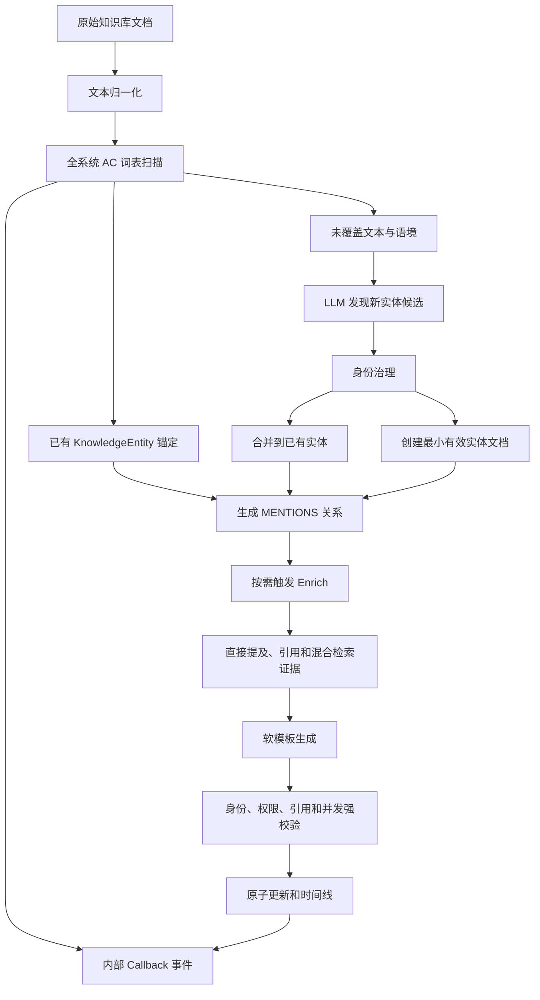

# KnowledgeEntity 发现、身份治理与文档富化方法论设计

## 1. 文档目标

本文档定义 ByKC 中 KnowledgeEntity 的目标方法论，用于指导后续的数据建模、能力设计、接口设计和评测。重点回答：

- KnowledgeEntity 的精确定义及其与原始文档、mention、candidate、fact 和 event 的边界；
- 如何让原始文档和实体文档共用知识库文档主模型；
- 如何通过全系统词表、AC 自动机、LLM 和身份治理发现或锚定实体；
- 如何在不建设重型 global/subject namespace 的情况下解决身份限定；
- 第一版应支持哪些明确、可验证的实体关系；
- 如何利用多份证据富化实体文档，并将模板保持为软约束；
- 如何通过内部 Python/SDK Callback 连接异步任务；
- KnowledgeEntity 定义、索引和富化方法后续如何版本化升级。

本文档描述方法论和目标设计，不规定具体类名、函数名、HTTP 路由或数据库迁移步骤。

相关文档：

- [知识模块设计](./design.md)
- [知识模块处理流程](./process.md)
- [元数据 API](./metadata_api.md)
- [知识获取、结构化打标与导入流程](./knowledge-acquisition-structured-import-design.md)
- [KnowledgeEntity 发现与文档富化接口设计](./knowledge-entity-api.md)

## 2. 范围与非目标

### 2.1 范围内

- 原始文档和 KnowledgeEntity 的统一文档模型；
- KnowledgeEntity v1 的定义、正反边界和版本机制；
- 全系统词表、AC 自动机匹配和轻量身份治理；
- 已有实体锚定、新实体发现和实体文档创建；
- 实体文档的证据召回、富化、引用和原子更新；
- 第一版关系白名单及其证据规则；
- discovery/enrich 异步任务的内部 Python/SDK Callback；
- 评测、可观测性和分阶段落地方式。

### 2.2 非目标

- 不引入独立 KnowledgeEntity 主数据表；
- 不建设草稿—审核—发布流程；
- 不建设 namespace 表、namespace 树或复杂的父子命名空间；
- 第一版不支持 HTTP Callback、Webhook 或跨进程 callable 序列化；
- 第一版不建设独立关系证据表或关系证据查询层；
- 不使用向量相似度直接自动合并实体；
- 不把共现、相似和“相关”直接持久化为业务关系；
- 不要求 Enrich 结果完全匹配模板标题、顺序和内容块。

## 3. 核心设计决策

### 3.1 文档是唯一知识主体

原始文档和 KnowledgeEntity 都是知识库文件，共用 `knowledge_fs_entry` 作为唯一内容主表。`knowledge_fs_entry.kid` 同时作为 KnowledgeEntity 的稳定身份 ID。

现有文件主模型见 [`knowledge_fs_entry`](../../../src/by_qa/knowledge_base/sql/002_knowledge_fs_entry.sql)，自定义属性使用现有 [`knowledge_file_metadata_value`](../../../src/by_qa/knowledge_base/sql/017_file_metadata_value.sql)。

“文档是唯一知识主体”不表示所有运行数据都塞入文档 metadata：

- 文档是业务内容的权威主体；
- metadata 是文档的结构化属性；
- 引用和语义关系是文档之间的投影；
- 异步任务是运行时记录；
- AC 自动机和向量索引是由文档派生、可以重建的索引。

### 3.2 无内容发布流

KnowledgeEntity 不存在草稿、待审核、已发布等内容状态。发现成功后创建的是一份有最小证据的有效实体文档；Enrich 成功后直接原子更新该文档。

异步任务可以有 `PENDING`、`RUNNING`、`SUCCEEDED`、`FAILED`、`CANCELLED` 等运行状态，但这些不是文档生命周期状态。

### 3.3 强身份、软模板

Enrich 不得改变实体身份、权限和证据边界，但文档章节、标题顺序、可选内容块和占位符只属于写作指导。

强约束保护：

- 稳定文档 ID 和实体身份名；
- 权限、引用和证据边界；
- 非空内容和大小限制；
- 并发更新一致性；
- 关系方向和生成任务的最低追溯性。

模板覆盖率不足只产生 warning 和质量指标，不使任务失败。

## 4. KnowledgeEntity v1 定义

> KnowledgeEntity 是一种 `documentKind=knowledgeEntity` 的知识库文档，代表一个可以跨时间或跨文档被重新识别，并能够持续汇聚事实、证据和关系的稳定知识主体。它回答“它是谁或是什么”，不回答“发生了什么”。

候选对象必须同时满足：

1. **稳定身份**：脱离当前句子或事件后，仍能回答“它是哪一个对象”。
2. **可持续积累**：未来可以继续附加来自其他文档、其他时间的事实和证据；初次发现可以只有一个来源。
3. **文档显著性**：删除后会明显影响对全文主题、主要结构、关键关系或结论的理解。
4. **可规范命名**：能够形成稳定标准名；若含义必须依附另一个稳定主体，则使用 subject-local 身份。
5. **非瞬时事实**：不是一次事件、动作、变化、状态值、属性值或单纯结论。
6. **有证据入口**：至少有一份原始文档或可追溯片段支持该身份的建立。

### 4.1 相邻概念边界

| 概念 | 定义 | 是否持久化为 KnowledgeEntity |
| --- | --- | --- |
| mention | 文档中的一次名称、别名或指代出现 | 否 |
| candidate | AC、LLM 或检索产生的待判定身份 | 否 |
| fact | 关于稳定主体的属性、状态或结论 | 否，写入实体文档 |
| event | 一次会议、发布、变化、故障或决策 | v1 否 |
| original document | 保留原始表述的证据文档 | 否，但共用文档主模型 |
| KnowledgeEntity | 保存稳定身份、累积内容和证据引用的实体文档 | 是 |

以下内容不应仅因出现频率高而成为 KnowledgeEntity：

- 文件名、文档标题、作者和来源渠道；
- 一次案例、一次会议、名单项或一次发布；
- 字段、函数、配置项和临时中间结果；
- 仅在当前事件中成立的角色、状态和属性；
- 只有共现或相似，却没有稳定身份的概念。

实现细节只有在其本身是直接研究对象、拥有稳定身份并可持续积累时，才可升级为 KnowledgeEntity。

## 5. 统一文档与 metadata 模型

### 5.1 文档类型

所有内容文档都使用 `knowledge_fs_entry` 的 `FILE` 节点，通过 `documentKind` 区分：

| `documentKind` | 含义 |
| --- | --- |
| `original` | 原始、采集、导入或人工撰写的证据文档 |
| `knowledgeEntity` | 表达一个稳定 KnowledgeEntity 的累积性文档 |

写入链路会在 import/upload/update 的同一事务中物化 `documentKind`：
保留目录 `/KnowledgeEntity` 下默认为 `knowledgeEntity`，其他文件默认为
`original`。显式 metadata 始终优先，系统默认不会覆盖已有值。增量 SQL
`031` 按同一规则回填历史 live FILE；读取层保留相同的兼容默认，
以支持滚动升级和未及时回填的存量数据。

### 5.2 原始文档 metadata

| 属性 | 必需 | 说明 |
| --- | --- | --- |
| `documentKind` | 是 | 固定为 `original` |
| `sourceType` | 否 | 上传、爬取、会议转写、外部系统等 |
| `sourceUri` | 否 | 原始来源定位符 |
| `sourceTime` | 否 | 来源文档对应的业务时间 |
| `processingCapabilities` | 否 | 覆盖默认处理能力；原始文档默认仅启用 `entityDiscovery` |

`checksum`、路径、文件大小和创建时间使用现有系统字段，不在 metadata 中重复保存。

### 5.3 KnowledgeEntity metadata

| 属性 | 必需 | 说明 |
| --- | --- | --- |
| `documentKind` | 是 | 固定为 `knowledgeEntity` |
| `entityName` | 是 | 规范名称；subject 实体使用限定名 |
| `aliases` | 是 | 可以为空列表；只保存已确认别名 |
| `definitionVersion` | 是 | 创建或最近重新判定时使用的实体定义版本 |
| `subjectFileId` | 否 | 不存在表示 global；存在表示 subject-local |
| `entityType` | 否 | 轻量类型描述，v1 不要求完整本体枚举 |
| `enrichVersion` | 否 | 最近一次成功 Enrich 使用的方法版本 |
| `processingCapabilities` | 否 | 覆盖默认处理能力；实体文档默认仅启用 `entityEnrich` |

任务状态、Callback、mention 位置、共现计数和向量候选不放入实体 metadata。当前 metadata 支持扁平 string、stringList、number、boolean 和 datetime，见 [`metadata_types.py`](../../../src/by_qa/knowledge_base/metadata_types.py)。

### 5.4 稳定身份

- `knowledge_fs_entry.kid` 是实体稳定身份；
- `entityName` 是可变业务标准名；
- 文件路径用于展示和组织，不是实体身份；
- 改名或移动文档不改变实体身份；
- Markdown 引用由现有 [`knowledge_file_reference`](../../../src/by_qa/knowledge_base/sql/026_knowledge_file_reference.sql) 解析和维护。

### 5.5 最简处理资格与调度判定

`documentKind` 决定文档默认可以执行的能力：

| `documentKind` | 可作为实体发现来源 | 可作为 Enrich 目标 |
| --- | --- | --- |
| `original` | 是 | 否 |
| `knowledgeEntity` | 否 | 是 |

默认能力为：

```text
original        -> [entityDiscovery]
knowledgeEntity -> [entityEnrich]
```

`processingCapabilities` 只用于覆盖默认策略。例如原始文档设置为空列表，表示该文档不参与实体发现。v1 不对 Enrich 后的 KnowledgeEntity 再执行实体发现，避免形成处理循环。
系统不为默认能力物化 `processingCapabilities`，以便保留“缺失表示使用默认、显式空列表表示禁用”的区别。

Discovery 和 Enrich 都支持单文件或全库触发。全库触发仍逐文件应用上述资格规则：Discovery 枚举本库全部合格 original 文档，并排除固定 `/KnowledgeEntity` 目录；Enrich 只枚举本库 `/KnowledgeEntity` 下的合格 knowledgeEntity 文档。未传文件路径不代表跳过资格校验。

“可以执行”和“现在需要执行”分开判断：

```text
canDiscover = original
              + entityDiscovery 已启用
              + 正文已解析且非空
              + 调用方有权限

canEnrich = knowledgeEntity
            + entityEnrich 已启用
            + 身份 metadata 完整
            + 至少有一份可访问证据
```

是否需要执行由最近一次成功任务的输入指纹决定，不在文档 metadata 中保存容易过期的 `needsDiscovery` 或 `needsEnrich`：

```text
needsDiscovery = canDiscover
                 + 文档 checksum、definitionVersion 或 discoveryMethodVersion 已变化

needsEnrich = canEnrich
              + 身份、证据集合/证据 checksum 或 enrichVersion 已变化
```

AC `indexVersion` 的每次变化不自动使全库原始文档失效；新增或变更词面通过定向回扫或定期 reconciliation 处理。Enrich 自己产生的新 checksum 也不能再次触发 Enrich。

调度判定统一为：

| 结果 | 含义 |
| --- | --- |
| `ELIGIBLE_AND_STALE` | 可以执行，并且输入已变化，需要执行 |
| `ELIGIBLE_BUT_FRESH` | 可以执行，但输入没有变化 |
| `INELIGIBLE` | 文档类型、处理策略、内容、权限或证据不满足 |

## 6. 轻量 global/subject 模型

- `subjectFileId` 为空：global；
- `subjectFileId` 指向另一个 KnowledgeEntity：subject-local。

运行时派生身份键，不引入 namespace 主表：

```text
global:  g:{normalize(entityName)}
subject: s:{subjectFileId}:{normalize(localName)}
```

subject 展示名使用 `{subjectEntityName}-{localName}`。系统可将 localName 作为别名参与匹配，但未结合 subject 语境时不能直接唯一锚定。

原则：

- 默认 global；
- 只有名称脱离稳定主体就无法确定含义时才使用 subject；
- subject 必须指向已经存在的稳定 KnowledgeEntity；
- subject 是身份限定，不自动产生 `PART_OF` 等语义关系；
- 主体改名时 `subjectFileId` 不变，异步刷新展示名和词表索引。

## 7. 总体流程



实体发现和 Enrich 是两个可独立调度、重试和查询的能力，不要求每次连续执行。

## 8. 全系统词表与 AC 自动机

### 8.1 定位

AC 自动机用于在整篇文档中一次扫描大量已知名称和别名，复杂度为：

```text
O(文档长度 + 命中数量)
```

它是候选发现索引，不是身份主数据，不负责语境消歧、显著性判断或实体合并。

### 8.2 词表来源

词表从整个系统中所有未删除的 KnowledgeEntity 文档派生：

- `entityName`；
- `aliases`；
- subject 实体限定名；
- 经确认的稳定缩写。

一个归一化词面可对应多个实体：

```text
normalizedSurface
  -> [{fileId, surfaceType, subjectFileId, weight}]
```

同名多候选必须进入消歧，不能默认选择第一项。

### 8.3 归一化和命中规则

- Unicode、大小写和全半角归一化；
- 可规则化空格和标点归一化；
- 英文和数字词面执行单词边界判断；
- 中文支持无空格命中；
- 重叠命中优先最长词，但保留同词面的多个身份候选；
- 保留归一化文本到原文位置的映射，支持回传证据片段。

### 8.4 Snapshot 与增量更新

- 使用不可变全量 AC snapshot，并携带单调递增的 `indexVersion`；
- 实体新建、改名和别名变更先进入小型 delta 索引；
- delta 达到阈值或定时周期后重建全量 snapshot；
- 新 snapshot 构建完成后原子切换；
- discovery 任务记录使用的 `indexVersion`；
- snapshot 刷新前使用精确数据库查询做一致性兜底。

全系统索引的结果在返回或写入前必须执行权限过滤。未授权实体的名称、ID、路径和内容不能因全局匹配而泄漏。

全系统词表只解决“用一套结构高速扫描全库词面”，不等于采用全系统统一实体身份。v1 的实体整理边界仍是当前知识库：AC 命中后只允许锚定当前知识库内的 KnowledgeEntity；其他知识库的 posting 不建立跨库关系、不合并别名，也不阻止当前库创建自己的实体。这样保留全系统 AC 的吞吐优势，同时避免引入重型全局 namespace。

## 9. KnowledgeEntity 发现流程

### 9.1 输入

- 知识库标识；
- 可选原始文档路径；传入时处理单文件，不传时处理该知识库全部合格原始文档；
- `definitionVersion`；
- 可选发现数量限制、模型配置和内部 Callback。

不将独立 ontology object 列表作为 KnowledgeEntity 发现的必要输入。`entityType` 在 v1 中只做辅助分类，不决定实体是否成立。

一次请求生成一个 `batchId`。单文件和全库触发统一先做资格与 freshness 判断，再为每个需要实际执行的文件建立独立任务；批次不是一个共享事务，一个文件失败不回滚其他文件。

### 9.2 阶段 A：读取和归一化

1. 读取原始文档当前 Markdown 和 metadata；
2. 记录输入 checksum；
3. 生成归一化文本及原文位置映射；
4. 提取标题地图和有代表性的全文上下文，不仅使用固定开头截断。

### 9.3 阶段 B：已有实体匹配

1. 使用 AC snapshot 和 delta 扫描全文；
2. 将命中映射回原文位置；
3. 应用权限、当前知识库和 subject 语境过滤；
4. 唯一精确命中直接锚定；
5. 同名多候选保留上下文，进入消歧；
6. 词面重叠但不等价时不自动写入别名。

### 9.4 阶段 C：LLM 新实体发现

LLM 输入包括：

- 原始文档的有代表性全文上下文和标题地图；
- AC 已命中实体及其位置；
- KnowledgeEntity v1 正反例和删除测试；
- global/subject 判定规则。

LLM 主要发现 AC 未覆盖但对理解文档显著的稳定主体。每个候选至少包含：

- 建议规范名和可选 `entityType`；
- 稳定身份说明；
- global 或 subject-local 判断及 subject 候选；
- 显著性理由；
- 证据片段和位置。

候选只是任务中间结果，不立即成为文档或词表条目。

### 9.5 阶段 D：身份治理

按以下顺序执行：

1. 规范名精确匹配；
2. 已确认别名精确匹配；
3. subject 限定身份匹配；
4. 同名多候选上下文消歧；
5. 可选向量同义候选召回；
6. 名称、subject、证据和语境对比裁决；
7. 无可信同一身份时创建新实体。

向量召回只产生 top-K 候选，不直接触发合并。阈值必须用真实标注集校准，不使用未经验证的固定 95% 阈值。

### 9.6 阶段 E：持久化

持久化目标固定为源文档所在知识库的 `/KnowledgeEntity` 目录；目录不存在时由系统自动创建。接口不提供 `targetKnCode` 或 `targetDirectoryPath`，v1 不把整理出的实体写入其他知识库。

对已有实体：

- 只在当前知识库中锚定已有实体，并建立原始文档到实体的 `MENTIONS`；
- 新证明的别名经身份裁决后追加到 `aliases`；
- 不直接覆盖实体正文；
- 可根据策略触发 Enrich。

对新实体：

1. 在当前知识库 `/KnowledgeEntity` 下创建 `documentKind=knowledgeEntity` 文档；
2. 写入 `entityName`、`aliases`、`definitionVersion` 和可选 `subjectFileId`；
3. 正文至少包含实体定义与边界、初始证据引用；
4. 建立原始文档到新实体的 `MENTIONS`；
5. 数据提交后触发词表 delta 更新。

该文档是有证据的最小有效知识，不是“草稿实体”。

### 9.7 幂等与并发

- 单文件和全库请求都按“一个实际处理文件一条任务记录”执行，同批文件共享 `batchId`；
- 任务状态按知识库查询，文件路径可选；需要查看某次触发时再用 `batchId` 收窄；
- 同一原始文档、同一 checksum、同一 `definitionVersion` 的重复任务可复用结果；
- 创建新实体前对派生身份键使用事务级互斥或等价机制；
- 并发创建冲突时重新读取已创建实体并转为锚定；
- 关系断言按“生产者运行 + 证据指纹”精确幂等；查询层再按 source、relation、target 合并为逻辑边；
- Callback 不参与核心事务。

## 10. 初始关系模型

### 10.1 原则

- 关系必须能直接读成“source relation target”；
- 只持久化一个方向，反向展示由查询层派生；
- Markdown 引用就是带正文位置证据的 `MENTIONS` 断言，与 Discovery/Enrich 关系共用一套写入、去重、查询、移动、删除和恢复逻辑；
- 除 `MENTIONS` 的精确命中外，语义关系必须有明确证据；
- 无法映射到精确关系时只保留自然语言和文档引用，不创建“相关”；
- 无效关系被丢弃并记录 warning，不使整个 Enrich 失败。

### 10.2 v1 白名单

#### `MENTIONS` / 提及

```text
原始文档 --MENTIONS--> KnowledgeEntity
```

源文档明确出现、指代或可唯一识别目标实体。可由 AC 精确命中、经消歧的同名命中或经身份治理的新实体发现产生。

它不表示文档支持实体的所有结论，也不表示两者存在组成、类型或依赖关系。

#### `PART_OF` / 组成于

```text
子实体 --PART_OF--> 整体实体
```

source 是 target 的稳定组成、模块、机制或结构部分，脱离 target 后其当前身份含义会显著变化。

示例：

```text
OSOT-OCG --PART_OF--> OSOT
OSOT-OCR --PART_OF--> OSOT
OSOT-OPA --PART_OF--> OSOT
```

查询 OSOT 时可以反向显示“包含 OCG/OCR/OPA”，但不另存 `HAS_PART`。

#### `IS_A` / 属于类型

```text
具体实体 --IS_A--> 上位类别实体
```

source 是 target 所表达类别、类型或概念的一个实例或更具体类型。v1 暂不拆分 `INSTANCE_OF` 和 `SUBTYPE_OF`。

`PART_OF` 不能替换成 `IS_A`：某机制是理论的组成部分，不表示它是该理论的一种类型。

#### `DEPENDS_ON` / 依赖

```text
依赖方 --DEPENDS_ON--> 被依赖方
```

source 的稳定能力、运行或成立明确要求 target 存在；去掉 target 会导致 source 的关键能力不可用或定义不完整。

建立条件：

- 原文明示依赖、必须、基于或前置条件；
- source 和 target 都是有效 KnowledgeEntity；
- 不从共现、相邻章节或常识推断；
- 普通“使用”不必然等于“依赖”。

### 10.3 预留但 v1 不自动生成

- `IMPLEMENTS`：系统或方案实现某个规范、理论或能力；
- `USES`：source 使用 target，但不构成强依赖；
- `PRODUCES`：source 稳定地产生 target；
- `AFFECTS`：source 对 target 产生有明确证据的影响；
- `COLLABORATES_WITH`：稳定主体之间的明确协作；
- `PRECEDES`：稳定流程模型中的前后关系。

只有拥有足够真实样本、明确查询价值和可评测规则时，关系才进入白名单。`IMPLEMENTS` 是 v1.1 最优先考察项。

### 10.4 明确不持久化

- `RELATED_TO`：语义过宽，可动态计算；
- `CO_OCCURS_WITH`：共现是统计信号，不是业务事实；
- `SIMILAR_TO`：向量相似是候选召回信号；
- `ALIAS_OF`：确认同一身份后应合并文档并写入 `aliases`；
- `BROADER_ENTITY` 或“上位实体”：方向容易混淆，应按真实语义使用 `PART_OF` 或 `IS_A`。

### 10.5 关系断言与证据

关系生成阶段仍必须基于明确原文，不因为 v1 暂缓独立证据表而放宽关系判定。每条持久化语义关系至少保存以下最低追溯字段：

```text
sourceFileId
relationCode
targetFileId
targetLocatorType / targetLocatorValue
discoveredBy / producerRunId
evidenceFingerprint
sourceHeadingPath / startLine / endLine / startOffset / endOffset
confidence / definitionVersion / sourceTaskId
```

每个物理行表示一次关系断言或证据出现，同一 source/relation/target 可以有多行；对外查询再聚合成一条逻辑边。Markdown Parser 记录标题路径、行号和字符偏移，Discovery/Enrich 记录生产任务和证据指纹。v1 仍不建设独立 `knowledge_document_relation_evidence`，也不在关系行中保存大段 evidence JSON。

关系投影不是新的内容主体。逻辑边的去重键是 source/relation/target，断言去重键另包含 discoveredBy、producerRunId 和 evidenceFingerprint。后续确有证据片段正文、checksum 失效治理和长期审计需求时，再增加独立证据投影，不改变关系语义。

## 11. KnowledgeEntity Enrich

### 11.1 定位与输入

Enrich 以实体稳定身份为中心，从多份授权证据中组织可阅读、可检索、可追溯的当前知识文档。它按需触发，不是每次 discovery 的必经步骤。

输入包括：

- 知识库标识；
- 可选目标 KnowledgeEntity 路径；传入时处理该实体，不传时处理本库 `/KnowledgeEntity` 下全部合格实体文档；
- 当前 `entityName`、`aliases`、`subjectFileId` 和 `definitionVersion`；
- 目标文档 checksum；
- 可选 `enrichVersion`、检索范围和内部 Callback。

全库触发只改变调度范围，不改变执行原子单元：每个实体文档独立召回、生成、校验和提交，并形成自己的任务记录；同批次共享 `batchId`。

### 11.2 证据召回

按优先级收集：

1. 通过 `MENTIONS` 指向目标实体的原始文档；
2. 实体正文中已有的原始文档引用；
3. 使用标准名、别名和 subject 限定名做全文/向量混合检索；
4. 通过 `PART_OF`、`IS_A`、`DEPENDS_ON` 连接的实体文档；
5. 与目标实体有高信号共现的候选证据。

ByKC 现有检索支持全文、向量融合和 metadata 过滤，可作为证据召回基础，见 [`knowledge_item_search_service.py`](../../../src/by_qa/knowledge_base/services/knowledge_item_search_service.py)。

处理规则：

- 排除目标文档自身和无权限文档；
- 按文档和片段去重；
- 直接提及和明确引用优先于语义相关；
- 只有语义相关而无身份连接的片段不能单独证明强关系；
- 记录每个片段的来源文档和位置。

### 11.3 生成与软模板

LLM 主要生成 Markdown 正文，不生成权威身份 metadata。

- `entityName`、`aliases`、`subjectFileId` 和版本由程序维护；
- LLM 不得通过 YAML 或标题改变目标身份；
- 重要事实通过 Markdown 引用指向原始文档；
- 章节可以自适应组织，不强制填满模板；
- 无证据内容应删除或明确标识为不确定；
- 关系候选与正文一起生成，但单独归一化和验证。

以下情况只产生 warning，不导致失败：

- 缺少模板标题或章节顺序不同；
- 可选内容块缺失；
- 仍有占位符；
- 结构化属性未填满；
- 没有生成语义关系。

建议输出质量信息：

```text
warnings
templateCoverage
missingSections
placeholderCount
discardedReferenceCount
discardedRelationCount
```

### 11.4 强校验

只有以下条件失败时阻断写入：

- 目标不存在或不是 KnowledgeEntity；
- 生成正文为空或超过系统上限；
- 生成内容试图改变目标身份；
- 包含无权限引用；
- 非法引用无法安全解析或降级；
- 目标 checksum 在任务期间已改变；
- 对象存储或数据库原子写入失败。

无效关系候选不阻断正文写入，应被丢弃并记录。

### 11.5 原子更新

1. 生成期间不修改当前文档；
2. 验证完成后重新校验 checksum；
3. 先将旧正文中的内部引用令牌还原为可重新解析的路径；
4. 删除本次更新文档的全部出边，不删除其他文档指向它的入边；
5. 重写 Markdown 引用为带章节/行/偏移证据的 `MENTIONS`，并写入当次 Enrich 产生的结构化关系；
6. 在同一数据库事务中更新文件摘要、派生状态和更新时间线，对象存储失败时恢复旧字节；
7. 提交成功后才发送 `task.succeeded` Callback；
8. 任何失败都保留上一版有效文档及其出边快照。

出边所有权遵循“source 文档管理自己的出边”。Enrich 更新文档，因此对该 source 做全量替换；Discovery 不改正文，因此只替换该 source 上由 `ENTITY_DISCOVERY` 生产的 `MENTIONS` 断言，不删除 Markdown Parser 生产的断言。

现有时间线基础见 [`knowledge_file_update_timeline`](../../../src/by_qa/knowledge_base/sql/027_knowledge_file_update_timeline.sql)。

## 12. 内部 Python/SDK Callback

### 12.1 范围和协议

v1 只支持内部 Python/SDK 调用，不支持 HTTP URL、Webhook、用户上传代码、跨进程 callable 序列化或服务重启后的持久化回调恢复。

概念签名：

```python
TaskCallback = Callable[[TaskEvent], Awaitable[None] | None]
```

Discovery 和 Enrich 接受可选 Callback：

```python
discover(..., callback: TaskCallback | None = None) -> batch_acceptance
enrich(..., callback: TaskCallback | None = None) -> batch_acceptance
```

同步 Callback 可以兼容包装，但不得阻塞核心事件循环。

### 12.2 事件模型

`TaskEvent` 是不可变快照，至少包含：

```text
eventId
taskId
batchId
taskType
eventType
stage
status
sequence
progress
sourceFileId
targetFileIds
resultSummary
error
occurredAt
```

v1 事件：

- `task.started`；
- `stage.completed`；
- `task.succeeded`；
- `task.failed`。

建议阶段名：

```text
load_document
vocabulary_match
entity_extract
identity_resolve
entity_persist
evidence_retrieve
document_generate
document_persist
```

### 12.3 执行语义

- Callback 是进程内 best-effort 通知；
- Callback 异常被捕获和记录，不改变主任务状态；
- Callback 不接收数据库连接、事务或可变任务内部对象；
- 对应数据提交后才触发阶段完成或成功事件；
- 进程崩溃可能导致终态事件丢失，v1 不声明 exactly-once；
- 任务查询结果是最终事实来源；
- 默认只通知阶段完成和终态，避免高频进度事件。

## 13. 向量同义候选召回

### 13.1 能力边界

向量能力只用于精确名和别名未命中时，为新候选召回可能的同一身份。它不能：

- 直接合并两个实体；
- 直接将相似词写入 `aliases`；
- 代替 global/subject 判定；
- 代替证据和上下文裁决。

候选向量表示建议由以下内容组成：

- 规范名和已确认别名；
- 一句稳定身份摘要；
- 可选 subject 主体名；
- 可选、经过去噪的典型上下文。

不应默认使用整篇实体文档作为身份向量，否则暂时事实会污染身份相似度。

### 13.2 与共现向量的区别

- 稠密语义向量：用于名称和身份候选召回；
- 稀疏共现特征：用于比较候选的文档上下文是否一致。

两者不能统称为一个“向量同义”步骤，避免混淆召回与裁决。

### 13.3 上线策略

1. 先以 shadow 模式运行，只记录 top-K 候选；
2. 用真实同义/非同义标注集评估召回率和误召回；
3. 校准不同类型和语言的 top-K 与阈值；
4. 验证后只接入候选层；
5. 合并仍需经过名称、subject、证据和上下文裁决。

## 14. ByDC 历史方法取证结论

本节用于区分“设计材料提出过”“代码实现过”和“接入 KnowledgeEntity 发现链路”三种证据等级。

### 14.1 AC 自动机

- 本地方法说明和汇报材料曾明确提出 AC 自动机；
- ByDC 可达 Git 历史中未找到 `pyahocorasick`、`ahocorasick`、`Aho-Corasick`、`Automaton` 或等价实现；
- 历史 HybridTokenizer 使用 jieba + BiMM，BiMM 不是 AC 自动机。

结论：AC 自动机是历史方案主张，不是可直接迁移的既有实现。

### 14.2 通用向量召回

- ByDC 存在通用术语 `strict -> BM25 -> vector` 候选召回、OpenGauss 向量检索和调用链；
- 单测能证明编排路径存在，但多使用 mock，不能证明线上效果；
- `object_instance_discovery.py` 的历史中未发现 vector、embedding 或 cosine 调用。

结论：通用术语向量召回有真实实现，但 KnowledgeEntity 发现中的向量同义治理没有真实接入。

### 14.3 历史同义候选链路

ByDC 在 2026-08-08 曾进入 `develop` 的实现是：

```text
精确查询
-> BM25 全文检索
-> ILIKE 别名反查
-> 子串重叠
-> LLM 同义裁决
```

关键提交：

- `a332332a`：词典锚定与别名反查；
- `2a96f309`：同义和歧义裁决；
- `acb8ca1f`：改为批量精确匹配，删除 BM25/ILIKE 同义候选。

结论：该链路是文本和 LLM 方法，不是向量同义召回，而且当前已不在实体发现主链路中。

## 15. 失败处理和任务语义

单文件是任务、重试和提交的最小单元。全库批次允许部分成功：某个文件失败不取消其他文件，调用方按知识库及可选文件路径查询任务，需要定位本次触发时再按 `batchId` 过滤。

### 15.1 Discovery

- 文档不存在、无权限或内容不可读：任务失败；
- AC 不可用：可降级为精确词表查询，并记录 degraded；
- LLM 输出不可解析：有限次重试后失败；
- 单个候选无法确认：丢弃并记录，不一定使整篇任务失败；
- 新实体创建或关系写入失败：回滚对应原子写入单元；
- Callback 失败：不改变主任务结果。

### 15.2 Enrich

- 无可用证据：返回 `SKIPPED` 或等价业务结果，不生成空洞文档；
- 模板覆盖不足：记录 warning；
- 非法关系或引用：尽可能安全降级或丢弃；
- 身份漂移、无权限引用、空正文或 checksum 冲突：阻断写入；
- 写入失败：保留上一版有效文档；
- Callback 失败：不改变主任务结果。

## 16. 版本化与升级

### 16.1 定义包

KnowledgeEntity 定义不是一段可以无痕修改的 prompt，而是一个版本化定义包：

```text
definitionVersion = ke/1.0
```

每个版本绑定：

- 正式定义、正例和反例；
- discovery prompt；
- 名称归一化和 global/subject 规则；
- 数量上限和显著性规则；
- 默认模型与参数版本；
- 评测集和指标。

版本语义：

- `1.x`：增加可选属性、别名规则或归一化优化，不改变实体边界；
- `2.0`：改变“什么是 KnowledgeEntity”的语义边界，例如未来允许某类具名事件成为实体。

Enrich 使用独立 `enrichVersion`，索引使用独立 `indexVersion`。

### 16.2 升级流程

1. 在固定标注集上评估新旧定义；
2. 以 shadow discovery 生成真实文档的新旧差异；
3. 分析新增、消失、合并、拆分和 namespace 变化；
4. 生成幂等迁移计划，不直接覆盖现有文档；
5. 同一身份升级时保留 `fileId`；
6. 更新定义版本后重建 AC 和向量索引；
7. 对受影响实体按需重新 Enrich；
8. 通过内部 Callback 通知批处理阶段和结果。

这是版本迁移任务，不是内容草稿审核流。

### 16.3 实体合并

确认两个文档是同一身份时：

1. 选择 canonical `fileId`；
2. 将其他标准名转入 `aliases`；
3. 合并证据和语义关系；
4. 将旧引用重定向到 canonical 文档；
5. 保留旧 ID 到 canonical ID 的可追溯 redirect；
6. 重建词表和向量索引。

不使用 `ALIAS_OF` 长期保留两个活跃实体文档。

### 16.4 实体拆分

发现一个文档混合多个稳定身份时：

1. 保留最符合原身份的文档 ID；
2. 为其他身份创建新实体文档；
3. 根据证据片段重新分配 `MENTIONS` 和语义关系；
4. 重新生成受影响实体文档；
5. 更新 AC 和向量索引；
6. 保留拆分任务的差异和映射记录。

## 17. 评测与可观测性

### 17.1 Discovery

- 文档级实体精确率、召回率和删除测试通过率；
- global/subject 判定准确率；
- 已有实体锚定准确率和重复新建率；
- 错误合并率；
- 每篇候选数、持久化实体数和裁决数。

### 17.2 AC 词表

- snapshot 词面数、postings 数、构建时间和内存；
- 单文档扫描延迟及 P95/P99；
- 每秒处理文本字节数；
- 最长词和边界规则误命中率；
- delta 命中数和快照切换失败率；
- 权限过滤前后的候选数。

### 17.3 身份治理

- 精确名、别名、向量和 LLM 各阶段召回贡献；
- 同名消歧准确率；
- 同义候选 top-K 召回率；
- 合并精确率，优先级高于合并召回率；
- subject-local 错误跨主体合并率。

### 17.4 Enrich 和关系

- 身份漂移率和无证据事实率；
- 重要事实证据引用覆盖率；
- 模板 warning 分布；
- 引用降级数和关系丢弃数；
- 每种关系的精确率、方向正确率和证据覆盖率；
- `PART_OF` 与 `IS_A` 混淆率；
- `DEPENDS_ON` 由共现或普通“使用”错误推断的比例。

### 17.5 运行指标

- discovery/enrich 任务数、成功率、失败分类和分阶段延迟；
- 重试次数；
- Callback 调用数、异常数和执行时间；
- 每个任务使用的 `definitionVersion`、`enrichVersion`、`indexVersion` 和模型版本。

## 18. 分阶段落地

### 阶段 0：定义和评测基线

- 固化 KnowledgeEntity `ke/1.0` 定义包；
- 建立正例、反例、global/subject、同名和同义评测集；
- 固化 v1 关系白名单和 metadata 命名。

### 阶段 1：统一文档与任务契约

- 原始文档和 KnowledgeEntity 共用文档主模型；
- 建立最小有效实体文档格式；
- 保留 `knowledge_build_task` 专用于文件构建，新增 `knowledge_semantic_processing_task` 统一承载 discovery/enrich，并支持同批文件共享 `batchId`；
- 保留原 `026` 不变，通过增量脚本把 `knowledge_file_reference` 扩展为统一关系断言投影；
- 支持内部 Python/SDK Callback。

### 阶段 2：AC 与实体发现

- 建立全系统 snapshot + delta 词表；
- 完成全文扫描、证据定位和权限过滤；
- 结合 AC 已命中结果与 LLM 新实体发现；
- 创建 `MENTIONS` 和最小有效实体文档；
- 支持精确名、别名和 subject 身份治理。

### 阶段 3：Enrich 与精确关系

- 接入直接提及、Markdown 引用和混合检索证据；
- 按软模板生成并执行身份、权限、引用和并发强校验；
- 支持 `PART_OF`、`IS_A`、`DEPENDS_ON`；
- 原子更新文档并记录时间线。

### 阶段 4：向量候选 shadow

- 建立与文档 chunk 检索分离的身份向量；
- 精确名和别名未命中时记录 top-K 同义候选；
- 评测召回、误召回和 subject 跨界风险；
- 不自动合并。

### 阶段 5：版本升级与关系扩展

- 支持 definition/enrich 版本迁移、实体合并、拆分和 redirect；
- 依据真实样本评估 `IMPLEMENTS` 等新关系；
- 依据查询价值决定是否拆分 `INSTANCE_OF` 和 `SUBTYPE_OF`。

## 19. 约束摘要

- 内容主体始终是知识库文档；
- KnowledgeEntity 和原始文档共用 `knowledge_fs_entry`；
- `fileId` 是实体稳定身份，metadata 表达文档类型和实体属性；
- `documentKind` 决定默认处理资格，`processingCapabilities` 覆盖策略，任务输入指纹决定是否需要重跑；
- Discovery/Enrich 支持单文件和全库触发；不传文件路径时逐文件筛选并执行，同批任务共享 `batchId`；
- 新实体只保存在源文档同库的 `/KnowledgeEntity` 目录，不接受自定义目标库和目标目录；
- 不建设草稿—审核—发布流；
- global/subject 只使用可选 `subjectFileId` 和派生身份键；
- 全系统词表使用 AC snapshot + delta，索引不是业务主数据；
- 向量召回只产生同义候选，不直接自动合并；
- v1 关系只有 `MENTIONS`、`PART_OF`、`IS_A`、`DEPENDS_ON`；
- v1 复用扩展后的 `knowledge_file_reference` 保存统一关系断言和轻量位置证据，不建设独立关系证据层；
- 共现、相似和“相关”是检索或统计信号，不是持久化业务关系；
- Enrich 保护身份和证据边界，模板只做软约束；
- Callback v1 只支持进程内 Python/SDK callable，失败不影响主任务；
- KnowledgeEntity 定义、Enrich 方法和索引快照分别版本化，以 shadow 评测和批处理迁移完成升级。
