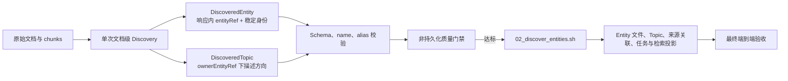

# KnowledgeEntity Discovery 可执行实施设计

## 1. 文档状态与使用方式

- 状态：待实施。
- 当前范围：完成单篇文档一次调用的 Entity/Topic Discovery 准确性、稳定性、输出协议、非持久化快速评测，以及通过 `02_discover_entities.sh` 验证最终持久化结果的端到端验收。
- 当前端到端范围包括：Entity 身份链路的现有行为、Entity 文件、Topic 持久化、来源关联、任务状态和最终数据库投影；这些都是 `02` 的实际输出，不能用纯模型评测替代。
- 当前明确不新增：Topic 跨文档语义同义归一、Topic 专用向量召回和新的文件级 Entity 身份裁决算法。
- 当前明确不实施：Enrich 召回改造及 Enrich 质量评测。
- 始终不在范围：封闭业务类型体系、Topic 独立文档、Topic 独立 Enrich 任务、特殊文档复制逻辑。
- 事实源：本文档中的“MUST / MUST NOT”条款和验收用例。原有方法论文档只作背景资料。

实施会话不得根据自己的理解缩减或改写本文档的行为契约。如果现有代码与契约冲突，应更改代码或明确提出设计冲突，不得默认保留旧行为。

### 1.1 原始实现对齐点

本文不是从零提出 Topic，而是保留原始实现中已验证的知识边界；当前里程碑必须把 Discovery 输出接入 `02` 的完整持久化链路：

- Discover 请求同时支持 `maxEntities` 与 `maxTopics`，一次模型调用输出 Entity 和 Topic。
- `knowledge_entity.object_kind` 区分 `ENTITY` 与 `TOPIC`，两者可以共表，但查询语义必须隔离。
- Topic 通过 `subject_entity_id` 绑定 canonical Entity，直接作为 `knowledge_entity` 中的受限记录查找，不建立独立 Topic 主表或 Evidence 表。
- Topic 不创建 KnowledgeEntity 文件、不进入 Entity 同义召回或 Entity embedding 候选空间、不作为独立 Enrich 目标。
- Topic 持久化属于当前 `02` 验收；Enrich 如何利用 Topic 仍不属于当前验收。
- 身份裁决中的 `TOPIC_OF` 用于避免把附属内容误写成 alias 或独立 Entity，不代表同义关系。

当前会话不得绕过非持久化质量门禁直接反复污染数据库，也不得把 Enrich 或 Topic 同义归一混入 `02` 验收。

## 2. 绝对红线

### 2.1 禁止使用正则或样本模式拟合语义结果

**绝对禁止在生产代码或评测代码中，使用正则表达式、关键词表、名称前后缀、字符串包含关系或特定文档名，强行决定下列语义问题：**

- 候选是否是 Entity；
- 候选是否是 Topic、Topic 是否有持续检索价值；
- Topic 应挂到哪个 owner Entity；
- 候选是否过细；
- 候选是上位对象、子功能、制度条款、修辞容器还是独立对象；
- 两个名称是否同义；
- alias 是否合法；
- 证据是否足以支持建 Entity；
- 评测输出是否命中某类错误。

以下实现都属于禁止行为：

```text
entityName 以 "OpenClaw-" 开头 => 判定为过细
entityName 匹配 ".*-审批流程$" => 删除
名称包含“制度” => 保留为 Entity
名称包含“流程” => 删除
canonicalName 是 alias 的子串 => 删除 alias
根据文章路径或标题命中特例 Prompt
为《本体江湖》、OpenClaw 或小红书写专用代码分支
```

正则表达式只能用于与语义无关的通用语法处理，例如合并空白字符、解析严格格式或校验技术性 ID。任何会改变 Entity 集、Topic 集、Topic owner、规范名、alias 集或评测语义结果的正则使用，都违反本设计。

### 2.2 禁止封闭 Entity 类型表

- Discover MUST NOT 输出 `entityType`。
- 生产代码 MUST NOT 通过“人、产品、制度、概念”等枚举表判断能否建 Entity。
- 文档中出现未预见的知识对象时，仍应使用统一的实体边界判断。

### 2.3 禁止用 Enrich 或数据模型补救 Discover

- Discover 过细必须在 Discover 修正。
- Discover 漏掉核心对象必须在 Discover 修正。
- Discover 过细但有持续检索价值的局部内容，应在 Discover 中归为 Topic，不能依赖 Enrich 猜回结构。
- Topic MUST NOT 创建独立文档、独立 Enrich 任务或全局身份。
- Topic 不设置 Entity aliases；Topic 的不同原文表述通过来源证据保留。
- MUST NOT 为某类文档增加特殊 Enrich 分支。

## 3. Entity 与 Topic 的定义

### 3.1 Entity

KnowledgeEntity 是可以被稳定指代、跨文档持续归并和维护，且当前文档对其提供了足够独立知识的对象。

候选对象 MUST 同时通过四项判断：

1. **稳定身份**：在不同时间、文档和语境中仍然能指向同一对象。
2. **直接研究**：当前文档在定义、解释、比较或系统描述它，而不是仅引用或提及。
3. **独立知识**：当前证据足以构成有意义的独立知识页，不是只有名称、一句介绍或列表项。
4. **持续价值**：用户未来可能围绕它跨文档检索、归并和更新。

任一项不通过都 MUST NOT 输出。

不是 Entity 的信息仍由原文分块检索。“不建 Entity”不等于“丢失知识”。

### 3.2 Topic

Topic 是绑定在一个 Entity 下、具有持续检索价值的描述方向，可以是该 Entity 的能力、机制、组成、方法维度、规则域、问题域或比较视角。

Topic MUST 同时满足：

1. **有明确 owner**：必须通过 ownerEntityRef 挂到当前 Discovery 输出的一个 Entity；无法确定 owner 时不输出。
2. **是附属语境**：当前文档在该 Entity 的语境下专门描述它，但没有赋予它足以独立维护的身份。
3. **有检索价值**：未来围绕 owner 检索时，该方向能帮助召回、限定或排序证据；普通章节标题和一次性细节不是 Topic。
4. **有直接证据**：原文存在可连续定位的内容，直接证明 owner 正在该方向上被描述。

Topic 不是低等级 Entity，也不是 Entity 类型。它没有全局身份，不参与跨 Entity 同义归一，不创建 `/KnowledgeEntity/<topic>.md`，不独立 Enrich。

同一个名称可以在不同文档中承担不同角色。例如某个方法在专题论文中通过 Entity 四项判断，可以是 Entity；在产品概览中仅表示该产品的一项专门能力时，可以是该产品的 Topic。系统不得仅按名称把二者合并。

### 3.3 Entity/Topic/原文三层边界

```text
具备独立稳定身份并值得跨文档维护 -> Entity
不具备独立身份，但属于 Entity 且有持续检索价值 -> Topic
普通事实、步骤、参数、例子和一次性细节 -> 只保留原文证据
```

这三层判断必须由通用语义推理完成，不得根据名称形态、章节层级、词汇表或正则决定。

### 3.4 可独立概念与 owner 专题如何判定

Entity/Topic 是“候选名称在当前文档中的知识角色”，不是这个词永久固定的类型。像“上下文管理”这样的名称既可能表示公共知识对象，也可能只表示某个产品的上下文管理专题。

必须先判断当前段落实际指向哪个对象，再判断是否建 Entity：

1. **指代对象测试**：原文是在定义“上下文管理”本身，还是在解释“某个 owner 如何管理上下文”？名称相同不代表指代对象相同。
2. **去 owner 测试**：移除 owner 后，当前定义、边界和主要结论是否仍然指向同一个可识别对象？如果内容随 owner 消失或改变，属于 Topic。
3. **独立证据测试**：当前文档是否提供 owner 无关的定义、适用范围、原理、比较或边界？仅有一句通用介绍，后文全部是 owner 特有实现，不足以建 Entity。
4. **独立知识页测试**：只使用当前 documentEvidence，能否形成不依赖 owner 特有事实、也不依赖模型外部常识的有意义知识页？不能则不建 Entity。
5. **持续归并测试**：未来其他文档讨论这个对象时，知识是否应归并到它自身，而不是归并到当前 owner？只有前者才支持独立 Entity。

决策表：

| 当前文档给予的知识角色 | 输出 |
| --- | --- |
| 只描述 owner 的具体能力、配置、限制、机制或实现 | owner Entity + Topic |
| 直接定义和研究 owner 无关的稳定对象，并通过 Entity 四项判断 | 独立 Entity |
| 同时直接研究公共对象，又专门描述 owner 对它的特化实现 | 独立 Entity + owner Entity + owner 下 Topic |
| 只有一次提及、通用背景句或操作细节 | 不建独立 Entity；满足 Topic 条件时只建 Topic，否则只留原文 |

以 OpenClaw 为人工评测案例：

- 文章只讲 OpenClaw 如何压缩、截断和恢复上下文：输出 `OpenClaw` Entity，以及它下面的“上下文管理” Topic；不得仅因“上下文管理”可被通用解释就创建同名 Entity。
- 文章直接定义上下文管理的公共边界、原理、方法和跨系统比较：可以输出“上下文管理” Entity；OpenClaw 若只是一个例子，不因此自动成为 Entity。
- 文章前半系统研究公共的上下文管理，后半专门研究 OpenClaw 的实现：允许同时输出“上下文管理” Entity、`OpenClaw` Entity 和 `OpenClaw` 下的“上下文管理” Topic。Entity 与 Topic 必须分别有足以支持各自角色的 documentEvidence 和 evidenceSummary。
- 某个上下文子系统拥有稳定专名和边界，但当前文章只列出名称或一句功能介绍：仍不建 Entity。专名不是独立证据。

同名 Entity 与 Topic 共存不是重复：前者表示可跨 owner 归并的公共对象，后者表示 owner 特化语境。两者不能建立同义关系，也不能互相去重。

其他文档或数据库中已经存在同名 Entity，也不能反向改变当前文档的角色判断：当前文档只提供 owner 特化知识时仍输出 Topic；是否把该 Topic 与既有 Entity 建立其他语义关系，属于后续身份/关系治理，不属于 Discover。

### 3.5 组织与利用架构



非持久化评测用于筛选 Prompt，`02_discover_entities.sh` 的最终持久化结果才是验收结论。Enrich 不在当前图中，也不属于当前验收。

## 4. 文档级判断顺序

LLM MUST 先判断文档，再判断候选，不得从专有名词或章节目录开始扫描。

### 4.1 第一步：文档信息任务

内部回答：

- 这篇文档想让读者理解什么？
- 全文的组织中心是什么？
- 结论中不可缺少的对象是什么？

### 4.2 第二步：核心研究对象

文档的核心研究对象 MUST 显式进入候选集，不得因分类成员、子功能或案例拥有更显眼的名称而被挤掉。

文章的修辞标题不自动成为 Entity。修辞性分组名不能替代被研究的真实对象。

### 4.3 第三步：并列研究对象

如果文档的直接任务就是定义和比较多个并列对象，并且每个对象都通过四项判断，它们可以同时输出。

一个核心研究对象与其多个被系统定义的并列方法，可以同时是 Entity。“容器与成员不共存”只适用于纯修辞容器，不得用于删除真实的核心研究对象。

### 4.4 第四步：局部内容分流

以下内容默认属于上位对象，MUST NOT 仅因为有独立章节、中英文名称或能用一句话解释就建 Entity：

- 普通子功能、内部机制、实现策略和组成模块；
- 制度条款、额度、审批流程、材料和例外；
- 规范中的结构、格式、表达、图片、标签和互动要求；
- 操作步骤、参数、字段、数据库表、内部类和函数；
- 仅通过一条亲属、任职、所有、引用或发布关系出现的对象；
- 只作为背景、例证、名单、引用、工具或依赖出现，未形成独立知识的对象。

“案例、样本、对比成员”的组织角色既不自动排除 Entity，也不自动证明 Entity。文档若对其提供稳定定义、能力/机制、边界/局限和跨文档归并价值，仍可通过 Entity 四项判断；只用于上位问题的例证、单项对比或名单罗列时不输出。例外只由四项判断决定，不由名称形式或章节长度决定。

局部内容不建 Entity 后继续判断：

- 有明确 owner、稳定描述方向和持续检索价值：输出为 Topic；
- 只有事实性、步骤性或一次性价值：不输出 Topic，只由原文分块保留。
- 明确只适用于某一下游产品、单个业务、特定活动、一次任务或局部受众的适配表、例子或建议，若不定义 owner 整体的稳定规则，不升为 owner Topic。

不得为了“保真”把所有章节都输出为 Topic。Topic 也必须经过语义筛选。

## 5. 正式 Discovery Prompt

实施 MUST 以本节为 Prompt 起点。可以根据评测结果做小幅通用化修改，但每次修改必须记录 Prompt hash，且不得加入文档名、产品名、领域名或正则特例。

```text
你是文档级 Entity/Topic 发现器，不是专有名词、章节、事件、事实或关系抽取器。

KnowledgeEntity 是可以被稳定指代、跨文档持续归并和维护，且当前文档对其提供了足够独立知识的对象。不需要也不允许为 Entity 猜测类型。
Topic 是绑定到某个 Entity 的持续描述方向：它在当前语境中没有独立维护身份，但能用于限定该 Entity 的证据召回。Topic 不是低等级 Entity，不创建独立知识页。

请先在内部完成文档级判断，再输出结果：
1. 识别文档的信息任务、组织中心、核心研究对象和主要结论。
2. 显式检查核心研究对象，不得因分类成员、子功能或案例的名称更显眼而遗漏它。
3. 对每个候选依次判断：是否具有稳定身份；是否被当前文档直接研究；是否拥有足够独立知识；是否具有跨文档持续检索、归并和更新价值。只有四项全部通过才可输出。
4. 区分真实的核心研究对象、被系统定义的并列研究对象、附属于 Entity 的 Topic、修辞性分组名和普通局部内容。

边界规则：
- 文档的真实核心研究对象必须参加实体判断；文章标题和修辞性组织方式不自动成为 Entity。
- 文档直接定义和比较的多个并列对象，若各自通过四项判断，可以同时输出。
- 普通子功能、内部机制、实现策略、组成模块、制度条款、额度、审批流程、申请材料、规范的规则域、操作步骤、参数、字段和实现细节，默认属于上位对象，不建独立 Entity。其中只有具有明确 owner、稳定描述方向和持续检索价值的内容才输出为 Topic；普通事实和一次性细节不输出。
- 对看起来可以脱离 owner 讨论的名称，先判断本文是在研究公共对象本身，还是只研究 owner 的特化实现。名称具有通用含义，不足以创建 Entity。
- 只有本文提供 owner 无关的定义、边界、原理、比较或持续归并价值，并且只依靠本文证据就能形成独立知识页时，才输出独立 Entity。
- 如果本文只说明 owner 如何实现、配置、限制或使用该内容，则只输出 owner 下 Topic。
- 如果本文分别充分研究公共对象和 owner 特化实现，允许同名的独立 Entity 与 owner Topic 同时输出；必须分别提供支持各自知识角色的必要性摘要。
- “有独立章节”、“有中英文名称”或“脱离上位对象后能用一句话解释”，都不足以证明它是 Entity。
- 仅作为案例、引用、背景产品、工具、依赖、名单项，或仅通过一条亲属、任职、所有、发布关系出现的对象不输出。
- 一次事件、时间点、状态、数值、单条事实、关系名、属性名、普通角色和章节标题不是 Entity。
- `entities` 和 `topics` 都允许为空数组；不按文档长度、章节数量或任何预设产量凑数。

命名、alias 和证据依据：
- Entity/Topic 规范名的选择顺序、最小充分名、括号/冒号/斜杠名处理及 gold 命名规则统一遵循 [Knowledge Entity / Topic 命名规范](knowledge-entity-topic-naming-convention.md)。命名只在语义角色和 owner 确定后执行，不得反向改变候选集、Entity/Topic 分层或 owner。
- Entity 的 name 必须是当前文档中已出现的、最稳定、精确且无歧义的名称。不得自创“上位对象-局部名”。
- 每个 Entity 分配一个仅在本次响应内有效且唯一的 entityRef。entityRef 只是关联键，没有业务含义，不是数据库 ID，也不参与身份归一。
- 在当前文档内完成同一对象的名称聚类。同一对象的全称、简称、缩写和文中明确的旧称只输出一项，其他等价名称放入 aliases。
- alias 必须是文档中明确支持、可独立指向同一对象的名称。只在当前篇章回指的“本文/本规范/该方案/上述机制”类指代表达，以及定义句中的描述性谓语，不是 alias；除非原文明确声明它是全称、简称、缩写、旧称或“又称/即”的同指名。相关词、上下位词、子功能、检索关键词和描述性短语不是 alias。
- Topic 必须通过 ownerEntityRef 挂到 entities 中的一项；ownerEntityRef 必须与对应 Entity 的 entityRef 完全一致。无法确定 owner 时不输出 Topic。
- Topic 的 name 表示面向检索的稳定描述方向，不是章节抄录；Topic 不输出 aliases。
- 输入文档上下文按结构和文档位置展示 documentEvidence。Entity 和 Topic 不复制连续原文，也不输出块引用。
- evidenceSummary 必须是简短摘要，用一句话说明为何有必要输出该项：Entity 说明其稳定身份、直接研究和独立维护价值；Topic 说明其与 owner 的附属关系及持续检索价值。不得复述长段原文或添加来源没有支持的结论。
- 摘要必须能由当前模型输入中的 documentEvidence 支持。
- 已有实体词表只在抽取完成后用于身份归一，不得改变当前文档的候选集。

只输出严格 JSON 对象，顶层只允许 entities 和 topics。entities 每项只允许 entityRef、name、aliases、evidenceSummary；topics 每项只允许 ownerEntityRef、name、evidenceSummary。两个数组按文档研究重要性降序排列，不要输出解释或 Markdown。
```

Prompt 中不写入真实评测文档名、真实产品名或金标答案。具体业务案例只存在评测集中。

## 6. 唯一 Discovery 领域协议

模型输出、严格解析、形式校验和非持久化评测统一使用本节协议。不保留外部协议/内部兼容协议两套结构。

### 6.1 模型输出与未解析领域模型

```json
{
  "entities": [
    {
      "entityRef": "e1",
      "name": "稳定规范名",
      "aliases": ["文中明确等价的名称"],
      "evidenceSummary": "一句话说明它为什么具有独立稳定身份并值得持续维护"
    }
  ],
  "topics": [
    {
      "ownerEntityRef": "e1",
      "name": "该实体下的稳定描述方向",
      "evidenceSummary": "一句话说明该方向为何属于 owner 且具有持续检索价值"
    }
  ]
}
```

字段契约：

- 顶层必须是对象，只允许 `entities` 和 `topics`，两者都必须是数组。
- `entityRef`：必填非空字符串，在本次响应的 entities 内唯一；仅用于响应内引用。
- Entity `name`：必填非空字符串。
- `aliases`：必填字符串数组，没有 alias 时为 `[]`。
- Entity 的 `evidenceSummary`：必填非空字符串，最长 160 个 Unicode code point。
- `ownerEntityRef`：必填非空字符串，必须精确引用本次 `entities` 中一个 `entityRef`。
- Topic `name`：必填非空字符串。
- Topic 的 `evidenceSummary`：必填非空字符串，最长 160 个 Unicode code point。
- Entity 项只允许上述四个字段，Topic 项只允许上述三个字段，不允许其他字段。
- 输出形状、字段集、字段类型或 Topic owner 引用错误时，视为严格输出失败，进入有界重试。

`entityRef` 不规定前缀、数字格式或长度模式，确定性代码只校验非空与唯一，不使用正则限定其形式。

解析后直接形成以下领域对象；字段名称可按项目 Python 命名规范转换，但语义不得增删：

```text
DiscoveryResult
  entities: tuple[DiscoveredEntity, ...]
  topics: tuple[DiscoveredTopic, ...]

DiscoveredEntity
  entity_ref: str
  name: str
  aliases: tuple[str, ...]
  evidence_summary: str

DiscoveredTopic
  owner_entity_ref: str
  name: str
  evidence_summary: str
```

协议中明确不包含：

- `identityScope`、`subjectEntityName`、`localName`、`entityType`；
- 数据库 Entity ID、文件 ID、`object_kind`；
- confidence、reason、额外内容摘要、检索词和 Enrich 内容。

这些信息要么属于废弃模型，要么只能在身份解析或持久化阶段产生，不应污染抽取结果。

### 6.2 不提供旧内部协议兼容

- 删除或直接替换旧 `EntityCandidate`、subject scope 和拼接名称传递链路。
- 所有调用方、worker、测试和评测器在同一功能分支内迁移到本节领域对象。
- 不增加双写、旧字段适配器、默认填充或“先转成旧 Candidate 再处理”的过渡层。
- 历史数据库数据是否治理是独立任务，不构成保留旧运行时协议的理由。
- 只读评测器直接消费 `DiscoveryResult`。`02` worker 也直接消费同一个结果：先解析全部 Entity 并建立 `entityRef -> canonical entity_id` 映射，再持久化 Topics；不得先转换成旧 Candidate 协议。

## 7. 确定性代码的职责边界

### 7.1 允许的确定性处理

确定性代码只允许：

1. 校验 JSON 对象、两个数组、字段集和字段类型。
2. 去除字段头尾空白，将连续空白归一为一个空格，但不改变来源块内容。
3. 校验 Entity/Topic `name` 是否在模型所见的文档上下文中出现。
4. 校验每个 alias 是否在同一上下文中连续出现。
5. 使用现有通用 Unicode/空白归一方法，对完全等价的 Entity `name` 做文档内去重。
6. 对同一规范名的重复项保留第一项的 entityRef 和 evidenceSummary，合并已通过形式校验的 aliases，并把引用被去重 entityRef 的 Topic 确定性重映射到保留 entityRef。
7. 校验 Entity `entityRef` 唯一、Topic `ownerEntityRef` 精确引用本次合格 Entity，并对同一 owner 下完全等值的 Topic `name` 去重。
8. 应用 Entity 和 Topic 各自的防御性候选数量上限；数量上限不是推荐产量。

Entity 与 Topic 只在各自数组内部去重。即使 name 完全相同，也不得做跨层去重。

### 7.2 禁止的确定性语义判断

确定性代码 MUST NOT：

- 根据名称包含、长度、连字符、前缀、后缀或词汇类型删除 Entity；
- 根据 canonicalName 与 alias 的包含关系删除 alias；
- 根据“系统、平台、制度、规范、流程、方案、策略”等字面做保留或拒绝；
- 根据章节层级或名称形式决定局部内容一定是 Topic；
- 将没有 owner 的 Topic 自动挂到标题、第一项 Entity 或名称最相似的 Entity；
- 根据 evidenceSummary 中的关键词决定 Entity/Topic 语义；
- 把“名称在文中出现”当成“足以建 Entity”的证明；
- 对文档路径、文档标题、知识库 ID 或真实产品名写特例；
- 通过金标答案反向修改生产输出。

形式校验失败时采用 fail-closed：丢弃该候选并记录 warning。不截断后冒充合格摘要；超长摘要触发有界重试。

## 8. alias 契约

### 8.1 文档内 alias

alias 的语义判断由 LLM 在当前文档语境中完成。确定性层只校验“非空、不与规范名完全重复、在原文连续出现”。

确定性层不得因为简称被包含在全称中就删除它。

Topic 不是 alias。即使 Topic 名称含有 owner 名、与 owner 名相似或曾被历史数据误存为 alias，也不能依靠字符串规则转换。新 Discovery 直接输出 Topic；历史 alias 是否应降级为 Topic，只能通过带证据的语义裁决完成。

判断表：

| 文档证据 | Entity name | alias | 预期 |
| --- | --- | --- | --- |
| 文中明确说明 Hermes 是 Hermes Agent 的简称 | `Hermes Agent` | `Hermes` | 保留 |
| 文中明确说明 PG 指 PostgreSQL | `PostgreSQL` | `PG` | 保留 |
| “OpenClaw 的上下文管理”只表示功能 | `OpenClaw` | `OpenClaw 上下文管理` | 不输出该 alias |
| “企业本体”和“企业业务本体”都出现，但没有明确共指 | 任一 | 另一名称 | 不依靠字符串猜测；模型应保守不输出 alias |

### 8.2 跨文档 alias

当前只评测文档内 aliases，不召回已有实体，也不向数据库写 alias。跨文档 alias 身份治理按第 13 节延期。

### 8.3 Topic 是否参与同义词召回

当前结论：**Topic 不参与任何跨文档语义同义召回。**

原因：

- Topic 是某篇来源对某个 owner 的描述方向，不是独立身份；当前目标是判断“这篇文档应输出什么”，不是建立跨文档 Topic 主数据。
- 相似 Topic 可能只是名称接近，但语境、范围和检索意图不同。过早合并会掩盖 Discovery 的 owner 或粒度错误。
- Topic 同义归一对当前 Entity/Topic 抽取准确率没有必要贡献，却会新增向量候选、裁决 Prompt、误合并和性能成本。

当前只做两类文档内处理：

1. 同一次 Discovery 调用中，同一 owner 下明确等价的 Topic 表述只输出一项。
2. 确定性层只对同一 owner 下完全规范化等值的 Topic name 去重。这是输出去重，不是语义同义召回。

跨文档时：

- 不召回相似 Topic，不执行 `SAME_TOPIC`/`DISTINCT_TOPIC` 裁决，不创建 Topic alias 或 Topic embedding。
- 不同表述暂时保留为各自来源的 Topic 结果，不能依靠字符串、向量或 LLM 自动合并。
- Topic 永远不进入 Entity 的 canonical、alias、向量候选或 `SAME_AS` 裁决。

只有在 Discovery 已验收、真实数据证明 Topic 重复显著影响后续使用时，才单独设计 Topic 归一；该设计不得混入当前实现。

## 9. 必要性摘要与文档来源契约

### 9.1 为什么不复制连续原文

连续原文会重复输入内容，显著增加输出 Token，而且长引文不等于模型说明了“为什么需要这个 Entity/Topic”。Discovery 只输出：

- `evidenceSummary`：模型生成的简短必要性摘要，回答为何输出。

来源文档、checksum、Topic 必要性摘要和原始输出只保留在 `knowledge_semantic_processing_task` 的任务记录中，不再投影为独立 Topic Evidence 表。

### 9.2 文档级来源保存

模型输出不包含 sourceRef。`knowledge_entity` 中的 Topic 只保存 owner、规范名和必要的通用字段；不保存来源文档、checksum、evidenceSummary 或块级位置。

### 9.3 evidenceSummary 必要性要求

Entity 摘要必须简洁说明：该对象为何拥有稳定身份、为何是本文直接研究对象，以及为何值得形成独立持续知识。无需逐项复述四个判断，但必须表达决定性的理由。

Topic 摘要必须简洁说明：该方向为何附属于指定 owner、为何不是独立 Entity，以及为何值得用于后续检索限定。

摘要最多 160 个 Unicode code point，建议一句话。不得复制大段原文、输出通用套话、编造来源未支持的结论，或只写“重要”“文中多次出现”。

### 9.4 形式校验与语义校验

确定性运行时代码只校验：

- 摘要非空且未超过协议上限；
- ownerEntityRef 有效。

“摘要是否足以证明必要性”“当前 documentEvidence 是否语义支持摘要”属于语义质量，必须由金标评测或独立质量评审判断，不得用关键词、名称包含或正则假装验证。

### 9.5 失败处理

- 摘要缺失或超长：严格输出失败并有界重试；仍失败则丢弃该项。
- Entity 被丢弃：同时丢弃引用它的 Topics。
- Topic owner 无法解析：丢弃该 Topic。
- 不因为候选被丢弃就自动新增其他 Entity 或 Topic。

## 10. Discovery 处理流程

```text
文档 Markdown
  -> 构造有界的文档全局上下文
  -> 一次 Entity + Topic Discovery LLM 调用
  -> 严格双数组 JSON Schema 校验
  -> name/alias 来源校验
  -> Entity 名称及 owner 内 Topic 名称完全等价去重
  -> Entity/Topic 各自的防御性数量上限
  -> 形成 DiscoveryResult
  -> 生成非持久化评测结果和原始报告
  -> 达到质量门禁后运行 02_discover_entities.sh
  -> 现有 Entity 身份链路解析 entities
  -> 建立 entityRef 到 canonical Entity ID 的映射
  -> 持久化 Entity 文件、Topics、必要性摘要和文档级来源关联
  -> 建立来源文档到 Entity 的召回关联
  -> 保存任务结果并校验最终投影
```

Discovery LLM 调用不加入整库 Entity/Topic 词表，确保抽取集合不受数据库状态影响。只有模型输出固定后，`02` 才使用现有 Entity 身份链路做规范名/alias 复用；Topic 不做语义同义召回。

## 11. 任务版本与重新执行契约

Prompt 或 Discovery 判断逻辑变更时，MUST 更新 `DISCOVERY_METHOD_VERSION`。

领域 Schema 使用独立的 `DISCOVERY_PROTOCOL_VERSION`：它标记 Entity/Topic JSON 的字段与语义契约，用于解释任务历史和 `rawDiscovery`；`DISCOVERY_METHOD_VERSION` 标记实际 Prompt/方法实现。两者都写入 `knowledge_semantic_processing_task`，但不参与调度新鲜度判定。

一个历史成功任务只需满足以下条件即可复用：

```text
historical.input_fingerprint == current.input_fingerprint
```

对 Discovery，`input_fingerprint` 只由源文档 checksum 生成。方法或协议升级不自动重跑历史文档；需要回填新结果时由调用方显式使用 `force=true` 或发起受控重建。

运行前清理数据是评测隔离手段，不得用来掩盖新鲜度实现错误。

## 12. `02` 持久化契约（当前必须实现）

非持久化结果达标后，`02_discover_entities.sh` 必须按以下契约产生最终结果：

- `knowledge_entity` 是 Entity 与 Topic 共用的物理存储表，通过 `object_kind` 区分；共表不代表二者语义相同。
- `object_kind=ENTITY` 表示稳定身份。canonical Entity 和 alias 继续遵循现有身份、embedding 和文档规则。
- `object_kind=TOPIC` 表示 Entity 下的描述方向，必须有 `subject_entity_id`，且只能指向同一知识库中的 canonical Entity。
- Topic 的 `canonical_entity_id` 为空，不加入 Entity alias 链，也没有独立实体文档或 embedding。
- Topic 在 owner 范围内按 `normalized_entity_name` 唯一；不同 owner 下的同名 Topic 是不同的范围记录，不跨 owner 自动合并。`local_name` / `normalized_local_name` 不再存储。
- 每个通过身份归一的 Entity 仍可拥有 `/KnowledgeEntity/<name>.md` 文档；Topic MUST NOT 创建 `/KnowledgeEntity/<topic>.md`。
- 来源文档对 Entity 的 `MENTIONS` 或现有等价关联 MUST 保留。
- 删除 canonical Entity 时通过 `subject_entity_id` 级联删除其 Topics；Entity 合并时必须显式迁移 Topics。
- Discovery 重跑对 Topic 采用保守的增量 upsert。由于不保存来源贡献，单篇文档的新结果不得自动删除已有 Topic，以免误删其他文档共享的 Topic。

所有 repository 查询必须显式区分 `ENTITY` 与 `TOPIC`。Topic 不得混入 Entity alias、Entity 向量召回或独立 Enrich 任务。

当前不做 Topic 语义同义归一。同一 owner 下完全规范化等值的 Topic name 可以为满足唯一性而确定性复用；不同名称即使含义相近也分别保存。

## 13. 后续跨文档 Entity 身份治理（当前不实现）

当前只在一次 Discovery 调用内聚类 Entity 全称、简称和缩写。规范名/alias 精确复用、相似 Entity 召回以及文件级批量 `SAME_AS/DISTINCT_ENTITY/UNCERTAIN` 裁决全部延期；Discovery 验收前不得修改这些链路。

## 14. 金标数据契约

### 14.1 每篇文档必须唯一匹配金标

任何参与评测的文档必须有且只有一份金标。

以下任一情况必须使整个评测失败：

- 文档没有金标；
- 文档同时命中多份金标；
- 金标含未知字段；
- 金标名称组为空；
- Entity 或 Topic 数量边界非法；
- 任一层 required/allowed/forbidden 之间存在完全等价名称冲突；
- Topic owner 不对应金标中的 required/allowed Entity；
- distinct identity 约束引用未知 Entity。

不允许在金标中使用 `forbiddenPatterns`、正则表达式或任何模式字段。

### 14.2 正式金标 Schema

```json
{
  "documentId": "稳定且唯一的文档 ID",
  "entities": {
    "required": [
      {
        "names": ["一个必须实体的可接受规范名"],
        "requiredAliases": [],
        "allowedAliases": []
      }
    ],
    "allowed": [],
    "forbidden": [
      {
        "names": ["明确不应建 Entity 的完整名称"],
        "reason": "TOPIC_PROMOTED"
      }
    ]
  },
  "topics": {
    "required": [
      {
        "ownerNames": ["该 Topic 的 Entity 可接受名称"],
        "names": ["一个必须 Topic 的可接受名称"]
      }
    ],
    "allowed": [],
    "forbidden": []
  },
  "identityConstraints": {
    "distinct": []
  },
  "expectedMinimumEntities": 1,
  "expectedMaximumEntities": 3,
  "expectedMaximumTopics": 12,
  "notes": "人工标注边界和分歧说明"
}
```

Entity 名称、Topic owner 和 Topic 名称的匹配都只使用通用 Unicode/空白归一后的完整名称等值。不使用正则、子串、模糊距离或关键词命中。Entity 与 Topic 分层评分，不能用一层的命中补偿另一层错误。

`expectedMinimumEntities`、`expectedMaximumEntities` 和 `expectedMaximumTopics` 是文档级人工期望，只能在 raw 模型输出完成后参与评分。评测器不得把它们传入 Discovery、模型 Prompt 或归一化截断。评测运行使用与生产一致、对所有文档相同的防御性上限，并在报告中分别记录 `extractionLimits` 与 `benchmarkExpectedBounds`。

### 14.3 必须交付的语料类别

实施开始前必须存在对应的测试文件和金标：

1. 产品总览：一个主产品，多个子功能。
2. 子系统反例：标题专门讲子机制，但仍无独立身份。
3. 子系统正例：拥有独立专名、边界和多语境证据。
4. 同公司两份制度：请假制度和报销制度分别建 Entity。
5. 两公司同名制度：不得因局部名相同而合并。
6. 写作规范：规范本身建 Entity，有持续检索价值的规则域建 Topic，普通条目只留原文。
7. 人物档案：主人物建 Entity，单条亲属关系不提升家庭成员。
8. 组织档案：主组织与仅被提及部门的边界。
9. 理论或概念论文：核心概念建 Entity；仅作为该概念构建路径或比较视角的方法建 Topic；真正被独立定义的方法允许建 Entity。
10. 修辞容器：修辞标题与真实研究对象并存。
11. 事件密集文档：事件、日期和状态不建 Entity。
12. 空知识对象文档：正确结果为 `entities=[]`、`topics=[]`。
13. 文档内全称/简称/缩写：评测 alias 精度和召回。
14. 同文档同名异义：不同指代不得因名称相同而聚类为 alias。
15. owner 特化专题：只描述产品自身的上下文管理，期望 owner Entity + Topic，不建公共概念 Entity。
16. 独立公共对象：直接定义上下文管理的公共边界、原理和比较，期望独立 Entity。
17. 两者共存：同一文档分别充分研究公共对象和 owner 实现，期望同名 Entity 与 Topic 共存并拥有各自依据。

只有现有 `大厂文章/` 而没有制度、人物、组织、事件和空样本时，不得声称通用 Discovery 质量已达标。

## 15. 评测公式

### 15.1 Entity 名称匹配

名称匹配仅使用完整规范化等值。

```text
required_recall = 命中的 required 实体组数 / required 实体组总数

entity_precision = 输出中命中 required 或 allowed 的唯一实体数
                   / 输出唯一实体总数
```

- 一个输出实体最多命中一个金标组。
- 一个金标组最多被一个输出实体命中。
- 重复输出不得重复计入正确数，且必须记录 `DUPLICATE_ENTITY`。
- 任一 forbidden 完整名称命中直接阻断该文档通过。
- 只有当金标的 Entity required/allowed 和 Topic required/allowed 全部为空时，才是空知识对象样本；此时两个输出数组都必须为空。

### 15.2 Topic 匹配

Topic 必须同时匹配 owner Entity 名称组和 Topic 名称组。

```text
topic_recall = 命中的 required Topic 组数 / required Topic 组总数

topic_precision = 输出中命中 required 或 allowed 的唯一 Topic 数
                  / 输出唯一 Topic 总数

topic_owner_accuracy = owner 匹配正确的已命中 Topic 数
                       / 所有名称命中的 Topic 数
```

- owner 正确但 Topic 名错误，或 Topic 名正确但 owner 错误，都不算命中。
- 同名 Topic 在不同 Entity 下分别评分，不得跨 owner 合并。
- Topic 被输出为 Entity 时记录 `TOPIC_PROMOTED`；required Entity 被输出为 Topic 时记录 `ENTITY_DEMOTED`。
- required Topic 为空且未输出 Topic 时，recall 和 precision 均定义为 `1.0`。

### 15.3 alias 匹配

```text
alias_precision = 输出中命中 requiredAliases 或 allowedAliases 的 alias 数
                  / 输出 alias 总数

alias_recall = 命中的 requiredAliases 数
               / requiredAliases 总数
```

零分母定义：

- 没有输出 alias 时，`alias_precision=1.0`。
- 金标没有 requiredAliases 时，`alias_recall=1.0`。
- 金标有 requiredAliases 而模型没有输出 alias 时，`alias_recall=0.0`，必须失败。

### 15.4 必要性摘要评测

```text
necessity_support_rate = 必要性摘要被判定为 SUPPORTED 的 Entity/Topic 数
                         / 输出 Entity/Topic 总数
```

`necessity_support_rate` 由人工复核或冻结 Prompt/模型的独立质量评审器判断。评审器看到候选、摘要和当前文档上下文，输出：

- `SUPPORTED`：来源足以支持摘要及 Entity/Topic 必要性；
- `INSUFFICIENT`：来源相关，但不足以支持独立 Entity 或持续 Topic；
- `UNSUPPORTED`：摘要含来源没有支持的判断。

评审不得使用关键词、正则、名称前后缀或文档特例。报告必须记录评审方式、Prompt hash、模型及原始裁决。高风险样本必须全部 `SUPPORTED`。

### 15.5 稳定性

同一文档至少独立运行两次。Discovery 评测必须关闭结果缓存，不得用缓存命中伪造稳定性。

```text
repeat_jaccard = |run1_entities ∩ run2_entities|
                 / |run1_entities ∪ run2_entities|
```

Topic 使用 `(owner, name)` 作为集合项，独立计算 `topic_repeat_jaccard`。运行次数大于两次时，分别报告 Entity 和 Topic 的所有两两 Jaccard 及最小值；验收使用各自最小值，不使用均值掩盖某一次波动。

### 15.6 最终持久化结果的评测视图

`02` 完成后必须按来源文档重建结果，不能只查看全库 Entity 总表：

- Entity：从该来源文件由 `ENTITY_DISCOVERY` 产生的来源关联解析到 canonical Entity，并读取规范名和已确认 aliases。
- Topic：从该来源最新成功任务的 `rawDiscovery` 读取文档级输出；全库 Topic 目录则直接查询 `knowledge_entity(object_kind='TOPIC')`。
- 必要性摘要和文档来源：从任务原始结果读取，并验证任务记录的文档 checksum。
- Entity 文件和检索投影：验证每个新 canonical Entity 的文件存在、可下载，并在 `knowledge_chunk_retrieval_mv` 有当前投影。

每篇文档用该重建视图重新执行第 15.1—15.4 节评分。全库去重后的 Entity 数量不能替代逐文档 Entity/Topic 准确率。

## 16. 评测门槛与报告字段

### 16.1 Discovery 质量门槛

| 指标 | 验收线 |
| --- | --- |
| required entity recall | `>= 0.90`，目标 `>= 0.95` |
| entity precision | `>= 0.90` |
| forbidden entity | `0` |
| 高风险样本过度拆分 | `0` |
| required topic recall | `>= 0.90`，目标 `>= 0.95` |
| topic precision | `>= 0.90` |
| topic owner accuracy | `1.00` |
| Topic→Entity 错误提升 | 高风险样本为 `0` |
| necessity support rate | `>= 0.95`，高风险样本 `1.00` |
| alias precision | `>= 0.98` |
| alias recall | `1.00` for requiredAliases |
| Entity/Topic repeat Jaccard 最小值 | 分层均 `>= 0.85`，目标 `>= 0.90` |
| 文档候选数越界 | `0` |
| evidenceSummary 协议越界 | `0` |

高风险样本的任一 forbidden 命中、核心 Entity/Topic 漏提、required alias 漏提或必要性摘要不受来源支持，都是阻断项，不得被全局平均分抵消。

### 16.2 报告必须字段

每次运行必须记录：

- 代码提交、分支和时间；
- model identity、模型参数、Prompt hash、method version 和 protocol version；
- 文档 ID、文档 checksum 和是否上下文截断；
- 每次原始 LLM JSON，不只是规范化后结果；
- 规范化后的 entities、topics、aliases、evidenceSummary、owner 映射和 warnings；
- Entity recall/precision、Topic recall/precision/owner accuracy、跨层错误、forbidden 命中、alias precision/recall 和 necessity support rate；
- Entity 与 Topic 所有重复运行的 Jaccard 和各自最小值；
- LLM 主调用次数、重试次数、输入/输出 Token 和墙钟耗时；
- Discovery 输出 Token/候选、摘要长度 p50/p95，以及相对连续原文基线的输出 Token 降幅；
- 整批 p50/p95、总墙钟时间、并发数和失败率。

如果底层 LLM 客户端无法返回 Token usage，报告必须显式记录 `unavailable`，不得省略字段。

同一模型、同一语料相对“复制连续原文”的基线，输出 Token/候选应显著下降，首轮目标为 `>= 30%`；不得以降低 Entity/Topic 召回或摘要支持率换取 Token 降幅。

## 17. 数据集分层与迭代规则

金标语料必须固定分为：

- `development`：用于定位错误和调整 Prompt。
- `regression`：每轮必跑，不允许为当前错误修改金标。
- `holdout`：实施者不使用其答案调整 Prompt，只在阶段验收时运行。

每轮迭代：

1. 选择一个主要错误类别。
2. 只修改直接对应的通用 Prompt 或形式校验。
3. 禁止修改生产代码去匹配金标名称或文档特征。
4. 保存改动前后的逐文档原始输出。
5. 目标错误必须下降，regression 集必须不退化。
6. 达到阶段门槛后才运行 holdout。
7. holdout 不达标时，返回错误类别分析，不将 holdout 文档名写入 Prompt。

## 18. 必须实现的测试

### 18.1 Discovery 单元测试

1. 严格 `entities/topics` 双数组输出成功。
2. 顶层、Entity 项或 Topic 项出现额外字段时输出失败并有界重试。
3. Entity 缺少 `entityRef`/`name`/`aliases`/`evidenceSummary`，或 Topic 缺少 `ownerEntityRef`/`name`/`evidenceSummary` 时失败。
4. 包含 `identityScope`、`subjectEntityName`、`localName` 或 `entityType` 时输出失败。
5. 不产生 subject Entity，不拼接名称。
6. Entity `name` 不在模型输入中时丢弃 Entity 及引用它的 Topics。
7. alias 不在模型输入中时丢弃该 alias，不丢弃合格 Entity。
8. 明确简称被包含在全称中时仍保留该 alias。
9. Topic owner 不存在或 owner Entity 解析失败时丢弃 Topic，不自动改挂。
10. evidenceSummary 为空或超过 160 个 Unicode code point 时严格失败，不在代码中截断。
11. 同一 Entity 名、同一 owner 下 Topic 名重复时只做完全等值去重。
12. `entities=[]`、`topics=[]` 是合法结果。
13. Entity/Topic 超过各自上限时只做防御性截断并记录 warning。
14. 不使用名称包含、前后缀、关键词或正则在 Entity 与 Topic 之间转换。
15. Entity `entityRef` 重复或 Topic `ownerEntityRef` 悬空时严格失败；不按名称猜测 owner。
16. Discovery 返回值直接是 `DiscoveryResult`，不存在旧 Candidate 适配或双写路径。

### 18.2 任务版本单元测试

1. input fingerprint 相同时可复用。
2. input 相同但 method/protocol version 不同时仍不自动重跑。
3. `_find_fresh_task` 只按 input fingerprint 查找可复用任务。
4. 新建任务仍写入当前 method/protocol version 用于审计。
5. 源文档 checksum 变化时返回 `INPUT_CHANGED` 并重跑。

### 18.3 评测器单元测试

1. 缺少金标直接失败。
2. 金标未知字段直接失败。
3. required/allowed/forbidden 冲突直接失败。
4. required entity 漏提正确降低 recall。
5. allowed entity 不降低 precision。
6. forbidden 完整名称命中直接失败。
7. required alias 缺失时 alias recall 为零并失败。
8. 没有 required alias 时，空 alias 不应失败。
9. 有 required alias 时，不得因 alias 输出为空就获得整体通过。
10. 空实体文档只有空输出才通过。
11. required Topic 漏提正确降低 Topic recall。
12. Topic 名称正确但 owner 错误时不算命中，并降低 owner accuracy。
13. Topic 被输出为 Entity 时记录 `TOPIC_PROMOTED`，不能用 Entity precision 平均掩盖。
14. 同名 Topic 在不同 owner 下分别评分。
15. Entity 与 Topic 重复运行验收分别使用最小 Jaccard，不使用均值。
16. 评测代码不接受任何正则或 pattern 金标字段。
18. necessity support 评审只读取被引用来源块，并保存原始裁决。
19. 摘要必要性评审不使用关键词、正则、名称模式或真实文档特例。

### 18.4 独立 Entity 与 owner Topic 边界专项测试

1. 文档只描述某 owner 的上下文能力：输出 owner Entity 和 Topic，不输出独立“上下文管理” Entity。
2. 文档直接定义和比较公共的上下文管理：输出独立 Entity；案例 owner 不因出现自动成为 Entity。
3. 文档分别充分研究公共对象与 owner 特化实现：允许同名 Entity 与 Topic 共存，并分别引用支持各自角色的来源块。
4. 同名 Entity 与 Topic 不做完全等值跨层去重，也不建立 alias 或同义关系。
5. 名称可以被通用解释、拥有独立章节或拥有稳定专名，但证据不足时不创建 Entity。
6. 只有一句公共背景、主体内容全部依赖 owner 时，不得借背景句提升独立 Entity。
7. 同一 owner、同一文档内明确等价的 Topic 表述由一次 Discovery 聚类；不同文档不启动 Topic 同义召回。
8. 当前 Discovery 代码不产生 `SAME_TOPIC`、Topic embedding 或跨文档 Topic 候选调用。

### 18.5 `02` 持久化与端到端测试

1. worker 直接消费 `DiscoveryResult`，不经过旧 Candidate 兼容层。
2. Entity 全部解析完成后再映射 Topic owner；owner 失败时 Topic fail-closed，不改挂。
3. Topic 持久化为 `object_kind=TOPIC`，不创建文件、alias、embedding 或 Enrich 任务。
4. 同一 owner 下完全等值 Topic 幂等复用；不同名称不做语义合并。
5. 来源文档到最终 canonical Entity 的关联完整，文档级 Topic 输出可从任务 `rawDiscovery` 审计。
6. 重跑同一来源时 Entity/Topic/关系幂等 upsert，不重复膨胀；不根据单篇文档结果自动删除旧 Topic。
7. `02` 批次和文件任务全部终态，失败项有明确 warning/error，不允许静默部分成功。
8. 最终 Entity 文件、数据库 Entity/Topic、来源关联和 `knowledge_chunk_retrieval_mv` 投影与原始 LLM 输出可核对。
9. 整个 `02` 流程不触发 Enrich，也不创建 Topic 同义候选调用。

### 18.6 真实语料回归

必须包含第 14.3 节的全部类别。先对 `DiscoveryResult` 做非持久化回归，再对 `02` 最终资产做一次端到端回归；真实语料回归不得被单元测试替代。

## 19. 分阶段修改边界

### 19.1 Discovery 质量阶段

原则上只允许修改：

```text
src/by_qa/knowledge_base/services/knowledge_entity_discovery.py
src/by_qa/knowledge_base/services/knowledge_entity_processing_service.py
src/by_qa/knowledge_base/services/knowledge_entity_task_worker.py
tests/knowledge_base/unit/test_knowledge_entity_intelligence.py
tests/knowledge_base/unit/test_knowledge_entity_processing_service.py
tests/knowledge_base/unit/test_knowledge_entity_task_worker.py
docs/modules/knowledge/knowledge-entity-discovery-reliable-implementation-design.md
```

benchmark、评测器、评测专用测试和运行报告放在不纳管的 `大厂文章/discovery-evaluation/` 下，不进入生产分支。

如果必须修改其他生产文件，实施会话必须先说明本文档哪条契约无法在上述范围内实现，不得自行扩大范围。

当前阶段明确禁止修改：

```text
src/by_qa/knowledge_base/sql/
src/by_qa/knowledge_base/services/knowledge_entity_enrichment.py
src/by_qa/knowledge_base/repositories/
```

此阶段只验证模型能否可靠输出 Entity/Topic，不写 Topic 数据。达到第 16.1 节门槛后进入 19.2。

### 19.2 `02` 端到端集成阶段

为使 `02_discover_entities.sh` 成为最终验收，允许且只允许增加：

```text
knowledge_entity 的 object_kind/subject_entity_id 约束与必要 migration
Topic repository
task worker 对 DiscoveryResult 的直接消费
entityRef -> canonical Entity ID 映射
Topic、Entity 文件和来源关联持久化
删除和幂等 upsert 生命周期
对应 unit/integration/E2E 验收代码
```

可以调用现有 Entity 身份链路，但不得在本阶段重新设计其召回算法或新增逐实体 LLM 调用。不得修改 `knowledge_entity_enrichment.py`、Enrich Prompt 或 Enrich 评测。

### 19.3 当前里程碑之后

Topic 语义同义归一、Entity 身份性能重构和 Enrich 必须在本轮 `02` 验收后分别重新立项。

## 20. 实施顺序

### 步骤 1：先实现评测契约

1. 建立完整语料和金标 Schema。
2. 为评测器增加第 18.3 节单元测试。
3. 用未修改的 Discovery 跑基线并保存报告。
4. 此时不改 Prompt。

### 步骤 2：实现严格输出契约

1. 实现 Entity/Topic 双数组 Schema。
2. 建立 `DiscoveryResult / DiscoveredEntity / DiscoveredTopic`，删除旧 Candidate 和 scope 概念。
3. 将全部直接调用方迁移到唯一领域协议，不增加兼容适配器。
4. 关闭 subject Entity 和拼接名称产生路径。
5. 实现 Entity/Topic 必要性摘要、entityRef 唯一性与 ownerEntityRef 校验。
6. 通过第 18.1 节单元测试。

### 步骤 3：实现任务版本契约

1. 修正 eligibility 判断。
2. 修正 fresh task 复用。
3. 通过第 18.2 节单元测试。

### 步骤 4：替换 Prompt

1. 使用第 5 节正式 Prompt。
2. 不写任何真实语料名称特例。
3. 运行 development 和 regression。

### 步骤 5：逐类错误迭代

只按第 17 节迭代，禁止同时修多个错误类别。

### 步骤 6：Discovery 阶段验收

1. development 和 regression 达标。
2. 运行 holdout。
3. 生成包含第 16.2 节所有字段的报告。
4. 人工复核所有 forbidden 命中、核心漏提和边界分歧。
5. 验收前不实施 Topic 数据库写入。

### 步骤 7：接入 `02` 持久化链路

1. 按第 12、19.2 节实现 Topic 与来源证据持久化。
2. worker 直接消费 `DiscoveryResult`，完成 Entity 后再映射 Topic owner。
3. 通过第 18.5 节 unit/integration tests。

### 步骤 8：准备清洁端到端知识库

1. 保存非持久化验收报告和原始输出。
2. 停止正在运行的 semantic worker，确认无 pending/running 任务。
3. 按第 23 节只清理目标知识库的 Discover/Enrich 派生数据，保留原文及原文索引。
4. 验证 Entity、Topic、关系和 KnowledgeEntity 投影为零，原文投影仍存在。

### 步骤 9：运行最终端到端验收

1. 执行 `02_discover_entities.sh`。
2. 等待批次与全部文件任务终态。
3. 下载或查询最终 Entity 文件、Topic、来源 evidence、关系和检索投影。
4. 使用相同金标评测最终持久化结果，并人工复核跨层边界样本。
5. 保存耗时、Token、任务、原始模型输出和最终资产差异报告。
6. 到此停止，不执行 `03_enrich_entities.sh`。

## 21. 实施完成定义

### 21.1 Discovery 质量阶段完成

只有同时满足以下条件才完成：

- 第 14.3 节全部语料类别有真实文档和金标。
- 第 18.1—18.4 节测试及第 18.6 节非持久化真实语料回归通过。
- 第 16.1 节所有门槛达标。
- holdout 达标。
- 非持久化报告同时包含 Entity 和 Topic，且 Topic owner 已评分。
- 没有新的 subject Entity；本阶段不写 Entity/Topic 数据，不修改数据库 schema。
- 任务新鲜度只比较 input fingerprint，method/protocol version 只作审计。
- 没有使用正则、关键词、名称前后缀、字符串包含或文档特例强行拟合任何语义结果。
- “owner 特化 Topic / 独立 Entity / 两者共存”三类样本均达到金标要求。
- 没有 Topic 跨文档同义召回、Topic embedding 或 Enrich 改动混入当前分支。

### 21.2 `02` 最终端到端完成

- 第 18.5、18.6 节测试和真实语料回归通过。
- 在清洁目标知识库上成功运行 `02_discover_entities.sh`，批次和全部文件任务进入明确终态。
- 最终 Entity 文件、`knowledge_entity` 中的 Entity/Topic、来源关系和 KnowledgeEntity 检索投影均与 Discovery 输出一致。
- 持久化结果重新计算第 16.1 节指标后仍达标；不能只引用非持久化结果。
- 同名独立 Entity 与 owner Topic 正确共存，owner 特化 Topic 没有被错误提升为 Entity。
- `knowledge_chunk_retrieval_mv` 中没有本轮清理遗留的旧 KnowledgeEntity 路径，也没有缺失本轮新 Entity 文件的投影。
- 整个验收没有执行 Enrich，没有 Topic 语义同义召回或 Topic embedding。

每个阶段的验收报告必须逐项引用对应完成条件，不得只报告“单元测试通过”或“当前大厂文章结果看起来正确”。

## 22. 代码审查清单

审查实施结果时逐项回答：

1. 是否只修改第 19 节允许的文件？
2. 新 LLM 输出是否严格为 `entities/topics`，两类项是否都只有各自规定的五个字段？
3. 是否已经删除 identity scope/subject/localName 运行时协议，Topic 是否都通过 ownerEntityRef 引用本次输出中的有效 Entity？
4. 旧 subject 输出是否被严格协议拒绝？
5. alias 是否只做形式校验，没有字符串启发式语义判断？
6. 必要性摘要失败是否 fail-closed，没有代码截断？
7. 是否没有任何正则、关键词、前后缀或真实文档特例参与语义决策？
8. 评测文档缺少金标时是否直接失败？
9. Entity/Topic 是否分层评分，Topic owner accuracy 是否为硬门槛？
10. alias recall 是否实际计算并作为门槛？
11. Entity/Topic 稳定性是否分别使用独立运行与最小 Jaccard？
12. method/protocol version 是否只作任务审计记录，不因版本变化自动触发重跑？
13. 当前分支是否完全没有 Topic 跨文档语义同义召回、Topic embedding 和 Enrich 改动？
14. owner 特化内容是否只有在当前文档提供 owner 无关的充分知识时才升级为独立 Entity？
15. 同名独立 Entity 与 owner Topic 是否可以在证据充分时共存且不被去重或视为同义？
16. worker 是否直接消费 `DiscoveryResult` 并正确映射 Entity owner，没有旧 Candidate 适配？
17. 是否在清洁知识库 1 上实际运行 `02_discover_entities.sh` 并保存全部任务终态？
18. 是否用最终 Entity 文件、Topic、来源关系和检索投影重新计算指标，而不是只报告非持久化结果？
19. 是否交付了全部语料类别、报告字段和真实运行结果？

任一项答案为“否”，对应实施阶段不得验收。

## 23. 运行与迭代操作契约

### 23.1 当前唯一运行入口

生产 Discovery 使用 lightweight profile。模型、温度和额外请求参数分别由 `LLM_LIGHTWEIGHT_MODEL`、`LLM_LIGHTWEIGHT_TEMP` 和 `LLM_LIGHTWEIGHT_EXTRA_BODY` 配置；构建器不再硬编码或覆盖 thinking/reasoning 参数。Enrichment 使用对应的 standard profile。

实现完成后的 Prompt 迭代使用 `大厂文章/discovery-evaluation/` 下不纳管的只读评测资产。根据本地评测器实际参数选择 development/regression/holdout 数据和显式报告路径。评测器 MUST NOT 写数据库、MinIO、KnowledgeEntity 文档、Topic 或关系，生产代码也不得导入这些本地资产。

`大厂文章/` 是持续保留的语料资产。已有脚本的当前处理方式：

- `00_create_knowledge_base.sh`、`01_build_articles.sh`：已有环境需要时才使用，不属于每轮 Prompt 迭代。
- `02_discover_entities.sh`：快速 Prompt 迭代不执行；非持久化 holdout 达标后必须执行，且是最终验收入口。
- `03_enrich_entities.sh`：当前明确不执行，也不做 Enrich 评测。
- `04_reset_entity_iteration_kb1.sql`：快速只读评测不执行；每次 `02` 端到端验收前用于清理知识库 1 的派生数据。

### 23.2 最终端到端运行

确认知识库 1 已保留并构建好 `/大厂文章` 原文后：

1. 确认没有 `pending/running` 的 Discovery/Enrich 任务，并在清理期间停止 semantic worker。
2. 核对数据库、schema 和知识库 ID 后执行 `大厂文章/04_reset_entity_iteration_kb1.sql`。
3. 清理后必须证明：

```text
知识库 1 的 Entity 数 = 0
知识库 1 的 Topic 数 = 0
知识库 1 的 Discovery/Enrich 关系和批次数 = 0
knowledge_chunk_retrieval_mv 中 KnowledgeEntity 路径数 = 0
knowledge_chunk_retrieval_mv 中 大厂文章原文路径数 > 0
```

4. 恢复服务/worker，执行：

```bash
TIMEOUT_SECONDS=3600 POLL_INTERVAL=2 \
  bash '大厂文章/02_discover_entities.sh' 1
```

5. 等待批次和全部文件任务终态，保存脚本输出。
6. 使用下载接口读取最终 KnowledgeEntity 文件，并查询 `knowledge_entity` 中的 Entity/Topic、任务 `rawDiscovery`、来源关系与 `knowledge_chunk_retrieval_mv`。
7. 将最终持久化资产转换成与金标相同的 Entity/Topic 视图，重新计算第 16.1 节指标。
8. 人工复核 owner 特化、独立 Entity 和两者共存三类关键样本。
9. 保存端到端报告并停止；不得执行 `03_enrich_entities.sh`。

清理脚本固定面向知识库 1，不是通用 migration。执行前必须人工确认连接目标、`search_path`、事务回滚能力以及不会删除 `/大厂文章` 原文。`knowledge_chunk_retrieval_mv` 没有完整外键保护，必须单独验证 KnowledgeEntity full path 已清零。

### 23.3 完整迭代顺序

```text
选择一类错误
  -> 修改一组通用规则
  -> 运行独立 development/regression 评测
  -> 保存报告和原始输出
  -> 复核 Entity/Topic 边界、owner、alias、摘要和文档级来源
  -> 不达标：归类错误，继续下一轮，不写入知识库
  -> development/regression 达标：运行 holdout
  -> holdout 达标：保存非持久化验收资产
  -> 清理知识库 1 的派生数据并验证原文保留
  -> 执行 02_discover_entities.sh
  -> 下载并查询最终持久化结果
  -> 重新计算指标并人工复核
  -> 不达标：保存差异，修复 Discovery/持久化链路后重新从只读门禁开始
  -> 达标：形成最终端到端验收报告
  -> 不执行 Topic 语义同义归一、不执行 Enrich
```
