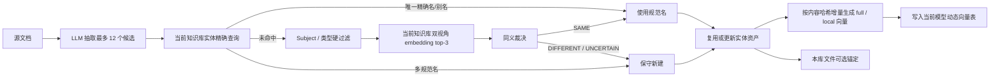

# KnowledgeEntity 异名同义归一与性能优化设计

## 1. 文档状态

- 状态：已实现，待业务验收
- 目标版本：KnowledgeEntity Discovery v2
- 范围：已知别名复用、新同义词识别、消除 worker 每任务全量加载
- 前置文档：[KnowledgeEntity 发现、身份治理与文档富化方法论设计](./knowledge-entity-discovery-enrichment-design.md)
- 实验资产：保存在不纳管的 `大厂文章/discovery-evaluation/` 下

本文档只解决异名同义和直接相关的性能问题。同名异义的完整语境消歧留待后续设计。

本文档是 KnowledgeEntity v2 的增量设计，实施后取代前置 v1 文档中的文件身份、全系统 AC 词表和 aliases metadata 事实源；未涉及的实体定义、证据、富化和关系规则继续沿用 v1。

## 2. 结论

本设计新增按知识库归属的实体资产主表，并按 embedding 模型动态创建实体向量表。KnowledgeEntity 文件不再是实体身份的事实源，而是资产在所属知识库中的可选文档化呈现。

实体资产的生命周期与文件解耦：

```text
knowledge_entity                       # 按知识库归属、模型无关、持续积累
knowledge_entity_embedding_<model>     # 动态创建、模型相关、可重建
knowledge_fs_entry                     # 可删除的来源文件或本库实体文档
```

`knowledge_entity.knowledge_base_id` 表示资产归属。当前知识库和文件采用逻辑删除，因此业务服务必须显式维护实体生命周期：文件逻辑删除时清空 canonical 的 `fs_entry_id`；知识库逻辑删除时硬删除该库实体行，并由实体外键继续级联 aliases 和向量。MVP 暂不跨知识库保留资产。

## 3. 当前问题

### 3.1 异名同义链路未接通

当前 worker 会加载全系统 `entityName` 和 `aliases`，但匹配结果没有参与 LLM 输出后的规范名决策。

例如当前知识库已有：

```text
entityName: PostgreSQL
aliases: [Postgres, PG]
```

当前知识库文档只出现 `PG` 时，现有实现仍可能创建 `entityName=PG` 的新实体。

### 3.2 每任务重复全量工作

每个 Discovery worker 都会：

1. 查询全系统 KnowledgeEntity metadata；
2. 构建自己的 Aho-Corasick 索引；
3. 在等待 LLM 时持有该份实体列表和索引。

全库任务含 `D` 个文档、系统共有 `E` 个实体时，全量查询和构建量接近 `O(D × E)`。

## 4. 设计原则

1. **实体资产按知识库持久化**：规范名称、别名和稳定实体 ID 归属知识库，但不依赖任何文件是否存在。
2. **文件是锚点，不是所有者**：文件删除只清空 `fs_entry_id`；实体资产继续参与当前知识库归一。
3. **先抽取，再查少量候选**：不将全量词表放入 Prompt，也不在每个文档上先扫描全局词面。
4. **精确别名优先**：已确认别名的唯一命中是确定性操作，不额外调用 LLM。
5. **新同义词保守确认**：候选召回只是候选，必须经过证据化裁决才能写入别名。
6. **向量表按模型动态创建**：参考 `014_embedding_table.sql.tpl`，模型或维度变化不覆盖旧模型向量。
7. **向量是可重建投影**：实体资产是事实源；动态向量表可以重建，但不能反向决定实体身份。

## 5. 精简架构



实体资产可以没有任何存活文件引用。文件层的 `MENTIONS`、Markdown 和 metadata 是消费实体资产的本库投影，不再承担 canonical 身份。

## 6. 独立实体资产与动态向量表

### 6.1 MVP 表范围

最小实现只需要两类表：

```text
knowledge_entity                         # 规范实体和别名使用同表自关联
knowledge_entity_embedding_<model>       # 动态创建的双视角向量
```

第一阶段不增加 observation、revision、surface 状态、置信度、合并历史或文件来源表。上述治理能力以后可以增量增加，不影响当前主键。

`knowledge_entity` 通过可空且唯一的 `fs_entry_id` 保存当前一一对应的文件锚点。外键的 `ON DELETE SET NULL` 只保护物理删除；现有文件删除是软删除，必须在同一业务事务内显式将该字段更新为 `NULL`。

### 6.2 实体与别名的同表自关联

别名也是一条名称记录，但不是独立实体。`canonical_entity_id` 指向它所属的规范实体；仅使用 `is_alias` 无法表达“是谁的别名”，因此不采用单独布尔字段。

建议静态 migration `033_knowledge_entity.sql`：

```sql
CREATE TABLE IF NOT EXISTS knowledge_entity (
    kid bigserial PRIMARY KEY,
    knowledge_base_id bigint NOT NULL
        REFERENCES knowledge_base(kid) ON DELETE CASCADE,
    fs_entry_id bigint NULL UNIQUE
        REFERENCES knowledge_fs_entry(kid) ON DELETE SET NULL,
    canonical_entity_id bigint NULL
        REFERENCES knowledge_entity(kid) ON DELETE CASCADE,
    name_role varchar(16) NOT NULL
        CHECK (name_role IN ('canonical', 'alias')),
    entity_name text NOT NULL,
    normalized_entity_name text NOT NULL,
    subject_entity_id bigint NULL
        REFERENCES knowledge_entity(kid) ON DELETE CASCADE,
    entity_type varchar(64) NULL,
    object_kind varchar(16) NOT NULL DEFAULT 'ENTITY',
    description text NULL,
    created_at timestamptz NOT NULL DEFAULT NOW(),
    updated_at timestamptz NOT NULL DEFAULT NOW(),
    CHECK (
        (name_role = 'canonical'
            AND canonical_entity_id IS NULL)
        OR
        (name_role = 'alias'
            AND canonical_entity_id IS NOT NULL
            AND fs_entry_id IS NULL
            AND subject_entity_id IS NULL
            AND entity_type IS NULL)
    ),
    UNIQUE (canonical_entity_id, normalized_entity_name)
);

CREATE INDEX IF NOT EXISTS idx_knowledge_entity_normalized_name
    ON knowledge_entity(knowledge_base_id, normalized_entity_name);

CREATE INDEX IF NOT EXISTS idx_knowledge_entity_subject_type
    ON knowledge_entity(knowledge_base_id, subject_entity_id, entity_type)
    WHERE name_role = 'canonical';

CREATE INDEX IF NOT EXISTS idx_knowledge_entity_canonical
    ON knowledge_entity(canonical_entity_id)
    WHERE canonical_entity_id IS NOT NULL;

CREATE INDEX IF NOT EXISTS idx_knowledge_entity_fs_entry
    ON knowledge_entity(fs_entry_id)
    WHERE fs_entry_id IS NOT NULL;
```

不对 `normalized_entity_name` 设置全局唯一约束。同一词面可能对应多个规范实体；精确查询返回多个 canonical ID 时进入同名异义消歧，不能任取第一条。

名称与别名的最小职责：

| 数据 | 位置 | 约束 |
| --- | --- | --- |
| 当前规范名称 | `name_role=canonical` 的记录 | `canonical_entity_id IS NULL` |
| Subject 内局部名称和类型 | 仅规范记录保存 | alias 行必须为空 |
| 历史名、翻译名、缩写 | `name_role=alias` 的记录 | `canonical_entity_id` 指向规范记录 |

服务层必须保证 `canonical_entity_id` 和 `subject_entity_id` 只能指向同一 `knowledge_base_id` 下 `name_role=canonical` 的记录，禁止 alias 指向 alias，并拒绝把与规范名称相同的规范化词面再次写成 alias。`fs_entry_id` 只能配置在 canonical 行，并且文件必须属于同一知识库、`documentKind=knowledgeEntity`。规范名称变更时，在一个事务中更新规范记录，并插入一条指向它的旧名称 alias。

精确查询统一扫描名称索引，并解析为规范实体 ID：

```sql
SELECT
    canonical.kid AS resolved_entity_id,
    canonical.entity_name AS canonical_entity_name,
    canonical.subject_entity_id,
    canonical.entity_type,
    matched.name_role AS matched_name_role,
    matched.entity_name AS matched_surface
FROM knowledge_entity matched
JOIN knowledge_entity canonical
  ON canonical.kid = COALESCE(matched.canonical_entity_id, matched.kid)
 AND canonical.knowledge_base_id = matched.knowledge_base_id
 AND canonical.name_role = 'canonical'
WHERE matched.knowledge_base_id = %(knowledge_base_id)s
  AND matched.normalized_entity_name = %(normalized_surface)s;
```

### 6.3 生命周期与删除接口

实体和文件是一对零或一关系，删除方向不对称：

```text
删除文件
  -> 现有文件服务逻辑删除 knowledge_fs_entry
  -> 同一事务显式设置 knowledge_entity.fs_entry_id = NULL
  -> canonical 实体、alias、embedding 保留

删除 canonical 实体
  -> 应用层先调用现有文件删除服务删除 fs_entry（若存在）
  -> 再删除 canonical 实体
  -> 数据库级联删除 alias 和实体 embedding

删除知识库
  -> 现有知识库服务逻辑删除知识库和文件
  -> 同一事务显式 DELETE 该 knowledge_base_id 的 knowledge_entity
  -> canonical 删除继续级联 alias 和实体 embedding
```

不能只依赖数据库外键：现有软删除不会触发外键动作。也不能从实体直接数据库级联删除 `knowledge_fs_entry`，因为文件删除还涉及对象存储、chunk、引用和检索投影，必须复用现有文件删除服务。

MVP 提供两个语义明确的接口：

```text
POST /api/v1/knowledgeEntities/delete
POST /api/v1/knowledgeEntities/aliases/delete
```

请求体分别为：

```json
{"knCode": "1", "entityId": 123}
{"knCode": "1", "entityId": 123, "aliasId": 456}
```

路由沿用现有 `knowledgeBases/delete`、`knowledgeItems/delete` 的 POST action 风格；可以同时提供 kebab-case 兼容别名，但不新增另一套语义。

删除 canonical 实体接口：

1. 只接受 `name_role=canonical`，传入 alias ID 返回参数冲突；
2. 锁定实体并检查是否存在 `subject_entity_id=entity_id` 的 canonical 子实体；存在时返回冲突，要求先删除或迁移子实体，不能依赖 `ON DELETE SET NULL` 静默改变身份范围；
3. 读取 `fs_entry_id`，非空时通过内部服务调用现有文件删除逻辑，不通过 HTTP 自调用；
4. 删除 canonical 行，数据库级联删除其 aliases 和当前所有模型的 embedding；
5. 缓存失效，并记录删除实体、别名和文件的数量。

删除 alias 接口：

1. 校验 alias 的 `name_role=alias` 且 `canonical_entity_id=entity_id`；
2. 只删除 alias 行，不删除 canonical 实体或文件；
3. 更新 canonical 的 `updated_at`；
4. 提交事务时删除当前活动模型表中 canonical 的 `full` 行，避免已删除 alias 继续参与召回；
5. 提交后尽力立即重算 `full` embedding；重算失败不回滚已完成的 alias 删除，缺失向量由后续刷新任务补齐；
6. 非活动模型表的旧向量不参与查询；该模型再次启用时必须先根据 `source_content_hash` 重建不匹配的行。

### 6.4 动态实体向量表

参考 `014_embedding_table.sql.tpl`，新增实体向量模板 `034_knowledge_entity_embedding_table.sql.tpl`。动态表名按模型名称规范化：

```text
knowledge_entity_embedding_<normalized_model_name>
```

模板建议：

```sql
CREATE TABLE IF NOT EXISTS {{ entity_embedding_table_name }} (
    kid bigserial PRIMARY KEY,
    entity_id bigint NOT NULL
        REFERENCES knowledge_entity(kid) ON DELETE CASCADE,
    representation varchar(16) NOT NULL
        CHECK (representation = 'full'),
    source_content_hash char(64) NOT NULL,
    embedding vector({{ embedding_dimension }}) NOT NULL,
    created_at timestamptz NOT NULL DEFAULT NOW(),
    updated_at timestamptz NOT NULL DEFAULT NOW(),
    UNIQUE (entity_id, representation)
);

CREATE INDEX IF NOT EXISTS {{ entity_embedding_table_name }}_entity_id_idx
    ON {{ entity_embedding_table_name }}(entity_id);
```

这里的 `ON DELETE CASCADE` 只响应显式删除 `knowledge_entity`，与文件删除无关。MVP 不提供自动清理实体的任务；硬删除只能由显式治理操作触发。

向量表中的 `entity_id` 只允许引用 `name_role=canonical` 的记录。alias 记录不单独生成向量，也不作为 Subject；它只参与精确词面查询和规范实体 `full` representation 的内容构建。

每个实体在一个模型表中最多有一条记录：

```text
representation=full
```

表名已经区分模型，`source_content_hash` 区分具体输入内容。模型切换时动态创建新表，旧表不覆盖。

最小失效规则：

| 变更 | 失效向量 |
| --- | --- |
| canonical 名称或 aliases | 当前实体 `full` |
| `entity_type` | 当前实体 `full` |
| Subject 的 canonical 名称 | 直接子实体的 `full` |
| `subject_entity_id` | 当前实体 `full` |

`full` 的 `source_content_hash` 必须覆盖 canonical 名称、排序后的 aliases、Subject canonical 名称、`entity_type` 和表示版本。

### 6.5 动态创建机制

扩展现有 `KnowledgeBaseSchemaBootstrapService`：

```text
normalize_entity_embedding_table_name(model_name)
  -> knowledge_entity_embedding_<normalized_model_name>

{{ entity_embedding_table_name }}
  -> 启动迁移时注入动态表名

{{ embedding_dimension }}
  -> 注入当前向量维度
```

与 chunk embedding 表相同，启动时必须检查已有动态表的 `vector(N)` 是否等于配置维度；不一致时 fail-fast，不能在原表中混写不同维度。

迁移账本版本应包含模板文件名和动态表名，使每个模型表只创建一次：

```text
034_knowledge_entity_embedding_table.sql.tpl:
knowledge_entity_embedding_text_embedding_v4
```

### 6.6 查询与可选运行时缓存

规范名称、alias 和 embedding 候选都只查询当前 `knowledge_base_id`。精确查询通过 `COALESCE(canonical_entity_id, kid)` 解析规范实体并去重；embedding 召回先按知识库、Subject 和类型限定 canonical `entity_id`，再查询当前动态向量表 Top-K。系统不读取其他知识库的名称、alias 或向量参与归一。

MVP 当前直接查询实体表，不维护全量或热点实体缓存。若精确查询的数据库开销经压测成为瓶颈，后续可以只缓存以下小型热点：

```text
normalized surface -> entity_id
entity_id -> canonical identity summary
```

可选缓存通过 TTL 或 Redis 失效通知更新；缓存未命中回源实体表。它只能是查询加速层，不承担实体事实或全量向量存储。

### 6.7 不再默认构建 AC

主链路先由 LLM 抽取最多 12 个显著实体，再查询实体名称索引。

因此第一阶段不构建全库 AC 自动机。实现已删除 `_scan_known_matches`、AC 数据结构以及 Discovery 的 `known_matches` 参数，worker 只能在 LLM 抽取后查询实体资产表。

如后续确实需要返回全文已知实体位置，再在共享 snapshot 上构建一份可选 AC 索引，不得恢复为每 worker 构建。

## 7. 异名同义处理

### 7.1 抽取候选

LLM 继续仅阅读文档内容，输出：

```json
{
  "entityName": "PG",
  "aliases": [],
  "identityScope": "global",
  "subjectEntityName": null,
  "entityType": "database",
  "evidence": "系统使用 PG 作为主数据库"
}
```

抽取负责判断显著性和稳定身份，实体资产仓储负责在抽取后做规范名归一。

抽取协议中的 `identityScope=global` 仅表示“没有 Subject”，在本设计中仍归属当前 `knowledge_base_id`，不表示跨知识库共享同一个 `entity_id`。

### 7.2 已知别名的确定性归一

对候选 `entityName` 和 `aliases` 做规范化后精确查询，并按以下 key 聚合：

```text
normalized_entity_name
+ subject_entity_id
+ entity_type
```

| 查询结果 | 处理 |
| --- | --- |
| 唯一兼容规范名组 | 使用该 `canonical_name` |
| 多个规范名组 | 记录 `AMBIGUOUS_SURFACE`，本阶段不自动选择 |
| 无命中 | 进入新同义词候选召回 |

唯一候选命中的是当前知识库的 canonical `entity_id`。其他知识库即使存在同名 canonical 或 alias，也不参与当前知识库的解析。

### 7.3 新同义词候选召回

精确未命中时，在当前模型的动态实体向量表上召回最多 3 个候选：

```text
ENTITY_SYNONYM_TOP_K=3
```

Subject、identity scope 和 `entityType` 先作为硬过滤条件。词法信号只用于精确匹配、诊断和 embedding 不可用时的降级：

- 字符 n-gram 重叠；
- token 重叠；
- 大小写、全半角和标点归一；
- 英文或组织名称缩写；
- 候选 `aliases` 交集；

本地挑战集评测资产不进入生产分支。默认回退路径使用 embedding Top-3，禁止仅凭向量 Top-1 自动合并。

每个候选保存一个可重建向量：

```text
full_embedding  = embed(canonical_name + subject + aliases)
```

查询使用同一 `full` 视角：

```text
full_query  = embed(mention + subject + evidence)
score       = cos(full_query, full_embedding)
```

Subject 和实体类型只做冲突硬过滤，不固定加分。该设计避免 `Palantir-对象时间线` 中的品牌词压过局部概念；压力测试中 `object timeline` 从 Top-3 外提升到第 1。

`full` 向量持久化到当前模型对应的动态表，按 `entity_id + representation` 幂等更新。`source_content_hash` 未变化时不调用外部 embedding 服务。worker 只提交查询向量并读取数据库 Top-K，不加载或重新向量化全库实体。

### 7.4 同义裁决

只有召回到候选时才调用裁决 LLM。输入限于：

- 当前 mention 和原文 evidence；
- 最多 3 个候选的 ID、规范名、aliases、Subject、localName、类型和身份范围；
- 可选的有界实体定义摘要。

严格输出：

```json
{
  "decision": "SAME",
  "selectedCandidateId": "candidate-id",
  "canonicalName": "PostgreSQL",
  "aliasToAdd": "PG",
  "reasonCode": "ABBREVIATION_AND_CONTEXT_MATCH"
}
```

`decision` 仅允许 `SAME`、`DIFFERENT` 或 `UNCERTAIN`。

服务端必须验证：

- `selectedCandidateId` 必须来自本次 top-3；
- `canonicalName` 必须等于被选候选的规范名；
- `aliasToAdd` 必须真实出现在原文或抽取结果中；
- 类型和 subject 不得冲突；
- 非法 JSON、超时或 `UNCERTAIN` 都不写入别名。

候选分数和 LLM 自报置信度不能单独触发归一。

### 7.5 裁决结果

| 结果 | 处理 |
| --- | --- |
| 精确唯一规范名 | 使用规范名，无额外 LLM |
| `SAME` | 使用规范名，将当前 mention 记为已确认别名 |
| `DIFFERENT` | 使用当前候选名创建实体 |
| `UNCERTAIN` | 保守创建，保留 warning，不写入当前知识库实体别名 |
| 多个精确规范名组 | 本阶段保守创建，留待同名异义设计 |

## 8. 实体资产更新与本库锚定

### 8.1 只锚定当前知识库

确定当前知识库的 canonical `entity_id` 后，直接读取该行的 `fs_entry_id`：

- 非空：使用该唯一文件锚点建立 `MENTIONS`；
- 为空：可按产品需求创建 KnowledgeEntity Markdown，并在同一业务操作中回写 `fs_entry_id` 和文件 metadata 的 `canonicalEntityId`；
- 文件创建失败：实体资产仍然有效，保持 `fs_entry_id=NULL`，允许后续重试。

正常链路不再按 `entityName`、aliases 或路径重新猜测文件锚点。仅显式数据修复任务允许用这些字段寻找文件，并在确认唯一后回填 `fs_entry_id`。

### 8.2 别名回写

已知 alias 精确命中时只复用 canonical 实体，不重复写入。只有新同义词裁决为 `SAME` 时，才新增 alias 记录。

回写必须：

- 按规范化值去重；
- 不将 `entityName` 重复写入 `aliases`；
- 保留稳定展示形式；
- 按 `(knowledge_base_id, normalized alias surface)` 加锁并重新查询；并发期间若该词面已指向其他兼容组，则记录 `AMBIGUOUS_SURFACE`，不自动新增 alias；
- 在 `knowledge_entity` 内幂等插入 `name_role=alias` 的记录，并更新规范记录的 `updated_at`；
- alias 提交后立即删除当前模型中该 canonical 的 `full` 向量行并投递异步重建；精确 alias 查询立即可用，不等待向量重建；
- 非活跃模型的旧向量允许暂存，但模型再次启用时必须通过 `source_content_hash` 不匹配触发重建；
- 在任务 `result_payload.actions` 中记录 `resolutionMethod`、`aliasAdded` 和 `candidateCount`；MVP 不回传原始 evidence，后续如需长期审计可再增加独立决策记录和证据指纹。

本库 KnowledgeEntity Markdown 可异步同步展示 aliases，但它不是事务事实源。alias 和向量候选集都严格限定在当前知识库。

### 8.3 并发创建保护

保留现有“创建前重新查询 + 路径冲突复用”机制，并建议按以下 key 使用事务级 advisory lock：

```text
(knowledge_base_id, subject_entity_id, normalized_entity_name)
```

写入前直接复核当前知识库实体资产，不重新加载全系统词表。文件锚点创建仍可额外使用当前知识库的路径锁。

## 9. 有界并发

复用现有 KnowledgeEntity worker 的有界并发配置：

```text
KNOWLEDGE_ENTITY_WORKER_CONCURRENCY=4
```

默认值 4 是安全起点，应根据数据库连接池和 LLM 并发限额通过压测调整。

并发许可覆盖整个 worker 执行期，而不仅是 LLM 调用，从而限制同时的数据库、对象存储、缓存和持久化压力。

## 10. 性能模型

定义：

- `D`：Discovery 文档数；
- `E`：当前知识库实体资产数；
- `S`：规范名加别名词面数；
- `M`：单文档抽取候选数，上限 12；
- `K`：单候选同义召回数，上限 3；
- `C`：worker 并发上限。

现有方式：

```text
全量查询：O(D × E)
索引构建：O(D × S)
峰值索引内存：O(C × S)
```

精简方式：

```text
精确查询：数据库索引查询
向量查询：先限定当前知识库 canonical 集合，再精确计算距离并取 Top-K
可选进程热点缓存：O(H)，H 远小于 E；MVP 当前为 0
单文档候选处理：O(M × K)
并发任务工作集：O(C)
```

每个 worker 的全量实体 SQL 查询数必须为 0；只允许带 `knowledge_base_id` 的精确查询、Top-K 查询和命中实体读取。

## 11. 任务结果与日志

`result_payload.actions` 建议增加：

```json
{
  "action": "ANCHORED",
  "inputEntityName": "PG",
  "canonicalEntityName": "PostgreSQL",
  "resolutionMethod": "EXACT_ALIAS",
  "aliasAdded": null,
  "candidateCount": 1
}
```

`resolutionMethod` 枚举：

```text
EXACT_CANONICAL
EXACT_ALIAS
SYNONYM_ADJUDICATED
CREATED_NEW
AMBIGUOUS_UNMERGED
```

动态向量表名、模型身份（由动态表名体现）和 `source_content_hash` 写入向量构建日志。实体资产变更严格按 6.4 节的最小规则失效相应 representation；Subject 规范名称变化还必须失效其直接子实体的 `full`。实体资产版本不纳入原文档 freshness 指纹。

日志不输出外库 `fileId`、路径和正文，只输出命中方式、候选数量和本库持久化结果。

## 12. 缓存一致性与失败处理

| 情况 | 处理 |
| --- | --- |
| 实体表不可用 | 任务失败，不回退到扫描全库文件 |
| 动态向量表不存在 | bootstrap 创建；创建失败则关闭近似召回并告警 |
| 动态表维度不匹配 | 启动 fail-fast，不覆盖已有向量 |
| 单实体 embedding 失败 | 保留资产并标记待重试；已因内容变化而失效的 representation 保持缺失，不继续服务旧 `source_content_hash` 的向量 |
| 热点缓存刷新失败 | 回源实体表；数据库不可用时任务失败 |
| 删除 canonical 时文件删除失败 | 不删除实体，返回文件删除错误，允许重试 |
| 文件已删除但实体删除失败 | `fs_entry_id` 已置空；重试时继续删除实体 |
| 文件或知识库只做逻辑删除 | 在原删除事务中显式清空 `fs_entry_id` 或硬删该库实体，不依赖 FK 动作 |
| 删除仍被子实体引用的 Subject | 返回冲突，先删除或迁移子实体；不得静默转为全局实体 |
| 裁决 LLM 超时或非法输出 | 按 `UNCERTAIN` 处理，不写别名 |
| 词面命中多个规范名 | 不自动选择，记录 `AMBIGUOUS_SURFACE` |
| 创建前发现本库已有实体 | 转为本库锚定 |

`knowledge_entity` 是身份与命名事实源；动态向量表是可重建召回索引；文件和内存缓存都不是实体事实源。

## 13. 分阶段实施

### 阶段 1：建立独立实体资产

1. 新增自关联的 `knowledge_entity` 及仓储，实体 ID 与文件 ID 解耦。
2. 新发现的 canonical、aliases、Subject、类型和 `fs_entry_id` 直接写入实体资产表，不提供旧 metadata 迁移链路。
3. 实现 canonical 实体和 alias 两个删除接口。
4. 接入现有软删除事务：文件删除显式置空锚点，知识库删除显式硬删该库实体资产。

项目尚未投产，没有需要兼容的旧实体数据，因此部署只执行 schema bootstrap，不提供 v1 metadata 迁移脚本。worker 只读实体资产表，不混用文件 metadata 作为身份事实源，也不会重新启用全量词表加载。

### 阶段 2：已知别名归一

1. 对 LLM 输出的最多 12 个候选查询实体资产仓储。
2. 唯一兼容规范名命中时执行确定性归一。
3. 复用或创建当前知识库实体资产，再按需创建本库文档锚点。
4. 增加归一结果审计字段。

### 阶段 3：新同义词识别

1. 扩展 bootstrap 的动态表名渲染和维度校验。
2. 新增实体 embedding SQL 模板和仓储。
3. 实现 Subject/类型硬过滤和双视角 embedding top-3 候选召回。
4. 实现严格 schema 的同义裁决。
5. 裁决为 `SAME` 时幂等回写实体资产 aliases。
6. 按 `source_content_hash` 增量更新两种 representation。
7. 使用标注集评估 Recall@3 和别名误写率。

### 阶段 4：按实际需求增强

只在指标证明必要时考虑：

- Redis 跨进程缓存失效通知；
- 热点精确查询的 Redis 缓存；
- 可选的共享 AC 全文位置索引；
- 同名异义的完整语境消歧。

## 14. 测试和验收

### 14.1 功能场景

| 场景 | 预期 |
| --- | --- |
| KB-A 文件发现 `PostgreSQL/PG`，随后文件被逻辑删除 | 同一事务将 `fs_entry_id` 置空，实体和向量继续存在 |
| 删除 canonical 实体且存在 `fs_entry_id` | 先完整删除文件，再级联删除 aliases 和 embeddings |
| 删除 alias | canonical 和文件保留，只重算 `full` embedding |
| canonical、alias 或 Subject 指向其他知识库实体 | 写入失败，不允许形成跨库实体关系 |
| alias 携带 `fs_entry_id`、作为 Subject 或生成 embedding | 写入失败，alias 仅参与精确匹配和 canonical `full` 表示 |
| 逻辑删除知识库 | 服务显式硬删该库实体，aliases 和 embeddings 继续级联删除 |
| KB-B 文档出现 `PG`，KB-B 已有该 alias | 复用 KB-B 的 `PostgreSQL` entity_id |
| 只有 KB-A 存在 `PG`，KB-B 首次发现 `PG` | KB-B 不读取 KB-A，在本库独立创建 `PG` 实体 |
| `PG` 对应多个规范名 | 不选第一个，记录 `AMBIGUOUS_SURFACE` |
| embedding 候选裁决为 `SAME` | 使用规范名并回写别名 |
| 裁决为 `DIFFERENT/UNCERTAIN` | 新建实体，不污染别名 |
| 裁决返回 top-3 之外 ID | 校验失败，按 `UNCERTAIN` 处理 |

### 14.2 性能场景

- bootstrap 按模型名只创建一次实体动态向量表；
- 已有动态表维度不一致时启动失败；
- 每个 worker 不执行全量 `list_entity_surfaces(None)` 或全量实体表扫描；
- 向量查询必须先形成带 `knowledge_base_id` 的 canonical 候选集合，不允许默认对全库向量计算距离；
- 查询计划必须保证先限定当前知识库 canonical 集合，再计算向量距离；不能对动态表全量算距后再过滤知识库；
- 每个 worker 不构建 AC 索引；
- 缓存内存不随 worker 并发数线性增长；
- 活跃 worker 数始终不超过配置上限；
- 精确别名归一不增加 LLM 调用；
- `source_content_hash` 命中时不调用外部向量服务；
- 单个实体变更只重新计算对应内容哈希的向量。
- 删除源文件不删除实体资产和实体 embedding。
- 软删除文件后 canonical 的 `fs_entry_id` 必须为空。
- 软删除知识库后该 `knowledge_base_id` 的实体行必须为 0。
- 删除 alias 只重算 canonical 的 `full` representation。

### 14.3 质量指标

- 已知别名规范名命中率；
- 新同义词 Recall@3；
- 别名误写率；
- `UNCERTAIN` 比例；
- 重复新建实体的降低比例；
- 缓存冷启耗时、内存和命中率。

首要门槛是别名误写率，而不是尽可能减少新实体数量。

## 15. 配置开关与回滚

```text
ENTITY_EMBEDDING_INDEX_ENABLED
ENTITY_SYNONYM_EXACT_ALIAS_ENABLED
ENTITY_SYNONYM_ADJUDICATION_ENABLED
ENTITY_SYNONYM_TOP_K
```

近似召回和裁决能力可独立回滚：

1. 关闭新同义词裁决，保留实体资产和已知别名归一；
2. 关闭动态向量召回，保留精确名称/alias 查询；
3. 实体资产表是 Discovery 的强依赖，不提供回退到旧全量词表链路的开关；需要回滚版本时必须同时回滚应用与数据库部署，而不是在运行时切换事实源。

应用版本回滚不得顺带删除实体资产或动态向量表；知识库删除仍按 6.3 节显式清理该库实体。其他资产清理只能通过明确的数据治理操作执行。
