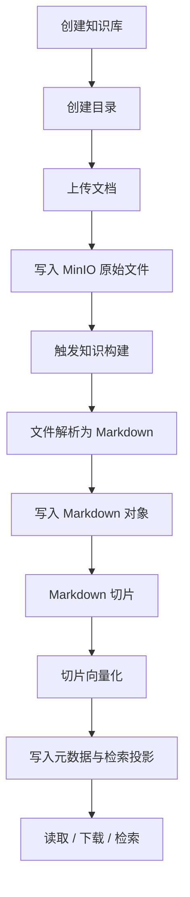
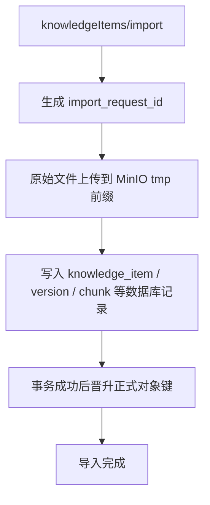
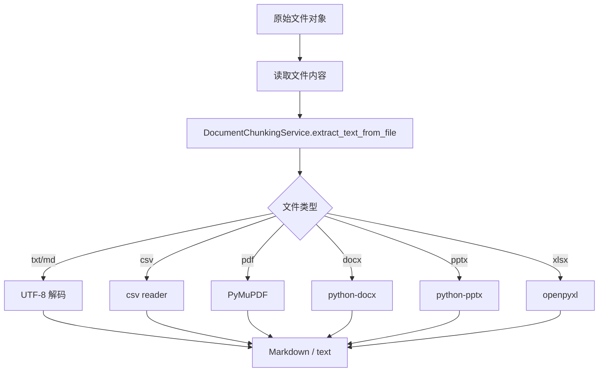
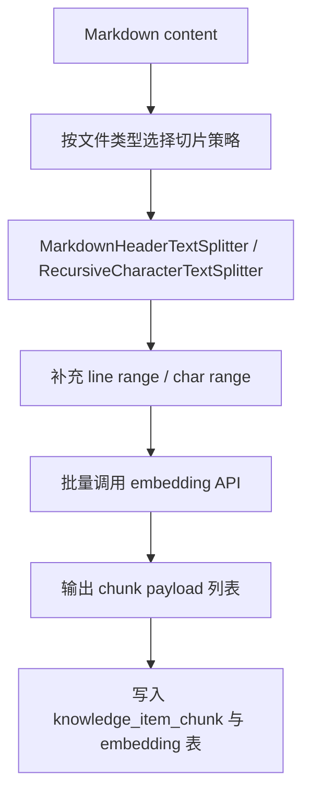
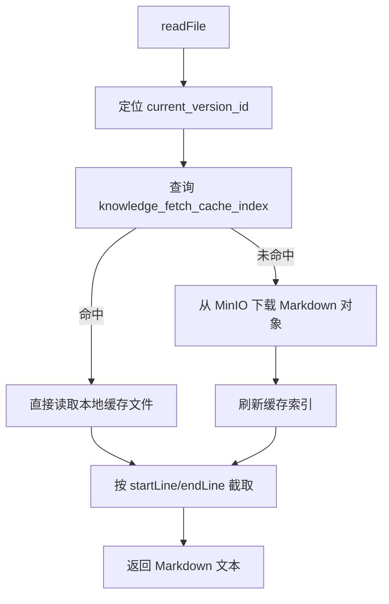
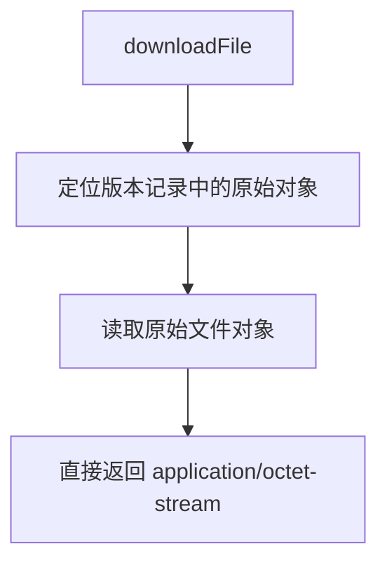
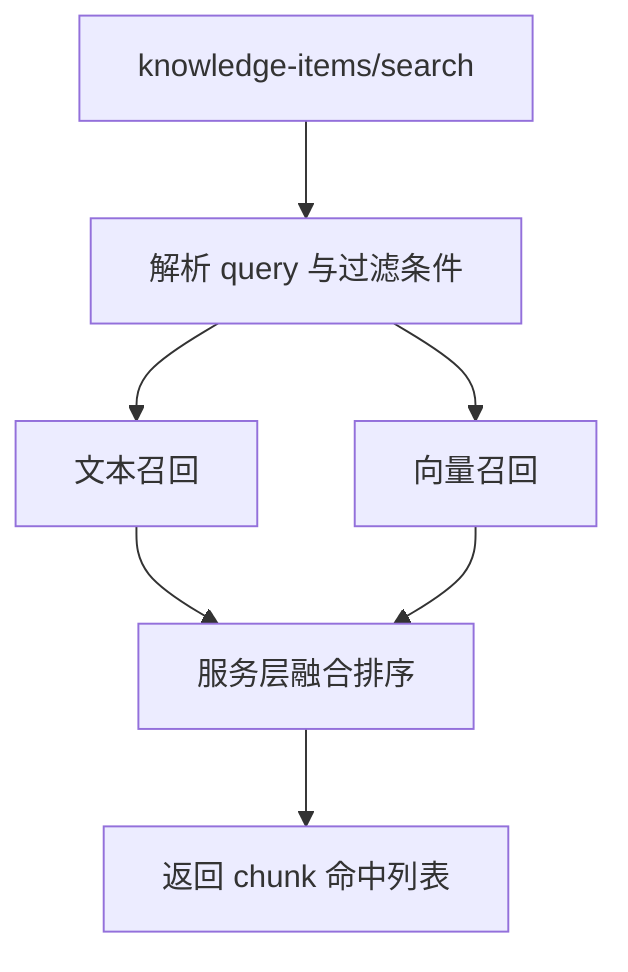

# 知识模块处理流程

相关文档：

- [api.md](./api.md)
- [framework.md](./framework.md)
- [design.md](./design.md)
- [minio.md](./minio.md)

## 总流程

## 导入与入库流程

说明：

- 上传接口接收表单文件
- 先写临时对象，再完成数据库入库
- 正式对象键只在事务成功后可见

## 文件解析流程

说明：

- 目标是尽快拿到可构建文本
- 复杂版式和高保真解析不在当前范围内

## 构建流程

说明：

- Markdown 优先按标题切片
- 纯文本走通用字符切片
- 最终输出统一的 chunk payload

## 文件读取流程

## 文件下载流程

## 检索流程

